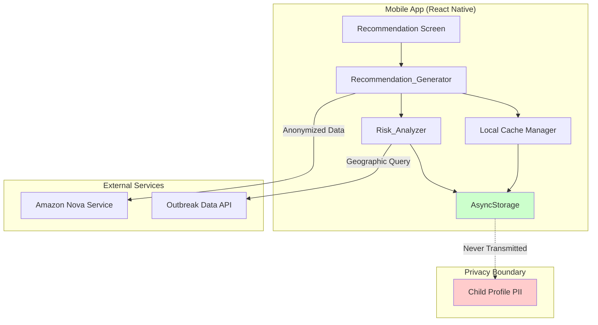
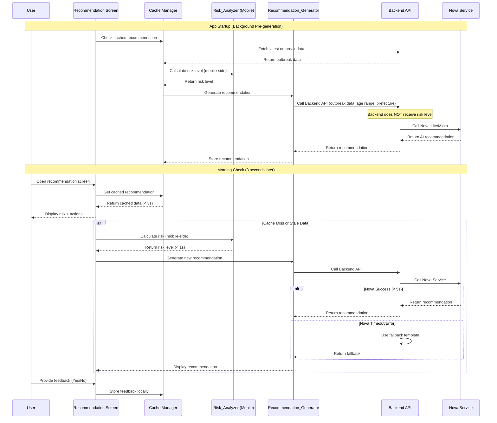
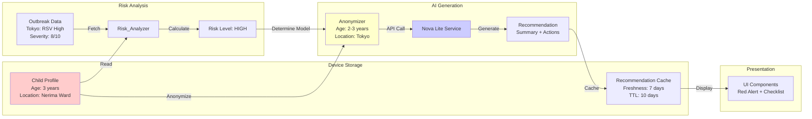
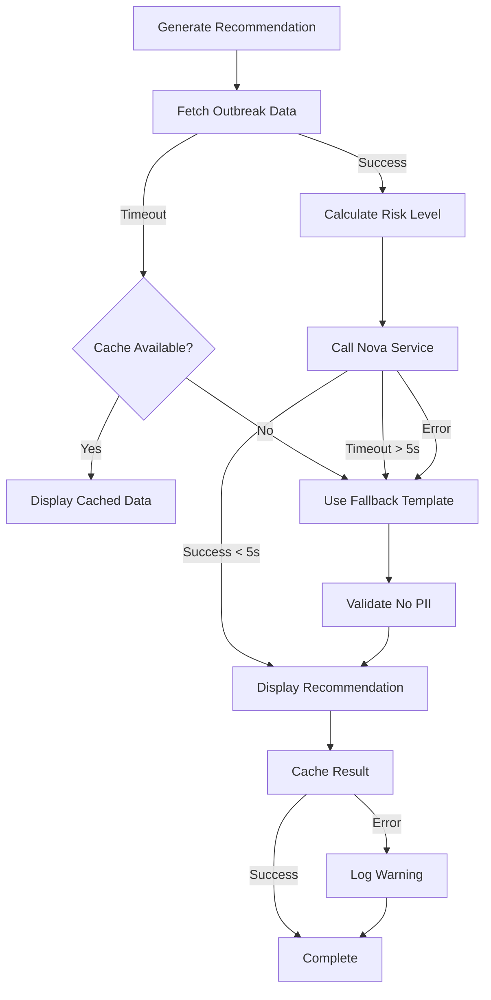

# Design Document: Nova AI Recommendations

## Overview

### Purpose

This feature integrates Amazon Nova Lite/Micro AI models to provide personalized infectious disease risk assessments and actionable recommendations for parents of young children. The system analyzes real-time outbreak data, child age, and geographic location to generate context-aware guidance that helps parents make informed decisions about childcare attendance and preventive measures during their morning routine.

### Key Design Goals

1. **Privacy-First Architecture**: All personally identifiable information (PII) remains on-device; only anonymized, aggregated data is transmitted to external services
2. **Performance Optimization**: Sub-3-second response time for cached recommendations to support busy morning routines
3. **Graceful Degradation**: Rule-based fallback system ensures functionality when AI services are unavailable
4. **Cultural Sensitivity**: Language-specific guidance that respects local childcare norms (e.g., Japanese 37.5°C fever threshold)
5. **Cost Efficiency**: Strategic use of Nova Micro (low-risk scenarios) vs Nova Lite (high-risk scenarios) to balance quality and cost

### High-Level Architecture

The system follows a layered architecture with clear separation between data collection, risk analysis, AI generation, and presentation:

```
┌─────────────────────────────────────────────────────────────┐
│                      Presentation Layer                      │
│  ┌──────────────┐  ┌──────────────┐  ┌──────────────┐      │
│  │ Risk Display │  │ Action Items │  │ Feedback UI  │      │
│  └──────────────┘  └──────────────┘  └──────────────┘      │
└─────────────────────────────────────────────────────────────┘
                            │
┌─────────────────────────────────────────────────────────────┐
│                    Application Layer                         │
│  ┌──────────────────────────────────────────────────┐       │
│  │         Recommendation_Generator                  │       │
│  │  ┌────────────┐  ┌────────────┐  ┌────────────┐ │       │
│  │  │ Nova_Lite  │  │ Nova_Micro │  │  Fallback  │ │       │
│  │  │  Service   │  │  Service   │  │  Templates │ │       │
│  │  └────────────┘  └────────────┘  └────────────┘ │       │
│  └──────────────────────────────────────────────────┘       │
│  ┌──────────────────────────────────────────────────┐       │
│  │            Risk_Analyzer                          │       │
│  │  - Severity Evaluation                            │       │
│  │  - Geographic Proximity Calculation               │       │
│  │  - Age-Based Risk Adjustment                      │       │
│  └──────────────────────────────────────────────────┘       │
└─────────────────────────────────────────────────────────────┘
                            │
┌─────────────────────────────────────────────────────────────┐
│                       Data Layer                             │
│  ┌──────────────┐  ┌──────────────┐  ┌──────────────┐      │
│  │   Outbreak   │  │    Child     │  │ Recommendation│      │
│  │   Data API   │  │   Profile    │  │    Cache      │      │
│  │              │  │ (Local Only) │  │  (Local Only) │      │
│  └──────────────┘  └──────────────┘  └──────────────┘      │
└─────────────────────────────────────────────────────────────┘
```

### Privacy Boundaries

The system maintains strict privacy boundaries with different granularity for local computation vs external transmission:

- **Local-Only Data**: Child profile (exact age, name, date of birth, address), conversation history, feedback data
- **Local Computation**: Risk_Analyzer uses ward/county level location data for accurate risk calculation
- **Anonymized Transmission to Nova**: Age range (0-1, 2-3, 4-6, 7+), geographic area (prefecture/state level only)
- **No PII Transmission**: Name, address, date of birth, ward/county, exact age never leave the device

## Architecture

### Component Diagram




### Sequence Diagram: Morning Routine Use Case



### Data Flow Diagram



## Components and Interfaces

### 1. Risk_Analyzer

**Responsibility**: Evaluates outbreak data and child profile to determine risk level (high, medium, low). This component runs on the mobile side, not on the backend.

**Important**: The Risk_Analyzer performs calculations locally on the mobile device using ward/county-level outbreak data for accurate risk assessment. The calculated risk level is then used to determine which Nova model to call, but the risk level itself is NOT passed as input to the Backend API. Instead, the Backend API receives outbreak data and calculates the appropriate model selection independently.

**Algorithm**:

```
function calculateRiskLevel(outbreakData, childProfile):
    // Step 1: Filter outbreaks by geographic proximity
    relevantOutbreaks = filterByGeography(outbreakData, childProfile.location)
    
    // Step 2: Apply age-based susceptibility weights
    weightedOutbreaks = applyAgeWeights(relevantOutbreaks, childProfile.ageRange)
    
    // Step 3: Determine risk level based on severity
    if hasHighSeverityOutbreak(weightedOutbreaks):
        return RiskLevel.HIGH
    else if hasMediumSeverityOutbreak(weightedOutbreaks):
        return RiskLevel.MEDIUM
    else:
        return RiskLevel.LOW
```

**Performance Target**: The Risk_Analyzer SHALL complete calculation within 3 seconds when using cached or fresh outbreak data (Requirement 1.1).


**Geographic Fallback Logic**:

When user location is more granular than available outbreak data:

1. **Exact Match**: User in "Nerima Ward, Tokyo" → Outbreak data for "Nerima Ward" → Use exact data
2. **Prefecture/State Fallback**: User in "Nerima Ward, Tokyo" → Outbreak data for "Tokyo" only → Use Tokyo-wide data with proximity adjustment
3. **National Fallback**: User in "Nerima Ward, Tokyo" → No Tokyo data → Use national data with significant risk reduction factor (0.5x)

**Geographic Precision Tradeoff** (Requirement 19.29):
When prefecture-specific data is unavailable (e.g., non-Tokyo prefectures in Japan), the system uses national-level data as fallback. This is an acceptable tradeoff for MVP to ensure data availability. The user should be notified: "Prefecture-specific data unavailable. Showing national trends." Note that national data may include outbreaks 1000+ km away, which reduces geographic proximity accuracy but ensures the system remains functional.

**Age-Based Susceptibility Weights**:

- **0-1 years (Infants)**: 1.5x weight for respiratory diseases, 1.2x for gastrointestinal
- **2-3 years (Toddlers)**: 1.3x weight for hand-foot-mouth disease, 1.1x for flu
- **4-6 years (Preschool)**: 1.0x baseline weight
- **7+ years (School-age)**: 0.9x weight (stronger immune system)

**Age Range Mapping to FluSurv-NET**:

For age-specific hospitalization data from FluSurv-NET:

- **App age range 0-1 years** → FluSurv-NET 0-1 years
- **App age range 2-3 years** → FluSurv-NET 1-4 years
- **App age range 4-6 years** → FluSurv-NET 5-11 years (use higher age group for conservative risk assessment)
- **App age range 7+ years** → FluSurv-NET 5-11 years or 12-17 years (select based on specific age if available, otherwise use 5-11 years)

**Severity Score Calculation**:

Severity scores are calculated using weighted formula with Min-Max Scaling:

```
Severity Score = (
  0.40 × Normalized_Wastewater_Activity +
  0.30 × Normalized_ILI_Percentage +
  0.20 × Normalized_Hospital_Admissions +
  0.10 × Normalized_Hospitalization_Rate
)

Where each metric is normalized to 0-100 scale using:
Normalized_Value = (Current - Min_12mo) / (Max_12mo - Min_12mo) × 100
```

**Weight Redistribution When WastewaterSCAN is Unavailable** (Requirement 19.14):

WastewaterSCAN is an optional data source (Requirement 19.2). When unavailable, weights are redistributed proportionally among remaining sources:
- NWSS wastewater: 40% (unchanged)
- FluView ILI: 35% (increased from 30%)
- NHSN hospital admissions: 15% (decreased from 20%)
- FluSurv-NET hospitalization rates: 10% (unchanged)

**Cold Start Fallback Values** (for new deployment or new disease):

When trailing 12-month data is unavailable, use CDC baseline values:
- Wastewater activity level: 5 (moderate)
- ILI percentage: 2.5%
- Hospital admissions: 1000 per week
- Hospitalization rate: 5 per 100k population

**Severity Thresholds**:

- **High Risk**: Any outbreak with severity ≥ 7/10 within user's geographic unit
- **Medium Risk**: Any outbreak with severity 4-6/10 within user's geographic unit
- **Low Risk**: Only outbreaks with severity ≤ 3/10, or no outbreaks

**Interface**:

```typescript
interface RiskAnalyzer {
  calculateRiskLevel(
    outbreakData: OutbreakData[],
    childProfile: ChildProfile
  ): Promise<RiskLevel>;
}

enum RiskLevel {
  HIGH = 'high',
  MEDIUM = 'medium',
  LOW = 'low'
}

interface OutbreakData {
  diseaseId: string;
  diseaseName: string;
  severity: number; // 1-10 scale
  geographicUnit: GeographicUnit;
  affectedAgeRanges: AgeRange[];
  reportedCases: number;
  timestamp: Date;
}

interface GeographicUnit {
  country: string;
  stateOrPrefecture: string;
  countyOrWard?: string; // Used for local risk calculation, excluded from Nova transmission
}

interface ChildProfile {
  ageRange: AgeRange;
  location: GeographicUnit;
}

enum AgeRange {
  INFANT = '0-1',
  TODDLER = '2-3',
  PRESCHOOL = '4-6',
  SCHOOL_AGE = '7+'
}
```

### 2. Recommendation_Generator

**Responsibility**: Produces actionable guidance based on risk analysis, using Nova AI or fallback templates.

**Nova Model Selection Strategy**:

```
function selectNovaModel(
  riskLevel: RiskLevel,
  outbreakData: OutbreakData[]
): NovaModel {
  // Cost optimization: Use Nova Micro up to MEDIUM risk
  // Use Nova Lite only for HIGH risk with complex conditions (multiple concurrent diseases)
  
  if (riskLevel === RiskLevel.LOW) {
    return NovaModel.MICRO; // Cost-efficient for simple guidance
  }
  
  if (riskLevel === RiskLevel.MEDIUM) {
    return NovaModel.MICRO; // Micro provides sufficient quality for medium risk
  }
  
  // For HIGH risk, evaluate complexity
  if (riskLevel === RiskLevel.HIGH) {
    const highSeverityCount = outbreakData.filter(o => o.severity >= 7).length;
    
    // Use Lite only when multiple high-severity diseases are concurrent
    if (highSeverityCount >= 2) {
      return NovaModel.LITE; // Higher quality for complex scenarios
    }
    
    return NovaModel.MICRO; // Single high-risk disease can be handled by Micro
  }
  
  return NovaModel.MICRO; // Default
}
```

**System Prompt Design**:

```
You are a helpful childcare advisor providing infectious disease guidance to parents.

ROLE: Act as a knowledgeable but reassuring childcare professional.

TONE REQUIREMENTS:
- Use calm, supportive language
- Avoid alarmist phrases like "dangerous", "urgent", "emergency"
- Focus on actionable steps rather than fear
- Be specific and practical

LANGUAGE REQUIREMENTS:
- Japanese: Use polite form (です・ます調)
- English: Use declarative sentences

PROHIBITED:
- Medical diagnosis or treatment recommendations
- Statements like "your child has [disease]"
- Phrases suggesting diagnosis: "suspected of", "疑いがあります", "diagnosed with"
- Advice to avoid medical consultation

OUTPUT FORMAT:
{
  "summary": "2-3 sentence overview mentioning disease names and risk level",
  "actionItems": [
    "Specific action 1",
    "Specific action 2",
    "Specific action 3"
  ]
}

CONTEXT:
- Child age range: {ageRange}
- Geographic area: {prefecture/state}
- Current outbreaks: {diseaseNames}
- Risk level: {riskLevel}
```


**Fallback Template Design**:

When Nova service is unavailable, use rule-based templates that match AI tone:

```typescript
const FALLBACK_TEMPLATES = {
  HIGH_RISK_JAPANESE: {
    summary: "{diseaseNames}の流行が{area}で報告されています。お子様の健康状態を注意深く観察し、症状が見られる場合は登園を控えることをお勧めします。",
    actionItems: [
      "朝の検温を実施し、37.5℃以上または平熱より高い場合は登園を見合わせる",
      "咳、鼻水、下痢などの症状がないか確認する",
      "手洗いとアルコール消毒を徹底する",
      "保育園に現在の流行状況を確認する",
      "症状が見られる場合は、医療機関を受診し、必要に応じて登園許可証を取得する"
    ]
  },
  HIGH_RISK_ENGLISH: {
    summary: "Outbreaks of {diseaseNames} have been reported in {area}. Monitor your child's health closely and consider keeping them home if symptoms appear.",
    actionItems: [
      "Check temperature in the morning; stay home if above 99.5°F or higher than normal",
      "Watch for symptoms like cough, runny nose, or diarrhea",
      "Practice thorough handwashing and use hand sanitizer",
      "Contact daycare to confirm current outbreak status",
      "If symptoms appear, consult a healthcare provider and obtain medical clearance if required"
    ]
  },
  MEDIUM_RISK_JAPANESE: {
    summary: "{diseaseNames}の感染が{area}で増加傾向にあります。予防措置を講じながら、通常通りの登園が可能です。",
    actionItems: [
      "登園前に体調を確認する",
      "手洗いを丁寧に行う",
      "十分な睡眠と栄養を確保する"
    ]
  },
  MEDIUM_RISK_ENGLISH: {
    summary: "Cases of {diseaseNames} are increasing in {area}. Normal attendance is appropriate with preventive measures in place.",
    actionItems: [
      "Check your child's condition before daycare",
      "Practice thorough handwashing",
      "Ensure adequate sleep and nutrition"
    ]
  },
  LOW_RISK_JAPANESE: {
    summary: "現在、{area}では大きな感染症の流行は報告されていません。通常通りの登園で問題ありません。",
    actionItems: [
      "日常的な手洗いを継続する",
      "規則正しい生活リズムを維持する",
      "体調の変化があれば早めに対応する"
    ]
  },
  LOW_RISK_ENGLISH: {
    summary: "No major disease outbreaks are currently reported in {area}. Normal attendance is appropriate.",
    actionItems: [
      "Continue routine handwashing practices",
      "Maintain regular sleep and meal schedules",
      "Monitor for any changes in health"
    ]
  }
};

// Diseases requiring medical clearance certificate (登園許可証) in Japan
const DISEASES_REQUIRING_CLEARANCE_JP = [
  'インフルエンザ', 'RSウイルス感染症', '溶連菌感染症', 
  '水痘', '流行性耳下腺炎', '風疹', '麻疹', '百日咳'
];
```

**Interface**:

```typescript
interface RecommendationGenerator {
  generateRecommendation(
    riskLevel: RiskLevel,
    outbreakData: OutbreakData[],
    childProfile: ChildProfile,
    language: Language
  ): Promise<Recommendation>;
  
  validateSafety(recommendation: Recommendation): boolean;
}

interface Recommendation {
  summary: string;
  actionItems: string[];
  riskLevel: RiskLevel;
  diseaseNames: string[];
  requiresMedicalClearance?: boolean; // True if disease requires 登園許可証 in Japan
  generatedAt: Date;
  outbreakDataTimestamp: Date;
  source: 'nova-lite' | 'nova-micro' | 'fallback';
}

enum Language {
  JAPANESE = 'ja',
  ENGLISH = 'en'
}
```

**Safety Validation Implementation**:

```typescript
class RecommendationGenerator {
  private readonly DIAGNOSIS_PATTERNS = [
    /疑いがあります/,
    /suspected of/i,
    /diagnosed with/i,
    /has [a-z\s]+ disease/i,
    /お子様は.*です/,
    /your child has/i
  ];
  
  // Numeric constraint validation for temperature thresholds
  private readonly TEMPERATURE_CONSTRAINTS = {
    celsius: { min: 36.0, max: 42.0, threshold: 37.5 },
    fahrenheit: { min: 96.8, max: 107.6, threshold: 99.5 }
  };
  
  validateSafety(recommendation: Recommendation): boolean {
    const fullText = recommendation.summary + ' ' + recommendation.actionItems.join(' ');
    
    // STRICT VALIDATION: "Suspicious is fallback" principle
    // Any uncertainty triggers fallback to ensure user safety
    
    // Check for medical diagnosis phrases
    for (const pattern of this.DIAGNOSIS_PATTERNS) {
      if (pattern.test(fullText)) {
        console.error('Safety validation failed: Medical diagnosis phrase detected', {
          pattern: pattern.source,
          text: fullText.substring(0, 100) // Log first 100 chars for debugging
        });
        return false;
      }
    }
    
    // Check for alarmist language (strict enforcement)
    const alarmistPatterns = [
      /危険/gi, /緊急/gi, /重大/gi, /深刻/gi, // Japanese
      /dangerous/gi, /urgent/gi, /emergency/gi, /severe danger/gi, /crisis/gi // English
    ];
    
    for (const pattern of alarmistPatterns) {
      if (pattern.test(fullText)) {
        console.error('Safety validation failed: Alarmist language detected', {
          pattern: pattern.source
        });
        return false;
      }
    }
    
    // Check for numeric constraint violations (temperature thresholds)
    if (!this.validateTemperatureThresholds(fullText)) {
      console.error('Safety validation failed: Invalid temperature threshold detected');
      return false;
    }
    
    // Check for age-inappropriate guidance (e.g., "gargle" for infants)
    if (!this.validateAgeAppropriateness(fullText, this.currentChildProfile)) {
      console.error('Safety validation failed: Age-inappropriate guidance detected');
      return false;
    }
    
    return true;
  }
  
  private validateAgeAppropriateness(text: string, childProfile: ChildProfile): boolean {
    // Infant (0-1 years) should not have instructions requiring child action
    // Note: This validation checks for instructions directed AT the child, not caregivers
    // "保護者が手洗いを徹底" (caregivers wash hands) is acceptable
    // "手洗いをしましょう" (child should wash hands) is not acceptable for infants
    if (childProfile.ageRange === '0-1') {
      const infantInappropriatePatterns = [
        /うがいをし/gi, // "do gargling" (action instruction)
        /手洗いをし/gi, // "do handwashing" (action instruction)
        /gargle/gi, 
        /wash.*your.*hands/gi, // "wash your hands" (directed at child)
        /rinse.*mouth/gi
      ];
      
      for (const pattern of infantInappropriatePatterns) {
        if (pattern.test(text)) {
          return false;
        }
      }
    }
    
    return true;
  }
  
  private validateTemperatureThresholds(text: string): boolean {
    // Extract temperature values with units
    const celsiusPattern = /(\d+\.?\d*)\s*°?C/gi;
    const fahrenheitPattern = /(\d+\.?\d*)\s*°?F/gi;
    
    // Check Celsius values
    const celsiusMatches = text.matchAll(celsiusPattern);
    for (const match of celsiusMatches) {
      const temp = parseFloat(match[1]);
      if (temp < this.TEMPERATURE_CONSTRAINTS.celsius.min || 
          temp > this.TEMPERATURE_CONSTRAINTS.celsius.max) {
        console.error(`Invalid Celsius temperature: ${temp}°C`);
        return false;
      }
      // Warn if threshold is not 37.5°C for Japanese context
      if (text.includes('登園') || text.includes('保育園')) {
        if (Math.abs(temp - this.TEMPERATURE_CONSTRAINTS.celsius.threshold) > 0.5) {
          console.warn(`Non-standard Japanese fever threshold: ${temp}°C (expected 37.5°C)`);
        }
      }
    }
    
    // Check Fahrenheit values
    const fahrenheitMatches = text.matchAll(fahrenheitPattern);
    for (const match of fahrenheitMatches) {
      const temp = parseFloat(match[1]);
      if (temp < this.TEMPERATURE_CONSTRAINTS.fahrenheit.min || 
          temp > this.TEMPERATURE_CONSTRAINTS.fahrenheit.max) {
        console.error(`Invalid Fahrenheit temperature: ${temp}°F`);
        return false;
      }
    }
    
    return true;
  }
  
  async generateRecommendation(
    riskLevel: RiskLevel,
    outbreakData: OutbreakData[],
    childProfile: ChildProfile,
    language: Language
  ): Promise<Recommendation> {
    let recommendation: Recommendation;
    
    try {
      // Generate recommendation via Nova or fallback
      recommendation = await this.generateInternal(riskLevel, outbreakData, childProfile, language);
      
      // Safety validation before returning
      if (!this.validateSafety(recommendation)) {
        // If validation fails, use safe fallback template
        recommendation = this.generateFallbackRecommendation(riskLevel, outbreakData, childProfile, language);
      }
      
      // Check if disease requires medical clearance certificate (Japan only)
      if (language === Language.JAPANESE) {
        recommendation.requiresMedicalClearance = this.checkMedicalClearanceRequired(outbreakData);
      }
      
      return recommendation;
    } catch (error) {
      console.error('Recommendation generation failed:', error);
      return this.generateFallbackRecommendation(riskLevel, outbreakData, childProfile, language);
    }
  }
  
  private checkMedicalClearanceRequired(outbreakData: OutbreakData[]): boolean {
    const diseaseNames = outbreakData.map(o => o.diseaseNameLocal);
    return diseaseNames.some(name => DISEASES_REQUIRING_CLEARANCE_JP.includes(name));
  }
  
  /**
   * Offline Mode: Ultimate Fallback for Network Failures
   * 
   * Use Case: User opens app in subway/poor network area during morning routine
   * Scenario: Cache is stale (>7 days) AND network error prevents Nova call
   * 
   * Strategy: Display Risk_Analyzer result + minimal essential actions
   * Rationale: Parent needs "at least the current risk level" to make decisions
   * 
   * This is the "ultimate fallback" - when both cache and network fail,
   * we still provide value by showing locally-calculated risk level.
   */
  generateOfflineModeRecommendation(
    riskLevel: RiskLevel,
    childProfile: ChildProfile,
    language: Language
  ): Recommendation {
    const isJapanese = language === Language.JAPANESE;
    
    // Minimal essential actions based on risk level only
    const essentialActions = {
      HIGH: isJapanese ? [
        "朝の検温を実施する（37.5℃以上は登園を見合わせる）",
        "咳、鼻水、下痢などの症状を確認する",
        "手洗いとアルコール消毒を徹底する"
      ] : [
        "Check temperature in the morning (stay home if above 99.5°F)",
        "Watch for symptoms like cough, runny nose, or diarrhea",
        "Practice thorough handwashing and use hand sanitizer"
      ],
      MEDIUM: isJapanese ? [
        "登園前に体調を確認する",
        "手洗いを丁寧に行う"
      ] : [
        "Check your child's condition before daycare",
        "Practice thorough handwashing"
      ],
      LOW: isJapanese ? [
        "日常的な手洗いを継続する",
        "規則正しい生活リズムを維持する"
      ] : [
        "Continue routine handwashing practices",
        "Maintain regular sleep and meal schedules"
      ]
    };
    
    const riskLevelText = {
      HIGH: isJapanese ? "高" : "high",
      MEDIUM: isJapanese ? "中" : "medium",
      LOW: isJapanese ? "低" : "low"
    };
    
    const summary = isJapanese
      ? `現在のリスクレベル: ${riskLevelText[riskLevel]}。ネットワーク接続が回復次第、詳細な推奨事項を表示します。`
      : `Current risk level: ${riskLevelText[riskLevel]}. Detailed recommendations will be displayed when network connection is restored.`;
    
    return {
      summary,
      actionItems: essentialActions[riskLevel],
      riskLevel,
      diseaseNames: [],
      generatedAt: new Date(),
      outbreakDataTimestamp: new Date(),
      source: 'fallback' // Mark as fallback to indicate offline mode
    };
  }
}
```
```

### 3. Nova_Service

**Responsibility**: Wrapper for Amazon Nova Lite/Micro API calls with timeout handling and error recovery.

**Implementation Details**:

```typescript
class NovaService {
  private readonly TIMEOUT_MS = 5000; // Considers latency from us-east-1 to Japan (~200ms round trip)
  private readonly INTERMEDIATE_UI_THRESHOLD_MS = 3000;
  private readonly MAX_RETRY_ATTEMPTS = 1;
  
  async callNova(
    model: NovaModel,
    systemPrompt: string,
    userInput: string
  ): Promise<NovaResponse> {
    const controller = new AbortController();
    const timeoutId = setTimeout(() => controller.abort(), this.TIMEOUT_MS);
    
    try {
      const response = await fetch(NOVA_API_ENDPOINT, {
        method: 'POST',
        headers: {
          'Content-Type': 'application/json',
          'Authorization': `Bearer ${API_KEY}`
        },
        body: JSON.stringify({
          model: model,
          systemPrompt: this.enhanceSystemPromptForJSON(systemPrompt),
          userInput: userInput,
          temperature: 0.7,
          maxTokens: 500,
          // Enable JSON Mode if supported by Nova API
          responseFormat: { type: 'json_object' }
        }),
        signal: controller.signal
      });
      
      clearTimeout(timeoutId);
      const rawResponse = await response.text();
      
      // Parse with retry logic for malformed JSON
      return this.parseNovaResponse(rawResponse);
    } catch (error) {
      if (error.name === 'AbortError') {
        throw new NovaTimeoutError('Nova service timeout after 5s');
      }
      throw new NovaServiceError(`Nova service error: ${error.message}`);
    }
  }
  
  private enhanceSystemPromptForJSON(systemPrompt: string): string {
    return systemPrompt + '\n\nCRITICAL: Return ONLY valid JSON. No markdown code blocks, no explanations, no additional text. Just the JSON object.';
  }
  
  private parseNovaResponse(rawResponse: string): NovaResponse {
    // Strip markdown code blocks if present
    let cleaned = rawResponse.trim();
    if (cleaned.startsWith('```json')) {
      cleaned = cleaned.replace(/^```json\s*/, '').replace(/\s*```$/, '');
    } else if (cleaned.startsWith('```')) {
      cleaned = cleaned.replace(/^```\s*/, '').replace(/\s*```$/, '');
    }
    
    try {
      const parsed = JSON.parse(cleaned);
      
      // Validate required fields
      if (!parsed.summary || !Array.isArray(parsed.actionItems)) {
        throw new Error('Missing required fields: summary or actionItems');
      }
      
      return parsed as NovaResponse;
    } catch (error) {
      throw new NovaServiceError(`Failed to parse Nova response: ${error.message}`);
    }
  }
}
```

**Cold Start Mitigation and Streaming Considerations**:

To handle Nova 2 Lite's potential 5-second latency from us-east-1 to Japan (~200ms round trip + generation time):

1. **Background Pre-generation**: On app startup, immediately fetch outbreak data and generate recommendations in the background
2. **Intermediate UI**: If generation takes > 3 seconds, display:
   - Risk level (calculated locally by Risk_Analyzer)
   - Visual indicator (red/yellow/green)
   - Loading message: "Generating personalized guidance..."
3. **Progressive Enhancement**: Once Nova responds, replace loading message with full recommendations

**Streaming Response Consideration** (Future Enhancement):

For improved perceived latency, consider implementing streaming responses:

```typescript
class NovaService {
  async callNovaStreaming(
    model: NovaModel,
    systemPrompt: string,
    userInput: string,
    onChunk: (chunk: string) => void
  ): Promise<NovaResponse> {
    // Use Bedrock InvokeModelWithResponseStream API
    const command = new InvokeModelWithResponseStreamCommand({
      modelId: model,
      body: JSON.stringify({
        prompt: this.buildPrompt(systemPrompt, userInput),
        max_tokens: 500,
        temperature: 0.7
      })
    });
    
    const response = await bedrockClient.send(command);
    let fullText = '';
    
    // Stream chunks to UI as they arrive
    for await (const event of response.body) {
      if (event.chunk) {
        const chunk = JSON.parse(new TextDecoder().decode(event.chunk.bytes));
        fullText += chunk.completion;
        onChunk(chunk.completion); // Update UI progressively
      }
    }
    
    return this.parseNovaResponse(fullText);
  }
}
```

**Benefits of Streaming**:
- Perceived latency reduced to 1-2 seconds (time to first token)
- User sees content appearing progressively
- Better UX during peak times or cold starts
- No change to 5-second timeout (still applies to complete response)

**Trade-offs**:
- Increased implementation complexity
- Requires UI to handle partial content
- JSON parsing must wait for complete response
- Consider for future iteration if 5-second timeout causes frequent fallbacks

**Interface**:

```typescript
interface NovaService {
  callNova(
    model: NovaModel,
    systemPrompt: string,
    userInput: string
  ): Promise<NovaResponse>;
}

enum NovaModel {
  LITE = 'amazon.nova-lite-v1:0',
  MICRO = 'amazon.nova-micro-v1:0'
}

interface NovaResponse {
  summary: string;
  actionItems: string[];
  model: NovaModel;
  latencyMs: number;
}
```


### 4. Cache_Manager

**Responsibility**: Manages recommendation caching with stale-while-revalidate pattern for optimal user experience.

**Caching Strategy**:

```typescript
class CacheManager {
  private readonly CACHE_TTL_MS = 10 * 24 * 60 * 60 * 1000; // 10 days (DynamoDB auto-deletion)
  private readonly FRESHNESS_THRESHOLD_MS = 7 * 24 * 60 * 60 * 1000; // 7 days (stale判定)
  
  async getCachedRecommendation(
    childProfile: ChildProfile
  ): Promise<CachedRecommendation | null> {
    const cacheKey = this.generateCacheKey(childProfile);
    const cached = await AsyncStorage.getItem(cacheKey);
    
    if (!cached) return null;
    
    const data = JSON.parse(cached);
    const age = Date.now() - data.timestamp;
    
    return {
      recommendation: data.recommendation,
      isStale: age > this.FRESHNESS_THRESHOLD_MS, // Stale after 7 days
      age: age,
      outbreakDataTimestamp: data.outbreakDataTimestamp
    };
  }
  
  async setCachedRecommendation(
    childProfile: ChildProfile,
    recommendation: Recommendation,
    outbreakDataTimestamp: Date
  ): Promise<void> {
    // Prune old cache entries before adding new one
    await this.pruneOldCache();
    
    const cacheKey = this.generateCacheKey(childProfile);
    const data = {
      recommendation,
      timestamp: Date.now(),
      outbreakDataTimestamp: outbreakDataTimestamp.getTime()
    };
    
    await AsyncStorage.setItem(cacheKey, JSON.stringify(data));
  }
  
  /**
   * Storage Management: Prune old cache entries to prevent storage bloat
   * 
   * Strategy: Keep only the most recent 20 recommendations per device
   * Rationale: Similar to feedback data limit (100 items), this prevents
   * the app from consuming excessive device storage over time.
   * 
   * Typical storage per recommendation: ~2KB (summary + action items + metadata)
   * Max storage with 20 items: ~40KB (negligible)
   */
  private async pruneOldCache(): Promise<void> {
    const MAX_CACHE_ITEMS = 20;
    
    try {
      // Get all cache keys
      const allKeys = await AsyncStorage.getAllKeys();
      const cacheKeys = allKeys.filter(key => key.startsWith('rec_'));
      
      if (cacheKeys.length <= MAX_CACHE_ITEMS) {
        return; // No pruning needed
      }
      
      // Get all cache items with timestamps
      const cacheItems = await Promise.all(
        cacheKeys.map(async (key) => {
          const data = await AsyncStorage.getItem(key);
          return {
            key,
            timestamp: data ? JSON.parse(data).timestamp : 0
          };
        })
      );
      
      // Sort by timestamp (oldest first)
      cacheItems.sort((a, b) => a.timestamp - b.timestamp);
      
      // Remove oldest items beyond limit
      const itemsToRemove = cacheItems.slice(0, cacheItems.length - MAX_CACHE_ITEMS);
      const keysToRemove = itemsToRemove.map(item => item.key);
      
      await AsyncStorage.multiRemove(keysToRemove);
      
      console.info(`Pruned ${keysToRemove.length} old cache entries`);
    } catch (error) {
      console.error('Cache pruning failed:', error);
      // Don't throw - cache pruning failure shouldn't break the app
    }
  }
  
  private generateCacheKey(childProfile: ChildProfile): string {
    // Cache key based on age range and prefecture/state only
    // Note: Backend generates cache key from normalized outbreak data.
    // Normalization: (1) sort disease names alphabetically, (2) round severity 
    // scores to 1 decimal, (3) use YYYY-MM-DD date format.
    // Mobile app does not participate in cache key generation.
    return `rec_${childProfile.ageRange}_${childProfile.location.stateOrPrefecture}`;
  }
}
```

**Cache Invalidation**:

- **Time-based**: Automatically invalidate after 10 days (DynamoDB TTL)
- **Staleness detection**: Mark as stale after 7 days (triggers background refresh)
- **Stale-while-revalidate**: Serve stale data (7-10 days old) while refreshing in background
- **Data-based**: Invalidate when outbreak data timestamp changes
- **Age-based**: Invalidate when child's age range changes (especially 0→1 year transition)
- **Manual**: User can force refresh

**Age Range Change Detection**:

```typescript
class CacheManager {
  async checkAgeRangeChange(childProfile: ChildProfile): Promise<boolean> {
    const cacheKey = this.generateCacheKey(childProfile);
    const cached = await AsyncStorage.getItem(cacheKey);
    
    if (!cached) return false;
    
    const data = JSON.parse(cached);
    const cachedAgeRange = data.childAgeRange;
    
    // If age range changed, invalidate cache
    if (cachedAgeRange !== childProfile.ageRange) {
      await this.invalidateCache(childProfile);
      return true;
    }
    
    return false;
  }
  
  async setCachedRecommendation(
    childProfile: ChildProfile,
    recommendation: Recommendation,
    outbreakDataTimestamp: Date
  ): Promise<void> {
    const cacheKey = this.generateCacheKey(childProfile);
    const data = {
      recommendation,
      timestamp: Date.now(),
      outbreakDataTimestamp: outbreakDataTimestamp.getTime(),
      childAgeRange: childProfile.ageRange // Store age range for change detection
    };
    
    await AsyncStorage.setItem(cacheKey, JSON.stringify(data));
  }
}
```

**Server-Side Caching** (High Priority for Cost Optimization):

For cost optimization, implement server-side caching with stale-while-revalidate pattern:

```
Cache Key: {prefecture/state}_{ageRange}_{outbreakDataHash}
DynamoDB TTL: 10 days (auto-deletion)
Freshness Threshold: 7 days (stale判定)
Benefit: Multiple users in same area/age group share cached AI responses
Pattern: Serve stale data (7-10 days) while refreshing in background
```

**Server-Side Caching Detailed Design**:

Considering Nova 2 Lite's cost characteristics, implement server-side caching as a high-priority feature.

**Cache Hit Rate Optimization (Hash Quantization)**:

To maximize cache hit rate, quantize outbreak data values before hashing to prevent minor changes from invalidating cache:

```typescript
class SharedCacheManager {
  private quantizeOutbreakData(outbreakData: OutbreakData[]): QuantizedOutbreak[] {
    return outbreakData.map(outbreak => ({
      diseaseId: outbreak.diseaseId,
      // Quantize severity to buckets of 1 (already 1-10 scale)
      severityBucket: Math.round(outbreak.severity),
      // Quantize case counts to nearest 100
      casesBucket: Math.round(outbreak.reportedCases / 100) * 100,
      // Quantize trend to discrete values
      trend: outbreak.severityTrend
    }));
  }
  
  generateCacheKey(
    stateOrPrefecture: string,
    ageRange: string,
    outbreakData: OutbreakData[]
  ): string {
    // Step 1: Quantize outbreak data to reduce hash sensitivity
    const quantized = this.quantizeOutbreakData(outbreakData);
    
    // Step 2: Normalize - sort disease names, exclude timestamps
    const normalized = quantized
      .sort((a, b) => a.diseaseId.localeCompare(b.diseaseId))
      .map(q => `${q.diseaseId}:${q.severityBucket}:${q.casesBucket}:${q.trend}`)
      .join('|');
    
    // Step 3: Calculate hash
    const hash = crypto
      .createHash('sha256')
      .update(normalized)
      .digest('hex')
      .substring(0, 16);
    
    return `${stateOrPrefecture}_${ageRange}_${hash}`;
  }
  
  async getCachedRecommendation(
    cacheKey: string
  ): Promise<Recommendation | null> {
    const result = await dynamodb.getItem({
      TableName: 'shared-recommendations-cache',
      Key: { cache_key: { S: cacheKey } }
    });
    
    if (!result.Item) return null;
    
    return JSON.parse(result.Item.recommendation.S);
  }
  
  async setCachedRecommendation(
    cacheKey: string,
    recommendation: Recommendation
  ): Promise<void> {
    // TTL: 10 days (configurable via environment variable)
    // Rationale: Infectious disease outbreak cycles typically last 2-4 weeks.
    // A 10-day TTL balances cost savings (cache reuse) with data freshness.
    // Consider extending to 14-21 days if outbreak patterns remain stable,
    // or implementing dynamic TTL based on outbreak severity changes.
    const ttlDays = parseInt(process.env.CACHE_TTL_DAYS || '10', 10);
    const expirationTime = Math.floor(Date.now() / 1000) + (ttlDays * 24 * 60 * 60);
    
    await dynamodb.putItem({
      TableName: 'shared-recommendations-cache',
      Item: {
        cache_key: { S: cacheKey },
        recommendation: { S: JSON.stringify(recommendation) },
        expiration_time: { N: expirationTime.toString() },
        created_at: { N: Date.now().toString() }
      }
    });
  }
}
```

**Lambda Integration Flow**:

```typescript
// Lambda handler
export async function handler(event: APIGatewayProxyEvent) {
  const request = JSON.parse(event.body);
  
  // 1. Check server-side cache
  const cacheKey = sharedCacheManager.generateCacheKey(
    request.geographicArea.split(',')[0], // "Tokyo, JP" -> "Tokyo"
    request.ageRange,
    request.outbreakData
  );
  
  const cached = await sharedCacheManager.getCachedRecommendation(cacheKey);
  if (cached) {
    console.log('Server-side cache hit:', cacheKey);
    return {
      statusCode: 200,
      body: JSON.stringify({
        recommendation: cached,
        source: 'server_cache'
      })
    };
  }
  
  // 2. Cache miss: Call Nova
  const recommendation = await novaService.generateRecommendation(request);
  
  // 3. Save result to cache
  await sharedCacheManager.setCachedRecommendation(cacheKey, recommendation);
  
  return {
    statusCode: 200,
    body: JSON.stringify({
      recommendation,
      source: 'nova_generated'
    })
  };
}
```

**Cost Reduction Impact**:

```
Scenario:
- Tokyo, age range 2-3, same outbreak data
- 100 users request within same 1-hour window

Traditional (client-side cache only):
- First visit: 100 Nova calls
- Cost: 100 * $0.0015 = $0.15

Server-side caching:
- First visit: 1 Nova call + 99 DynamoDB reads
- Cost: 1 * $0.0015 + 99 * $0.00000025 = $0.0015 + $0.000025 = $0.001525
- Reduction: 99%

Monthly impact (100 requests/day, 80% common conditions):
- Traditional: 100 * 30 * $0.0015 = $4.50/month
- Optimized: 20 * 30 * $0.0015 + 80 * 30 * $0.00000025 = $0.90 + $0.006 = $0.906/month
- Savings: $3.59/month (80% reduction)
```

**Privacy Boundary Maintenance**:

- Cache key uses only prefecture/state level (no ward/city)
- Uses only age range (no exact age)
- Uses only outbreak data hash (no personal information)
- Recommendation content contains no PII (guaranteed by Guardrails)

**Interface**:

```typescript
interface CacheManager {
  getCachedRecommendation(
    childProfile: ChildProfile
  ): Promise<CachedRecommendation | null>;
  
  setCachedRecommendation(
    childProfile: ChildProfile,
    recommendation: Recommendation,
    outbreakDataTimestamp: Date
  ): Promise<void>;
  
  invalidateCache(childProfile: ChildProfile): Promise<void>;
}

interface CachedRecommendation {
  recommendation: Recommendation;
  isStale: boolean;
  age: number; // milliseconds
  outbreakDataTimestamp: Date;
}
```

### 5. Feedback_Collector

**Responsibility**: Collects user feedback on recommendation usefulness for prompt improvement.

**Implementation**:

```typescript
class FeedbackCollector {
  private readonly MAX_FEEDBACK_ITEMS = 100;
  private readonly FEEDBACK_RETENTION_DAYS = 30;
  
  async saveFeedback(
    recommendationId: string,
    helpful: boolean,
    reason?: string
  ): Promise<void> {
    const feedback: FeedbackData = {
      id: generateUUID(),
      recommendationId,
      helpful,
      reason,
      timestamp: Date.now(),
      // Anonymized context
      riskLevel: this.currentRiskLevel,
      ageRange: this.currentAgeRange,
      language: this.currentLanguage
    };
    
    await this.appendToLocalStorage(feedback);
    
    // Optional: Send to server if user opted in
    if (await this.hasUserConsent()) {
      await this.sendAnonymizedFeedback(feedback);
    }
  }
  
  private async appendToLocalStorage(feedback: FeedbackData): Promise<void> {
    const key = 'feedback_data';
    const existing = await AsyncStorage.getItem(key);
    const feedbackList: FeedbackData[] = existing ? JSON.parse(existing) : [];
    
    // Add new feedback
    feedbackList.push(feedback);
    
    // Prune old feedback (> 30 days or > 100 items)
    const cutoffTime = Date.now() - (this.FEEDBACK_RETENTION_DAYS * 24 * 60 * 60 * 1000);
    const pruned = feedbackList
      .filter(f => f.timestamp > cutoffTime)
      .slice(-this.MAX_FEEDBACK_ITEMS);
    
    await AsyncStorage.setItem(key, JSON.stringify(pruned));
  }
}
```

**Interface**:

```typescript
interface FeedbackCollector {
  saveFeedback(
    recommendationId: string,
    helpful: boolean,
    reason?: string
  ): Promise<void>;
  
  hasUserConsent(): Promise<boolean>;
  requestConsent(): Promise<boolean>;
}

interface FeedbackData {
  id: string;
  recommendationId: string;
  helpful: boolean;
  reason?: string;
  timestamp: number;
  riskLevel: RiskLevel;
  ageRange: AgeRange;
  language: Language;
}
```

## Data Models

### Child_Profile

```typescript
interface ChildProfile {
  // Stored locally only
  id: string;
  name: string; // Never transmitted
  dateOfBirth: Date; // Never transmitted
  exactAge: number; // Never transmitted
  
  // Transmitted in anonymized form
  ageRange: AgeRange; // Transmitted as range
  location: GeographicUnit; // Transmitted as prefecture/state only
  
  createdAt: Date;
  updatedAt: Date;
}
```

### Outbreak_Data

```typescript
interface OutbreakData {
  id: string;
  diseaseId: string;
  diseaseName: string;
  diseaseNameLocal: string; // Localized name
  
  severity: number; // 1-10 scale
  severityTrend: 'increasing' | 'stable' | 'decreasing';
  
  geographicUnit: GeographicUnit;
  affectedAgeRanges: AgeRange[];
  
  reportedCases: number;
  casesPerCapita: number;
  
  symptoms: string[];
  transmissionMode: 'airborne' | 'contact' | 'foodborne' | 'vector';
  
  reportedAt: Date;
  dataSource: string;
}
```

**Disease Name Localization**:

Since data sources (CDC NWSS, FluSurv-NET, etc.) return English disease names, the system must map them to localized names for Japanese users:

```typescript
class DiseaseNameMapper {
  private readonly DISEASE_NAME_MAP: Record<string, Record<string, string>> = {
    'en': {
      'RSV': 'RSV',
      'Influenza': 'Influenza',
      'Influenza A': 'Influenza A',
      'Influenza B': 'Influenza B',
      'Hand-Foot-Mouth Disease': 'Hand-Foot-Mouth Disease',
      'Norovirus': 'Norovirus',
      'COVID-19': 'COVID-19',
      'SARS-CoV-2': 'COVID-19',
      'Measles': 'Measles',
      'Mpox': 'Mpox',
      'H5': 'H5 Avian Influenza'
    },
    'ja': {
      'RSV': 'RSウイルス感染症',
      'Influenza': 'インフルエンザ',
      'Influenza A': 'インフルエンザA型',
      'Influenza B': 'インフルエンザB型',
      'Hand-Foot-Mouth Disease': '手足口病',
      'Norovirus': 'ノロウイルス',
      'COVID-19': '新型コロナウイルス感染症',
      'SARS-CoV-2': '新型コロナウイルス感染症',
      'Measles': '麻疹',
      'Mpox': 'サル痘',
      'H5': 'H5型鳥インフルエンザ'
    }
  };
  
  mapDiseaseName(englishName: string, targetLanguage: Language): string {
    const languageMap = this.DISEASE_NAME_MAP[targetLanguage];
    return languageMap[englishName] || englishName; // Fallback to English if no mapping
  }
  
  enrichOutbreakData(
    outbreakData: OutbreakData[],
    targetLanguage: Language
  ): OutbreakData[] {
    return outbreakData.map(outbreak => ({
      ...outbreak,
      diseaseNameLocal: this.mapDiseaseName(outbreak.diseaseName, targetLanguage)
    }));
  }
}
```

**Integration Point**: The `OutbreakDataFetcher` or `Risk_Analyzer` should call `enrichOutbreakData()` after fetching data from CDC/NIID sources to populate `diseaseNameLocal` field before passing to `Recommendation_Generator`.

```typescript
class OutbreakDataFetcher {
  private diseaseMapper = new DiseaseNameMapper();
  
  async fetchOutbreakData(
    location: GeographicUnit,
    language: Language
  ): Promise<OutbreakData[]> {
    // Fetch from CDC/NIID (returns English names)
    const rawData = await this.fetchFromDataSources(location);
    
    // Enrich with localized names
    return this.diseaseMapper.enrichOutbreakData(rawData, language);
  }
}
```

### Recommendation

```typescript
interface Recommendation {
  id: string;
  
  summary: string;
  actionItems: ActionItem[];
  
  riskLevel: RiskLevel;
  diseaseNames: string[];
  
  generatedAt: Date;
  outbreakDataTimestamp: Date;
  
  source: 'nova-lite' | 'nova-micro' | 'fallback';
  modelLatencyMs?: number;
  
  childAgeRange: AgeRange;
  geographicArea: string; // Prefecture/state level
  language: Language;
}

interface ActionItem {
  id: string;
  text: string;
  category: 'hygiene' | 'monitoring' | 'attendance' | 'nutrition' | 'other';
  priority: number; // 1-5, 1 being highest
}
```

### Feedback_Data

```typescript
interface FeedbackData {
  id: string;
  recommendationId: string;
  
  helpful: boolean;
  reason?: 'too-vague' | 'not-relevant' | 'too-alarming' | 'other';
  
  timestamp: number;
  
  // Anonymized context (no PII)
  riskLevel: RiskLevel;
  ageRange: AgeRange;
  language: Language;
  source: 'nova-lite' | 'nova-micro' | 'fallback';
}
```

## API Specifications

### Nova_Service API

**Request**:

```typescript
interface NovaRequest {
  model: 'amazon.nova-lite-v1' | 'amazon.nova-micro-v1';
  systemPrompt: string;
  userInput: string;
  temperature: number; // 0.7 recommended
  maxTokens: number; // 500 recommended
}
```

**Response**:

```typescript
interface NovaResponse {
  summary: string;
  actionItems: string[];
  model: string;
  latencyMs: number;
}
```

**Error Handling**:

```typescript
class NovaTimeoutError extends Error {
  constructor(message: string) {
    super(message);
    this.name = 'NovaTimeoutError';
  }
}

class NovaServiceError extends Error {
  constructor(message: string) {
    super(message);
    this.name = 'NovaServiceError';
  }
}
```


### Outbreak Data API

**Endpoint**: `GET /api/v1/outbreaks`

**Query Parameters**:

```typescript
interface OutbreakQueryParams {
  country: string;
  stateOrPrefecture: string;
  countyOrWard?: string;
  startDate?: string; // ISO 8601
  endDate?: string; // ISO 8601
}
```

**Response**:

```typescript
interface OutbreakAPIResponse {
  data: OutbreakData[];
  metadata: {
    lastUpdated: Date;
    dataSource: string;
    coverage: 'national' | 'regional' | 'local';
  };
}
```

**Data Source Notes**:

1. **Caching and Performance** (Requirements 19.31-37): The Outbreak_Data_Fetcher SHALL cache fetched data in DynamoDB with 10-day TTL and consider data stale after 7 days (aligned with CDC's weekly update schedule).

2. **WastewaterSCAN Weight Redistribution** (Requirement 19.14): WastewaterSCAN is optional. When unavailable, weights are redistributed: NWSS wastewater 40%, FluView ILI 35%, NHSN hospital admissions 15%, FluSurv-NET hospitalization rates 10%.

3. **Tokyo Prefecture Data Fallback** (Requirement 19.28-29): When Tokyo-specific data is unavailable, the system SHALL use IDWR national-level data as fallback. When using national-level data for non-Tokyo prefectures, geographic proximity accuracy is reduced (data may include outbreaks 1000+ km away), but this is an acceptable tradeoff for MVP to ensure data availability.

### Internal Component Interfaces

**Risk_Analyzer → Recommendation_Generator**:

```typescript
interface RiskAnalysisResult {
  riskLevel: RiskLevel;
  relevantOutbreaks: OutbreakData[];
  primaryDiseases: string[];
  riskFactors: string[];
}
```

**Recommendation_Generator → Cache_Manager**:

```typescript
interface CacheableRecommendation {
  recommendation: Recommendation;
  outbreakDataTimestamp: Date;
  cacheKey: string;
}
```

## Correctness Properties

*A property is a characteristic or behavior that should hold true across all valid executions of a system—essentially, a formal statement about what the system should do. Properties serve as the bridge between human-readable specifications and machine-verifiable correctness guarantees.*

### Property Reflection

Before defining properties, I analyzed the acceptance criteria to eliminate redundancy:

**Redundancies Identified**:

1. **Risk Calculation Properties (1.6, 1.7, 1.8)**: These three properties test specific severity scenarios. They can be combined into a single comprehensive property that validates the severity-to-risk-level mapping.

2. **Age-Specific Guidance Properties (2.1, 2.2, 2.3, 2.4)**: These four properties test the same behavior (age-appropriate content) for different age ranges. They can be combined into one property that validates age-appropriate guidance across all age ranges.

3. **Language Output Properties (8.1, 8.2)**: These test the same behavior (language matching) for different languages. They can be combined into one property.

4. **Risk-Specific Guidance Properties (4.1, 4.2, 4.3, 4.4)**: These test that different risk levels produce appropriate guidance. They can be combined into a single property that validates risk-appropriate content.

5. **Privacy Properties (5.2, 5.3, 5.6, 5.7)**: These all test data transmission restrictions. They can be combined into a comprehensive privacy property.

**Properties Retained**:

After reflection, the following properties provide unique validation value and will be implemented:

### Property 1: Risk Level Calculation Performance

*For any* outbreak data and child profile, the Risk_Analyzer SHALL calculate and return a risk level within 3 seconds.

**Validates: Requirements 1.1**

### Property 2: Risk Level Output Constraint

*For any* outbreak data and child profile, the Risk_Analyzer SHALL return exactly one of three risk levels: high, medium, or low.

**Validates: Requirements 1.5**

### Property 3: Severity-Based Risk Classification

*For any* outbreak data and child profile, the Risk_Analyzer SHALL return high risk when high-severity outbreaks (≥7/10) exist, medium risk when only medium-severity outbreaks (4-6/10) exist, and low risk when only low-severity outbreaks (≤3/10) exist or no outbreaks exist.

**Validates: Requirements 1.6, 1.7, 1.8, 1.9**

### Property 4: Age Range Influence on Risk

*For any* two identical outbreak scenarios with different child age ranges, the Risk_Analyzer SHALL produce different risk calculations when the age ranges have different susceptibility weights.

**Validates: Requirements 1.2**

### Property 5: Geographic Proximity Influence on Risk

*For any* two scenarios with identical outbreak data but different geographic proximities, the Risk_Analyzer SHALL produce higher risk for closer proximity.

**Validates: Requirements 1.3**

### Property 6: Disease Severity Influence on Risk

*For any* two scenarios with identical parameters except disease severity, the Risk_Analyzer SHALL produce higher risk for higher severity levels.

**Validates: Requirements 1.4**

### Property 7: Age-Appropriate Guidance Generation

*For any* child age range (0-1, 2-3, 4-6, 7+), the Recommendation_Generator SHALL include age-appropriate guidance keywords specific to that age range in the generated recommendations.

**Validates: Requirements 2.1, 2.2, 2.3, 2.4**

### Property 8: Action Item Count Constraint

*For any* generated recommendation, the Recommendation_Generator SHALL produce between 3 and 5 action items (inclusive).

**Validates: Requirements 2.5**

### Property 9: Action-Oriented Language

*For any* generated recommendation, the Recommendation_Generator SHALL use action verbs and SHALL NOT include fear-based terms like "dangerous", "emergency", or "urgent".

**Validates: Requirements 2.6**

### Property 10: Recommendation Generation Performance

*For any* risk level and outbreak data, the Recommendation_Generator SHALL complete generation within 5 seconds.

**Validates: Requirements 2.7**

### Property 11: Structured Output Format

*For any* Nova_Service call, the response SHALL contain both a summary field and an actionItems array field.

**Validates: Requirements 3.2**

### Property 12: Non-Alarmist Tone

*For any* Nova_Service generated recommendation, the text SHALL NOT contain alarmist language such as "panic", "crisis", "deadly", or "severe danger".

**Validates: Requirements 3.4**

### Property 13: Medical Diagnosis Prohibition

*For any* Nova_Service generated recommendation, the text SHALL NOT contain medical diagnosis phrases such as "your child has", "diagnosed with", or "treatment for".

**Validates: Requirements 3.5**

### Property 14: Disease Name Inclusion

*For any* Nova_Service call with outbreak data containing disease names, the generated summary SHALL include at least one disease name from the input data.

**Validates: Requirements 3.6**

### Property 15: Language Output Matching

*For any* user language setting (Japanese or English), the Recommendation_Generator SHALL produce output text in the specified language.

**Validates: Requirements 3.7, 8.1, 8.2**

### Property 16: Japanese Polite Form

*For any* recommendation generated in Japanese, the text SHALL use polite form markers (です, ます) and SHALL NOT use casual form.

**Validates: Requirements 8.3**

### Property 17: Risk-Appropriate Guidance Content

*For any* generated recommendation, when risk level is high, the output SHALL include monitoring guidance and symptom information; when risk level is medium, the output SHALL include preventive measures; when risk level is low, the output SHALL indicate normal attendance is appropriate.

**Validates: Requirements 4.1, 4.2, 4.3, 4.4**

### Property 18: Cached Recommendation Performance

*For any* cached recommendation, the system SHALL display it within 3 seconds of request.

**Validates: Requirements 4.5**

### Property 19: Privacy Data Transmission Restriction

*For any* Nova_Service API call and cache key generation, the request SHALL NOT contain child exact age, name, address, date of birth, or location more granular than prefecture/state level (ward/county must be excluded).

**Validates: Requirements 5.2, 5.3, 5.5, 5.6, 5.7**

### Property 20: Fallback on Service Failure

*For any* Nova_Service timeout (>5 seconds) or error response, the system SHALL return a fallback recommendation with the same risk level as would be calculated by Risk_Analyzer.

**Validates: Requirements 7.1, 7.2, 7.5**

### Property 21: Non-Alarming Error Messages

*For any* error condition, the system SHALL NOT display error messages containing alarming terms like "failed", "error", "broken", or "unavailable" to the user.

**Validates: Requirements 7.4**

### Property 22: Low Risk Display Performance

*For any* low risk scenario, the system SHALL display the summary within 10 seconds.

**Validates: Requirements 9.1**

### Property 23: Cache Invalidation on Data Change

*For any* cached recommendation, when outbreak data timestamp changes, the system SHALL generate a new recommendation rather than using the cached version.

**Validates: Requirements 9.6**

### Property 24: Behaviorally Specific Actions

*For any* generated action item, the text SHALL contain specific behaviors (verbs + objects) and SHALL NOT contain vague terms like "be careful", "stay safe", or "be cautious".

**Validates: Requirements 10.1, 10.2**

### Property 25: High Risk Content Requirements

*For any* high risk recommendation, the action items SHALL include at least one hygiene-related action and at least one monitoring-related action.

**Validates: Requirements 10.3, 10.4**

### Property 26: Feedback Data Privacy

*For any* feedback data, the stored or transmitted data SHALL NOT contain personally identifiable information such as child name, exact age, address, or date of birth.

**Validates: Requirements 12.6**

---

### Additional Comprehensive Properties

The following properties provide higher-level validation that integrates multiple requirements and design goals:

### Property 27: Risk-Appropriate Output Consistency

*For any* risk level (high, medium, low), the generated recommendations SHALL be consistent with the safety standards and tone defined for that risk level (e.g., high risk includes cautious observation guidance, low risk includes routine preventive measures).

**Validates: Requirements 4.1, 4.2, 4.3**

**Rationale**: This property ensures end-to-end consistency between risk calculation and recommendation content, validating that the system's output matches user expectations for each risk level.

### Property 28: Complete PII Isolation Across All Execution Paths

*For any* execution path, PII (exact name, date of birth, ward/county, detailed address) SHALL NOT be transmitted outside the device. Nova Service inputs SHALL be restricted to anonymized aggregated data (age range and prefecture/state level location only).

**Validates: Requirements 5.1, 5.2, 5.3**

**Rationale**: This property provides comprehensive privacy validation across all code paths, ensuring no PII leakage through any execution scenario including error conditions and edge cases.

### Property 29: Performance and Response Time Guarantees

*For any* recommendation request, when cache exists, the system SHALL display recommendations within 3 seconds. When cache is absent or requires update, the system SHALL complete Nova model generation within 10 seconds OR display intermediate UI (risk level only) to minimize user wait time.

**Validates: Requirements 9.1, 9.10**

**Rationale**: This property validates the complete user experience timing, ensuring the system meets performance expectations in both cached and uncached scenarios.

### Property 30: Cultural and Regional Accuracy (Japanese Standards)

*For any* Japanese language guidance that mentions fever, the system SHALL respect Japanese childcare practices (37.5°C threshold) and SHALL maintain non-diagnostic language.

**Validates: Requirements 4.5, 4.6**

**Rationale**: This property ensures cultural sensitivity and accuracy for the primary target audience, validating that localization goes beyond translation to include culturally appropriate medical thresholds.

### Property 31: Fault Tolerance and Graceful Degradation

*For any* Nova Service timeout (>5 seconds) or error response, the system SHALL immediately switch to rule-based fallback templates and SHALL provide practical guidance to users rather than blank screens or error messages.

**Validates: Requirements 3.1, 3.2**

**Rationale**: This property validates the system's resilience, ensuring users always receive actionable guidance even when AI services fail.

### Property 32: Cost-Efficient Model Selection Logic

*For any* scenario, the model selection logic SHALL prioritize Nova Micro for low/medium risk and single-disease high risk scenarios, and SHALL select Nova Lite ONLY for complex high risk scenarios with multiple diseases, thereby optimizing API costs.

**Validates: Requirements 1.3, 1.4**

**Rationale**: This property ensures cost optimization while maintaining quality, validating that the system makes economically efficient decisions without compromising user experience.

### Property 33: Age-Adaptive Guidance Validity

*For any* generated action items, the content SHALL be physically and developmentally appropriate for the target child's age range (e.g., for infants, guidance should focus on caregiver actions like sanitization rather than child actions like handwashing).

**Validates: Requirements 6.1, 6.2**

**Rationale**: This property validates that recommendations are not only age-labeled but actually contain age-appropriate and executable actions, ensuring practical utility for parents.


## Error Handling

### Error Categories

**1. Nova Service Errors**

| Error Type | Cause | Handling Strategy |
|------------|-------|-------------------|
| NovaTimeoutError | Response time > 5s | Use fallback template |
| NovaServiceError | API error response | Use fallback template |
| NovaAuthError | Invalid credentials | Log error, use fallback |
| NovaRateLimitError | Rate limit exceeded | Exponential backoff, then fallback |

**2. Outbreak Data Errors**

| Error Type | Cause | Handling Strategy |
|------------|-------|-------------------|
| OutbreakAPITimeout | API timeout | Use cached data if available |
| OutbreakDataNotFound | No data for region | Fallback to broader region |
| OutbreakDataStale | Data > 10 days old | Display staleness warning |

**3. Cache Errors**

| Error Type | Cause | Handling Strategy |
|------------|-------|-------------------|
| CacheReadError | AsyncStorage failure | Generate fresh recommendation |
| CacheWriteError | Storage full | Log warning, continue operation |

**4. Privacy Validation Errors**

| Error Type | Cause | Handling Strategy |
|------------|-------|-------------------|
| PIIDetectedError | PII in API payload | Block transmission, log error |
| LocationTooGranularError | Location more detailed than allowed | Anonymize to prefecture/state |

### Error Handling Flow



### User-Facing Error Messages

All error messages follow non-alarmist tone:

```typescript
const USER_ERROR_MESSAGES = {
  GENERAL_ERROR: {
    ja: "現在、推奨事項を生成しています。しばらくお待ちください。",
    en: "Generating recommendations. Please wait a moment."
  },
  STALE_DATA: {
    ja: "表示されている情報は{hours}時間前のものです。",
    en: "This information is {hours} hours old."
  },
  NO_OUTBREAK_DATA: {
    ja: "現在、お住まいの地域の感染症情報を取得できません。一般的な予防措置を継続してください。",
    en: "Unable to retrieve outbreak data for your area. Continue general preventive measures."
  }
};
```

### Logging Strategy

**Log Levels**:

- **ERROR**: Service failures, API errors, privacy violations
- **WARN**: Cache failures, stale data, fallback usage
- **INFO**: Successful operations, cache hits
- **DEBUG**: Performance metrics, API latency

**Log Format**:

```typescript
interface LogEntry {
  timestamp: Date;
  level: 'ERROR' | 'WARN' | 'INFO' | 'DEBUG';
  component: string;
  message: string;
  metadata?: {
    riskLevel?: RiskLevel;
    ageRange?: AgeRange;
    latencyMs?: number;
    errorCode?: string;
  };
}
```

**Privacy in Logs**:

- Never log PII (names, exact ages, addresses)
- Log only anonymized data (age ranges, prefecture/state)
- Sanitize error messages before logging

## Testing Strategy

### Dual Testing Approach

This feature requires both unit tests and property-based tests for comprehensive coverage:

**Unit Tests**: Focus on specific examples, edge cases, and integration points
- Specific outbreak scenarios (e.g., "RSV outbreak in Tokyo with severity 8")
- Edge cases (empty outbreak data, missing fields)
- Error conditions (API timeouts, invalid responses)
- UI component rendering
- Cache hit/miss scenarios

**Property-Based Tests**: Verify universal properties across all inputs
- Risk calculation correctness across random outbreak data
- Language output consistency across random inputs
- Privacy guarantees across all API calls
- Performance requirements across varied scenarios

**Coverage Target**: 60% or higher overall, 80% for critical paths (Risk_Analyzer, privacy validation)

### Property-Based Testing Configuration

**Library**: Use `fast-check` for TypeScript/React Native

**Configuration**:
```typescript
import fc from 'fast-check';

// Minimum 100 iterations per property test
const PBT_CONFIG = {
  numRuns: 100,
  timeout: 10000, // 10 seconds per test
  verbose: true
};
```

**Test Execution Strategy for CI/CD Optimization**:

To prevent CI/CD pipeline slowdown from 27 property tests (each running 100 iterations), categorize tests by criticality and execution frequency:

```typescript
// Test Categories
const TEST_CATEGORIES = {
  CRITICAL: 'critical',    // Run on every commit
  STANDARD: 'standard',    // Run on every commit
  EXTENDED: 'extended'     // Run daily or pre-deployment only
};

// Category Assignment
const PROPERTY_TEST_CATEGORIES = {
  // CRITICAL: Security and Privacy (run always)
  'Property 11: PII Detection': TEST_CATEGORIES.CRITICAL,
  'Property 12: Location Anonymization': TEST_CATEGORIES.CRITICAL,
  'Property 13: No PII in Cache Keys': TEST_CATEGORIES.CRITICAL,
  'Property 14: No PII in Logs': TEST_CATEGORIES.CRITICAL,
  'Property 15: No PII in Error Messages': TEST_CATEGORIES.CRITICAL,
  
  // CRITICAL: Core Business Logic (run always)
  'Property 1: Risk Level Calculation Performance': TEST_CATEGORIES.CRITICAL,
  'Property 2: Risk Level Determinism': TEST_CATEGORIES.CRITICAL,
  'Property 3: Severity Threshold Correctness': TEST_CATEGORIES.CRITICAL,
  'Property 4: Age-Based Susceptibility Weights': TEST_CATEGORIES.CRITICAL,
  'Property 5: Geographic Proximity Filtering': TEST_CATEGORIES.CRITICAL,
  
  // STANDARD: Functional Correctness (run always)
  'Property 6: Cache Staleness Detection': TEST_CATEGORIES.STANDARD,
  'Property 7: Cache Key Uniqueness': TEST_CATEGORIES.STANDARD,
  'Property 8: Model Selection Logic': TEST_CATEGORIES.STANDARD,
  'Property 9: Timeout Enforcement': TEST_CATEGORIES.STANDARD,
  'Property 10: Fallback Activation': TEST_CATEGORIES.STANDARD,
  'Property 16: Temperature Threshold Validation': TEST_CATEGORIES.STANDARD,
  'Property 17: Age-Appropriate Guidance': TEST_CATEGORIES.STANDARD,
  'Property 18: Medical Clearance Detection': TEST_CATEGORIES.STANDARD,
  
  // EXTENDED: Output Quality (run daily/pre-deployment)
  'Property 19: Tone Validation (Non-Alarmist)': TEST_CATEGORIES.EXTENDED,
  'Property 20: No Medical Diagnosis Phrases': TEST_CATEGORIES.EXTENDED,
  'Property 21: Action Item Specificity': TEST_CATEGORIES.EXTENDED,
  'Property 22: Summary Length Constraint': TEST_CATEGORIES.EXTENDED,
  'Property 23: Language Consistency': TEST_CATEGORIES.EXTENDED,
  'Property 24: JSON Output Format': TEST_CATEGORIES.EXTENDED,
  'Property 25: Disease Name Accuracy': TEST_CATEGORIES.EXTENDED,
  'Property 26: Risk Level Consistency': TEST_CATEGORIES.EXTENDED,
  'Property 27: Outbreak Data Freshness': TEST_CATEGORIES.EXTENDED
};
```

**Jest Configuration for Selective Execution**:

```javascript
// jest.config.js
module.exports = {
  testMatch: ['**/__tests__/**/*.test.ts'],
  testPathIgnorePatterns: ['/node_modules/'],
  
  // Run different test suites based on environment
  testEnvironment: 'node',
  
  // Custom test runner for categorized execution
  runner: 'jest-runner',
  
  // Global setup for test categories
  globals: {
    TEST_CATEGORY: process.env.TEST_CATEGORY || 'critical,standard'
  }
};
```

**Package.json Scripts**:

```json
{
  "scripts": {
    "test": "npm run test:critical && npm run test:standard",
    "test:critical": "TEST_CATEGORY=critical jest --testNamePattern='critical'",
    "test:standard": "TEST_CATEGORY=standard jest --testNamePattern='standard'",
    "test:extended": "TEST_CATEGORY=extended jest --testNamePattern='extended'",
    "test:all": "TEST_CATEGORY=critical,standard,extended jest",
    "test:pbt": "npm run test:all"
  }
}
```

**CI/CD Pipeline Integration**:

```yaml
# .github/workflows/ci.yml
name: CI

on: [push, pull_request]

jobs:
  test-critical-standard:
    runs-on: ubuntu-latest
    steps:
      - uses: actions/checkout@v3
      - uses: actions/setup-node@v3
        with:
          node-version: '20'
      - run: npm ci
      - run: npm run test  # Runs critical + standard only
      
  test-extended:
    runs-on: ubuntu-latest
    # Run extended tests only on main branch or daily schedule
    if: github.ref == 'refs/heads/main' || github.event_name == 'schedule'
    steps:
      - uses: actions/checkout@v3
      - uses: actions/setup-node@v3
        with:
          node-version: '20'
      - run: npm ci
      - run: npm run test:extended

# Daily extended test schedule
on:
  schedule:
    - cron: '0 0 * * *'  # Run at midnight UTC daily
```

**Estimated Execution Times**:
- Critical tests (10 properties × 100 iterations): ~30 seconds
- Standard tests (8 properties × 100 iterations): ~25 seconds
- Extended tests (9 properties × 100 iterations): ~30 seconds
- Total (all tests): ~85 seconds

**Benefits**:
- Every commit: Fast feedback (55 seconds for critical + standard)
- Daily/Pre-deployment: Comprehensive validation (85 seconds for all tests)
- Prevents CI/CD bottleneck while maintaining high test coverage

**Test Tagging**: Each property test must reference its design document property:

```typescript
describe('Risk_Analyzer Properties', () => {
  it('Property 1: Risk Level Calculation Performance - Feature: nova-ai-recommendations', async () => {
    await fc.assert(
      fc.asyncProperty(
        outbreakDataArbitrary(),
        childProfileArbitrary(),
        async (outbreakData, childProfile) => {
          const startTime = Date.now();
          const riskLevel = await riskAnalyzer.calculateRiskLevel(
            outbreakData,
            childProfile
          );
          const duration = Date.now() - startTime;
          
          expect(duration).toBeLessThan(3000);
          expect(riskLevel).toBeDefined();
        }
      ),
      PBT_CONFIG
    );
  });
});
```

### Test Generators (Arbitraries)

**Outbreak Data Generator**:

```typescript
function outbreakDataArbitrary(): fc.Arbitrary<OutbreakData[]> {
  return fc.array(
    fc.record({
      diseaseId: fc.uuid(),
      diseaseName: fc.constantFrom('RSV', 'Influenza', 'Hand-Foot-Mouth', 'Norovirus'),
      severity: fc.integer({ min: 1, max: 10 }),
      geographicUnit: geographicUnitArbitrary(),
      affectedAgeRanges: fc.array(ageRangeArbitrary(), { minLength: 1 }),
      reportedCases: fc.integer({ min: 1, max: 10000 }),
      timestamp: fc.date()
    }),
    { maxLength: 10 }
  );
}
```

**Child Profile Generator**:

```typescript
function childProfileArbitrary(): fc.Arbitrary<ChildProfile> {
  return fc.record({
    ageRange: ageRangeArbitrary(),
    location: geographicUnitArbitrary()
  });
}

function ageRangeArbitrary(): fc.Arbitrary<AgeRange> {
  return fc.constantFrom(
    AgeRange.INFANT,
    AgeRange.TODDLER,
    AgeRange.PRESCHOOL,
    AgeRange.SCHOOL_AGE
  );
}
```

**Boundary Value Generators** (Focus on Critical Transitions):

Property-based tests should focus on boundary conditions where behavior changes:

```typescript
// Age transition boundaries
function ageTransitionArbitrary(): fc.Arbitrary<ChildProfile> {
  return fc.record({
    // Generate ages near transition points: 1.99→2.01, 3.99→4.01, 6.99→7.01
    exactAge: fc.constantFrom(1.99, 2.01, 3.99, 4.01, 6.99, 7.01),
    ageRange: fc.constantFrom(AgeRange.INFANT, AgeRange.TODDLER, AgeRange.PRESCHOOL, AgeRange.SCHOOL_AGE),
    location: geographicUnitArbitrary()
  });
}

// Severity score transition boundaries
function severityTransitionArbitrary(): fc.Arbitrary<OutbreakData> {
  return fc.record({
    diseaseId: fc.uuid(),
    diseaseName: fc.constantFrom('RSV', 'Influenza', 'Norovirus'),
    // Generate severities near thresholds: 3.9→4.1 (low→medium), 6.9→7.1 (medium→high)
    severity: fc.constantFrom(3.9, 4.0, 4.1, 6.9, 7.0, 7.1),
    geographicUnit: geographicUnitArbitrary(),
    affectedAgeRanges: fc.array(ageRangeArbitrary(), { minLength: 1 }),
    reportedCases: fc.integer({ min: 1, max: 10000 }),
    timestamp: fc.date()
  });
}

// Geographic proximity threshold boundaries
function geographicProximityArbitrary(): fc.Arbitrary<{child: ChildProfile, outbreak: OutbreakData}> {
  return fc.record({
    child: fc.record({
      ageRange: ageRangeArbitrary(),
      location: fc.record({
        country: fc.constant('JP'),
        stateOrPrefecture: fc.constant('Tokyo'),
        countyOrWard: fc.constantFrom('Nerima', 'Setagaya', 'Shibuya')
      })
    }),
    outbreak: fc.record({
      diseaseId: fc.uuid(),
      diseaseName: fc.constantFrom('RSV', 'Influenza'),
      severity: fc.integer({ min: 5, max: 9 }),
      // Test proximity: same ward, same prefecture, different prefecture
      geographicUnit: fc.constantFrom(
        { country: 'JP', stateOrPrefecture: 'Tokyo', countyOrWard: 'Nerima' }, // Same ward
        { country: 'JP', stateOrPrefecture: 'Tokyo', countyOrWard: 'Setagaya' }, // Different ward, same prefecture
        { country: 'JP', stateOrPrefecture: 'Osaka', countyOrWard: undefined } // Different prefecture
      ),
      affectedAgeRanges: [AgeRange.INFANT, AgeRange.TODDLER],
      reportedCases: fc.integer({ min: 50, max: 500 }),
      timestamp: fc.date()
    })
  });
}
```

**Boundary Value Test Examples**:

```typescript
describe('Boundary Value Properties', () => {
  it('Property: Age transition affects risk calculation', async () => {
    await fc.assert(
      fc.asyncProperty(
        ageTransitionArbitrary(),
        async (childProfile) => {
          const outbreakData = [createHighSeverityOutbreak()];
          
          // Calculate risk for age just below transition
          const profileBefore = { ...childProfile, exactAge: 1.99, ageRange: AgeRange.INFANT };
          const riskBefore = await riskAnalyzer.calculateRiskLevel(outbreakData, profileBefore);
          
          // Calculate risk for age just above transition
          const profileAfter = { ...childProfile, exactAge: 2.01, ageRange: AgeRange.TODDLER };
          const riskAfter = await riskAnalyzer.calculateRiskLevel(outbreakData, profileAfter);
          
          // Risk calculation should differ due to age-based susceptibility weights
          expect(riskBefore).not.toBe(riskAfter);
        }
      ),
      PBT_CONFIG
    );
  });
  
  it('Property: Severity threshold crossing changes risk level', async () => {
    await fc.assert(
      fc.asyncProperty(
        severityTransitionArbitrary(),
        childProfileArbitrary(),
        async (outbreak, childProfile) => {
          // Test that severity 6.9 (medium) vs 7.1 (high) produces different risk levels
          const outbreakMedium = { ...outbreak, severity: 6.9 };
          const outbreakHigh = { ...outbreak, severity: 7.1 };
          
          const riskMedium = await riskAnalyzer.calculateRiskLevel([outbreakMedium], childProfile);
          const riskHigh = await riskAnalyzer.calculateRiskLevel([outbreakHigh], childProfile);
          
          // Crossing severity threshold should change risk level
          expect(riskMedium).toBe(RiskLevel.MEDIUM);
          expect(riskHigh).toBe(RiskLevel.HIGH);
        }
      ),
      PBT_CONFIG
    );
  });
  
  it('Property: Geographic proximity threshold affects risk', async () => {
    await fc.assert(
      fc.asyncProperty(
        geographicProximityArbitrary(),
        async ({ child, outbreak }) => {
          const riskLevel = await riskAnalyzer.calculateRiskLevel([outbreak], child);
          
          // Same ward should produce higher risk than different prefecture
          if (outbreak.geographicUnit.countyOrWard === child.location.countyOrWard) {
            expect(riskLevel).toBe(RiskLevel.HIGH);
          } else if (outbreak.geographicUnit.stateOrPrefecture !== child.location.stateOrPrefecture) {
            // Different prefecture should have reduced risk
            expect(riskLevel).not.toBe(RiskLevel.HIGH);
          }
        }
      ),
      PBT_CONFIG
    );
  });
});
```

### Unit Test Examples

**Risk Analyzer Tests**:

```typescript
describe('Risk_Analyzer', () => {
  it('should return HIGH risk for high-severity outbreak in user area', async () => {
    const outbreakData = [{
      diseaseId: 'rsv-001',
      diseaseName: 'RSV',
      severity: 8,
      geographicUnit: { country: 'JP', stateOrPrefecture: 'Tokyo', countyOrWard: 'Nerima' },
      affectedAgeRanges: [AgeRange.INFANT],
      reportedCases: 150,
      timestamp: new Date()
    }];
    
    const childProfile = {
      ageRange: AgeRange.INFANT,
      location: { country: 'JP', stateOrPrefecture: 'Tokyo', countyOrWard: 'Nerima' }
    };
    
    const riskLevel = await riskAnalyzer.calculateRiskLevel(outbreakData, childProfile);
    expect(riskLevel).toBe(RiskLevel.HIGH);
  });
  
  it('should return LOW risk when no outbreaks exist', async () => {
    const outbreakData = [];
    const childProfile = {
      ageRange: AgeRange.TODDLER,
      location: { country: 'JP', stateOrPrefecture: 'Tokyo' }
    };
    
    const riskLevel = await riskAnalyzer.calculateRiskLevel(outbreakData, childProfile);
    expect(riskLevel).toBe(RiskLevel.LOW);
  });
});
```

**Privacy Validation Tests**:

```typescript
describe('Privacy Validation', () => {
  it('should not transmit child exact age to Nova Service', async () => {
    const mockFetch = jest.fn();
    global.fetch = mockFetch;
    
    const childProfile = {
      name: 'Test Child',
      dateOfBirth: new Date('2021-05-15'),
      exactAge: 3.5,
      ageRange: AgeRange.TODDLER,
      location: { country: 'JP', stateOrPrefecture: 'Tokyo', countyOrWard: 'Nerima' }
    };
    
    await recommendationGenerator.generateRecommendation(
      RiskLevel.MEDIUM,
      [],
      childProfile,
      Language.JAPANESE
    );
    
    const apiCall = mockFetch.mock.calls[0][1].body;
    expect(apiCall).not.toContain('3.5');
    expect(apiCall).not.toContain('Test Child');
    expect(apiCall).not.toContain('Nerima');
    expect(apiCall).toContain('2-3');
    expect(apiCall).toContain('Tokyo');
  });
});
```

### Integration Tests

**End-to-End Recommendation Flow**:

```typescript
describe('Recommendation Flow Integration', () => {
  it('should generate and cache recommendation on app startup', async () => {
    // Mock outbreak API
    mockOutbreakAPI.mockResolvedValue([
      { diseaseName: 'RSV', severity: 7, /* ... */ }
    ]);
    
    // Trigger app startup
    await app.initialize();
    
    // Wait for background generation
    await waitFor(() => {
      expect(cacheManager.getCachedRecommendation).toHaveBeenCalled();
    });
    
    // Verify cache contains recommendation
    const cached = await cacheManager.getCachedRecommendation(testProfile);
    expect(cached).toBeDefined();
    expect(cached.recommendation.riskLevel).toBe(RiskLevel.HIGH);
  });
});
```

### Performance Tests

```typescript
describe('Performance Requirements', () => {
  it('should display cached recommendation within 3 seconds', async () => {
    // Pre-populate cache
    await cacheManager.setCachedRecommendation(testProfile, testRecommendation, new Date());
    
    const startTime = Date.now();
    render(<RecommendationScreen />);
    
    await waitFor(() => {
      expect(screen.getByText(/RSV/)).toBeInTheDocument();
    });
    
    const duration = Date.now() - startTime;
    expect(duration).toBeLessThan(3000);
  });
});
```

## Security & Privacy

### Data Anonymization Implementation

**Anonymization Pipeline**:

```typescript
class DataAnonymizer {
  anonymizeForNovaService(
    childProfile: ChildProfile,
    outbreakData: OutbreakData[]
  ): AnonymizedProfile {
    return {
      ageRange: childProfile.ageRange, // Already anonymized
      geographicArea: this.anonymizeLocation(childProfile.location),
      filteredOutbreakData: this.filterOutbreakData(outbreakData, childProfile.location)
    };
  }
  
  private anonymizeLocation(location: GeographicUnit): string {
    // Only transmit prefecture/state level
    return `${location.stateOrPrefecture}, ${location.country}`;
  }
  
  private filterOutbreakData(
    outbreakData: OutbreakData[],
    location: GeographicUnit
  ): OutbreakData[] {
    // Exclude data irrelevant to target region or low-priority data
    // Optimize token cost and context window
    return outbreakData
      .filter(outbreak => 
        outbreak.geographicUnit.stateOrPrefecture === location.stateOrPrefecture
      )
      .filter(outbreak => outbreak.severity >= 4) // Exclude low severity (<4)
      .sort((a, b) => b.severity - a.severity) // Sort by severity
      .slice(0, 5); // Limit to max 5 outbreaks
  }
  
  validateNoPII(payload: any): boolean {
    // Structural sanitization: Validate only whitelisted properties
    // Avoids false positives from regex (e.g., "Severe Cough", "req-123-4567")
    
    const allowedProperties = {
      ageRange: ['0-1', '2-3', '4-6', '7+'],
      geographicArea: /^[\u3000-\u9FFF\uFF00-\uFFEFa-zA-Z\s都道府県]+,\s[A-Z]{2}$/, // "Tokyo, JP" or "東京都, JP" or "California, US"
      riskLevel: ['high', 'medium', 'low'],
      language: ['ja', 'en']
    };
    
    // Validate only allowed properties
    for (const [key, allowedValues] of Object.entries(allowedProperties)) {
      if (payload[key] === undefined) continue;
      
      if (Array.isArray(allowedValues)) {
        if (!allowedValues.includes(payload[key])) {
          console.error(`Invalid value for ${key}: ${payload[key]}`);
          return false;
        }
      } else if (allowedValues instanceof RegExp) {
        if (!allowedValues.test(payload[key])) {
          console.error(`Invalid format for ${key}: ${payload[key]}`);
          return false;
        }
      }
    }
    
    // Check for unexpected properties
    const allowedKeys = new Set([
      'ageRange', 'geographicArea', 'riskLevel', 'language', 
      'diseaseNames', 'outbreakData'
    ]);
    
    for (const key of Object.keys(payload)) {
      if (!allowedKeys.has(key)) {
        console.warn(`Unexpected property in payload: ${key}`);
        return false;
      }
    }
    
    return true;
  }
}
```

### Defense in Depth with Bedrock Guardrails

**Defense in Depth Strategy**: In addition to client-side structural sanitization, use Bedrock Guardrails to filter PII and sensitive information on both input and output.

**Guardrails Configuration**:

```typescript
// Terraform configuration
resource "aws_bedrock_guardrail" "pii_filter" {
  name        = "outbreak-radar-for-kids-pii-filter-${var.environment}"
  description = "Filter PII and sensitive information from Nova requests/responses"
  
  content_policy_config {
    filters_config {
      type = "PII"
      input_strength  = "HIGH"  // Strict input filtering
      output_strength = "MEDIUM" // Moderate output filtering
    }
  }
  
  sensitive_information_policy_config {
    pii_entities_config {
      type   = "NAME"
      action = "BLOCK"
    }
    pii_entities_config {
      type   = "ADDRESS"
      action = "BLOCK"
    }
    pii_entities_config {
      type   = "AGE"
      action = "BLOCK"
    }
    pii_entities_config {
      type   = "DATE_TIME"
      action = "ANONYMIZE" // Anonymize dates (not complete block)
    }
  }
  
  topic_policy_config {
    topics_config {
      name       = "medical_diagnosis"
      definition = "Medical diagnosis or treatment recommendations"
      examples   = [
        "Your child has influenza",
        "You should give this medication",
        "This is a symptom of COVID-19"
      ]
      type   = "DENY"
      action = "BLOCK"
    }
  }
  
  blocked_input_messaging  = "Input contains sensitive information."
  blocked_outputs_messaging = "Response contains sensitive information."
}
```

**Lambda Integration**:

```typescript
class NovaService {
  async generateRecommendation(request: NovaRequest): Promise<NovaResponse> {
    const bedrockClient = new BedrockRuntimeClient({ region: 'us-east-1' });
    
    // Calculate risk level from outbreak data (backend-side)
    const riskLevel = this.calculateRiskLevel(request.outbreakData, request.ageRange);
    
    const command = new InvokeModelCommand({
      modelId: this.selectNovaModel(riskLevel, request.outbreakData),
      contentType: 'application/json',
      accept: 'application/json',
      body: JSON.stringify({
        prompt: this.buildPrompt(request),
        max_tokens: 500,
        temperature: 0.3
      }),
      guardrailIdentifier: process.env.GUARDRAIL_ID, // Apply Guardrails
      guardrailVersion: process.env.GUARDRAIL_VERSION || '1' // Use versioned Guardrail (not DRAFT) for production
    });
    
    try {
      const response = await bedrockClient.send(command);
      return this.parseResponse(response);
    } catch (error) {
      if (error.name === 'GuardrailInterventionException') {
        console.error('Guardrail blocked request/response:', error);
        // Return fallback template
        return this.getFallbackRecommendation(riskLevel);
      }
      throw error;
    }
  }
}
```

**Benefits**:
- Last line of defense if client-side validation is bypassed
- Protection against unexpected PII in Nova output
- Automatic blocking of medical diagnosis expressions
- Leverage AWS-managed PII pattern database
```

### Local Storage Security

**AsyncStorage Encryption** (Optional Enhancement):

```typescript
import * as SecureStore from 'expo-secure-store';

class SecureLocalStorage {
  async setItem(key: string, value: string): Promise<void> {
    await SecureStore.setItemAsync(key, value, {
      keychainAccessible: SecureStore.WHEN_UNLOCKED
    });
  }
  
  async getItem(key: string): Promise<string | null> {
    return await SecureStore.getItemAsync(key);
  }
}
```

### API Security

**Request Validation**:

```typescript
class NovaServiceClient {
  private validateRequest(request: NovaRequest): void {
    // Ensure no PII in request
    if (!this.anonymizer.validateNoPII(request)) {
      throw new PIIDetectedError('PII detected in Nova Service request');
    }
    
    // Ensure location is not too granular
    if (this.isLocationTooGranular(request.userInput)) {
      throw new LocationTooGranularError('Location more detailed than prefecture/state');
    }
  }
  
  private isLocationTooGranular(input: string): boolean {
    const granularPatterns = [
      /ward/i,
      /county/i,
      /district/i,
      /\d{3}-\d{4}/, // Postal code
      /\d+.*street/i
    ];
    
    return granularPatterns.some(pattern => pattern.test(input));
  }
}
```

### Consent Management

**Feedback Transmission Consent**:

```typescript
class ConsentManager {
  async requestFeedbackConsent(): Promise<boolean> {
    const consent = await this.showConsentDialog({
      title: 'Help Improve Recommendations',
      message: 'May we collect anonymized feedback to improve our recommendations? No personal information will be shared.',
      options: ['Yes, help improve', 'No thanks']
    });
    
    await AsyncStorage.setItem('feedback_consent', consent.toString());
    return consent;
  }
  
  async hasConsent(): Promise<boolean> {
    const consent = await AsyncStorage.getItem('feedback_consent');
    return consent === 'true';
  }
}
```

## Performance Optimization

### Background Pre-generation Strategy

**App Startup Flow**:

```typescript
class AppInitializer {
  async initialize(): Promise<void> {
    // IMPORTANT: Await background tasks during splash screen
    // iOS kills fire-and-forget Promises when app suspends
    // Alternative: Use Expo TaskManager for proper background task lifecycle
    
    try {
      await Promise.all([
        this.prefetchOutbreakData(),
        this.pregenerateRecommendations()
      ]);
    } catch (error) {
      console.warn('Background task failed:', error);
      // Continue with UI initialization even if background tasks fail
    }
    
    // Continue with UI initialization
    await this.initializeUI();
  }
  
  private async pregenerateRecommendations(): Promise<void> {
    const childProfile = await this.getChildProfile();
    if (!childProfile) return;
    
    const outbreakData = await this.outbreakAPI.fetch(childProfile.location);
    const riskLevel = await this.riskAnalyzer.calculateRiskLevel(
      outbreakData,
      childProfile
    );
    
    const recommendation = await this.recommendationGenerator.generateRecommendation(
      riskLevel,
      outbreakData,
      childProfile,
      this.getUserLanguage()
    );
    
    await this.cacheManager.setCachedRecommendation(
      childProfile,
      recommendation,
      new Date()
    );
  }
}
```

### Intermediate UI for Slow Responses

**Progressive Loading with 1-Second Risk Display**:

To minimize perceived latency during busy morning routines, the system implements aggressive progressive rendering:

1. **< 1 second**: Display risk level indicator (red/yellow/green) immediately after Risk_Analyzer completes
2. **1-3 seconds**: Show "Generating personalized guidance..." message with risk level visible
3. **3-5 seconds**: Replace loading message with full AI-generated recommendation

This approach ensures parents see actionable information (risk level) within 1 second, even if full recommendation takes longer.

```typescript
class RecommendationScreen extends React.Component {
  state = {
    riskLevel: null,
    recommendation: null,
    loading: true,
    riskCalculationTime: null
  };
  
  async componentDidMount() {
    const startTime = Date.now();
    
    // Step 1: Show risk level immediately (< 1s target)
    const riskLevel = await this.riskAnalyzer.calculateRiskLevel(
      this.props.outbreakData,
      this.props.childProfile
    );
    
    const riskCalculationTime = Date.now() - startTime;
    this.setState({ riskLevel, loading: true, riskCalculationTime });
    
    // Log performance metric
    if (riskCalculationTime > 1000) {
      console.warn(`Risk calculation took ${riskCalculationTime}ms (target: <1000ms)`);
    }
    
    // Step 2: Generate full recommendation (may take up to 5s)
    const recommendation = await this.recommendationGenerator.generateRecommendation(
      riskLevel,
      this.props.outbreakData,
      this.props.childProfile,
      this.props.language
    );
    
    this.setState({ recommendation, loading: false });
  }
  
  render() {
    // Show risk level immediately with loading message
    if (this.state.riskLevel && this.state.loading) {
      return (
        <View>
          <RiskIndicator level={this.state.riskLevel} />
          <LoadingMessage>
            {this.props.language === 'ja' 
              ? '詳細なアドバイスを構成中...' 
              : 'Generating personalized guidance...'}
          </LoadingMessage>
        </View>
      );
    }
    
    // Show full recommendation when ready
    return (
      <View>
        <RiskIndicator level={this.state.riskLevel} />
        <RecommendationContent recommendation={this.state.recommendation} />
      </View>
    );
  }
}
```

### Nova Lite/Micro Cost Optimization

**Model Selection Logic**:

```typescript
class ModelSelector {
  selectModel(riskLevel: RiskLevel, outbreakData: OutbreakData[]): NovaModel {
    // Use Nova Micro for LOW, MEDIUM, and HIGH single disease
    if (riskLevel !== RiskLevel.HIGH) {
      return NovaModel.MICRO;
    }
    
    // For HIGH risk, check if multiple concurrent high-severity diseases
    const highSeverityDiseases = outbreakData.filter(o => o.severity >= 7);
    
    if (highSeverityDiseases.length >= 2) {
      // Multiple concurrent high-severity diseases → Nova Lite
      return NovaModel.LITE;
    }
    
    // HIGH risk but single disease → Nova Micro
    return NovaModel.MICRO;
  }
}
```

**Cost Tracking**:

```typescript
interface CostMetrics {
  novaLiteCalls: number;
  novaMicroCalls: number;
  fallbackUsage: number;
  estimatedCost: number;
}

class CostTracker {
  private readonly LITE_COST_PER_CALL = 0.0006; // Example pricing
  private readonly MICRO_COST_PER_CALL = 0.00015;
  
  async trackCall(model: NovaModel): Promise<void> {
    const metrics = await this.getMetrics();
    
    if (model === NovaModel.LITE) {
      metrics.novaLiteCalls++;
      metrics.estimatedCost += this.LITE_COST_PER_CALL;
    } else if (model === NovaModel.MICRO) {
      metrics.novaMicroCalls++;
      metrics.estimatedCost += this.MICRO_COST_PER_CALL;
    }
    
    await this.saveMetrics(metrics);
  }
}
```

---

## Appendix

### Cultural Considerations

**Japanese Childcare Norms**:

- 37.5°C (99.5°F) fever threshold for daycare attendance
- Emphasis on group harmony and not spreading illness
- Preference for conservative health decisions
- Respect for medical authority

**US Childcare Norms**:

- 100.4°F (38°C) fever threshold common
- Emphasis on individual decision-making
- Balance between work obligations and child health
- Direct communication style

### Disease Reference Data

**Common Childhood Diseases**:

| Disease | Peak Season | Age Susceptibility | Severity Range |
|---------|-------------|-------------------|----------------|
| RSV | Winter | 0-2 years (high) | 6-9/10 |
| Influenza | Winter | All ages | 5-8/10 |
| Hand-Foot-Mouth | Summer | 2-5 years (high) | 3-5/10 |
| Norovirus | Winter | All ages | 6-8/10 |
| Rotavirus | Winter/Spring | 0-3 years (high) | 5-7/10 |

### Observability & Metrics

**SRE Perspective**: To ensure system reliability and optimize AI utilization, collect the following metrics:

**1. AI Utilization Metrics**:

```typescript
interface AIUtilizationMetrics {
  totalRequests: number;
  novaLiteUsage: number;
  novaMicroUsage: number;
  fallbackUsage: number;
  aiAvailabilityRate: number; // (novaLite + novaMicro) / totalRequests
}
```

**2. Latency Histogram**:

Track Nova response time distribution to validate 3s/5s thresholds:

```typescript
interface LatencyMetrics {
  p50: number; // Median latency
  p95: number; // 95th percentile
  p99: number; // 99th percentile
  under3s: number; // Count of responses < 3s
  under5s: number; // Count of responses < 5s
  over5s: number; // Count of timeouts
}
```

**3. Feedback Ratio by Risk Level**:

```typescript
interface FeedbackMetrics {
  highRisk: { helpful: number; notHelpful: number };
  mediumRisk: { helpful: number; notHelpful: number };
  lowRisk: { helpful: number; notHelpful: number };
}
```

**Metrics Collection**:

```typescript
class MetricsCollector {
  private readonly MAX_METRICS_ITEMS = 1000;
  private readonly METRICS_RETENTION_DAYS = 7;
  
  async recordRecommendationGeneration(
    source: 'nova-lite' | 'nova-micro' | 'fallback',
    latencyMs: number,
    riskLevel: RiskLevel
  ): Promise<void> {
    const metrics = await this.getMetrics();
    
    metrics.totalRequests++;
    if (source === 'nova-lite') metrics.novaLiteUsage++;
    if (source === 'nova-micro') metrics.novaMicroUsage++;
    if (source === 'fallback') metrics.fallbackUsage++;
    
    metrics.latencyHistogram.push({
      timestamp: Date.now(),
      latencyMs,
      riskLevel
    });
    
    // Prune old metrics (> 7 days or > 1000 items)
    const cutoffTime = Date.now() - (this.METRICS_RETENTION_DAYS * 24 * 60 * 60 * 1000);
    metrics.latencyHistogram = metrics.latencyHistogram
      .filter(m => m.timestamp > cutoffTime)
      .slice(-this.MAX_METRICS_ITEMS);
    
    await this.saveMetrics(metrics);
  }
}
```

**Metrics Dashboard** (Future Enhancement):

Display metrics in app settings for debugging:
- AI availability rate (target: >95%)
- Average latency (target: <3s for cached, <5s for new)
- Feedback satisfaction rate by risk level
- Cache hit rate (target: >80% during morning hours)

### Geographic Normalization

**Challenge**: User input "東京都練馬区" vs outbreak data "練馬区" or "Tokyo" creates matching issues.

**Solution**: Normalize geographic units to standard codes before Risk_Analyzer processing:

```typescript
class GeographicNormalizer {
  normalize(userInput: string): GeographicUnit {
    // Try exact match with JIS code map
    const exact = this.JIS_CODE_MAP[userInput];
    if (exact) {
      return {
        country: 'JP',
        stateOrPrefecture: exact.prefecture,
        countyOrWard: exact.ward,
        jisCode: exact.jisCode
      };
    }
    
    // Fallback to fuzzy matching
    return this.fuzzyMatch(userInput);
  }
}
```

**Updated GeographicUnit Interface**:

```typescript
interface GeographicUnit {
  country: string;
  stateOrPrefecture: string;
  countyOrWard?: string; // Used for local risk calculation, excluded from Nova transmission
  jisCode?: string; // JIS municipality code for precise matching (Japan only)
  fipsCode?: string; // FIPS code for US counties
}
```

**Benefits**:
- Eliminates matching ambiguity in Property 5 (Geographic Proximity)
- Enables precise outbreak data filtering
- Supports future multi-region expansion

### Future Enhancements

1. **Predictive Pre-generation**: Generate recommendations before user opens app based on usage patterns
2. **Multi-Child Support**: Handle multiple children with different age ranges
3. **Symptom Checker Integration**: Allow parents to input symptoms for more personalized guidance
4. **Push Notifications**: Alert users when risk level changes significantly
5. **Historical Tracking**: Show risk level trends over time
6. **Feedback Loop**: Use collected feedback to fine-tune system prompts automatically

---

**Document Version**: 1.0  
**Last Updated**: 2024  
**Authors**: Kiro AI Agent  
**Status**: Ready for Review


## Backend API Architecture

### Overview

The Backend API acts as a trust boundary between the mobile app and Amazon Bedrock Nova, providing:
- API credential protection (not exposed to mobile app)
- Input validation and PII detection
- Outbreak data filtering and token optimization
- DynamoDB caching for cost reduction
- Rate limiting and abuse prevention

**Important Architecture Note**: The mobile app performs risk calculation locally using ward/county-level data for accuracy. However, the Backend API does NOT receive the calculated risk level as input. Instead, the Backend API receives:
- Outbreak data (anonymized to prefecture/state level)
- Age range (0-1, 2-3, 4-6, 7+)
- Prefecture/state
- Language (ja/en)
- Optional nearby_hotspot flag

The Backend API independently calculates risk level from the outbreak data to determine which Nova model (Lite vs Micro) to call. This architecture ensures the backend can make cost-optimization decisions based on outbreak complexity without relying on client-side calculations.

### Architecture Diagram

```
┌─────────────────────────────────────────────────────────────┐
│                    Mobile App                                │
│  - Obtain temporary AWS credentials via Cognito Identity Pool│
│  - Sign API Gateway requests with AWS Signature V4           │
└─────────────────────────────────────────────────────────────┘
                            │ HTTPS + IAM Auth
                            ▼
┌─────────────────────────────────────────────────────────────┐
│                    API Gateway                               │
│  - IAM authentication validation                             │
│  - Rate limiting (10 requests per 15 min per identity)       │
│  - Optional: WAF IP-based rate limiting (20 req per 15 min)  │
│  - CloudWatch logging                                        │
└─────────────────────────────────────────────────────────────┘
                            │
                            ▼
┌─────────────────────────────────────────────────────────────┐
│                    Lambda Function                           │
│  ┌─────────────────────────────────────────────────────┐    │
│  │ 1. Input validation (PII detection, location check) │    │
│  │ 2. DynamoDB cache check                             │    │
│  │ 3. Outbreak data filtering                          │    │
│  │ 4. Nova Lite/Micro call (5s timeout)                │    │
│  │ 5. Response sanitization                            │    │
│  │ 6. DynamoDB cache save                              │    │
│  └─────────────────────────────────────────────────────┘    │
└─────────────────────────────────────────────────────────────┘
         │                                    │
         ▼                                    ▼
┌──────────────────┐              ┌──────────────────┐
│   DynamoDB       │              │  Bedrock Nova    │
│  Cache Table     │              │  (us-east-1)     │
│  - TTL: 10 days  │              │  - Nova Lite     │
│  - Freshness: 7d │              │  - Nova Micro    │
│  - On-demand     │              │                  │
└──────────────────┘              └──────────────────┘
```

### Lambda Function Implementation

**Important Architecture Note**: The Backend API independently calculates risk level from outbreak data for model selection purposes. This is separate from the mobile-side Risk_Analyzer calculation. Both components calculate risk level independently:
- **Mobile side**: Calculates risk level using ward/county-level data for UI display (within 1 second)
- **Backend side**: Calculates risk level from the outbreak data sent by mobile to determine which Nova model (Lite vs Micro) to use

The mobile app does NOT pass its calculated risk level to the backend. This dual calculation ensures the backend can make optimal model selection decisions based on the actual outbreak data it receives, while the mobile app can display risk indicators immediately without waiting for the backend response.

```typescript
// Cache staleness check
function isCacheStale(cached: CacheItem): boolean {
  const ageMs = Date.now() - cached.created_at;
  const FRESHNESS_THRESHOLD_MS = 7 * 24 * 60 * 60 * 1000; // 7 days
  return ageMs > FRESHNESS_THRESHOLD_MS;
}

// Lambda handler
export async function handler(event: APIGatewayEvent): Promise<APIGatewayResponse> {
  const startTime = Date.now();
  
  try {
    // 1. Input validation
    const input = JSON.parse(event.body);
    const validationResult = validateInput(input);
    if (!validationResult.valid) {
      return {
        statusCode: 400,
        body: JSON.stringify({ error: 'Invalid input', details: validationResult.errors })
      };
    }
    
    // 2. PII detection
    if (detectPII(input)) {
      console.error('PII detected in request');
      return {
        statusCode: 400,
        body: JSON.stringify({ error: 'Request contains personally identifiable information' })
      };
    }
    
    // 3. DynamoDB cache check
    const cacheKey = generateCacheKey(input);
    const cached = await dynamoDB.get(cacheKey);
    if (cached && !isCacheStale(cached)) {
      console.info('Cache hit', { cacheKey, age: Date.now() - cached.timestamp });
      return {
        statusCode: 200,
        body: JSON.stringify(cached.recommendation)
      };
    }
    
    // 4. Outbreak data filtering
    const filteredOutbreaks = filterOutbreakData(
      input.outbreakData,
      input.prefecture
    );
    
    // 5. Calculate risk level from outbreak data (backend-side calculation)
    // Note: Mobile app does NOT pass risk level to backend
    // Backend independently calculates risk level for model selection
    const riskLevel = calculateRiskLevelFromOutbreaks(filteredOutbreaks, input.ageRange);
    
    // 6. Nova call (5s timeout)
    const model = selectNovaModel(riskLevel, filteredOutbreaks);
    let recommendation;
    
    try {
      recommendation = await Promise.race([
        callNova(model, filteredOutbreaks, input),
        timeout(5000)
      ]);
    } catch (error) {
      console.warn('Nova call failed, using fallback', { error: error.message });
      recommendation = generateFallback(input, riskLevel);
    }
    
    // 7. Response sanitization
    const sanitized = sanitizeResponse(recommendation);
    
    // 8. DynamoDB cache save
    await dynamoDB.put(cacheKey, {
      recommendation: sanitized,
      timestamp: Date.now(),
      ttl: Math.floor(Date.now() / 1000) + (10 * 24 * 60 * 60) // 10 days
    });
    
    // 9. Record metrics
    await recordMetrics({
      model,
      latency: Date.now() - startTime,
      cacheHit: false,
      riskLevel: riskLevel
    });
    
    return {
      statusCode: 200,
      body: JSON.stringify(sanitized)
    };
    
  } catch (error) {
    console.error('Lambda execution error', { error: error.message });
    return {
      statusCode: 500,
      body: JSON.stringify({ error: 'Internal server error' })
    };
  }
}

// Cache key generation (normalized hash)
function generateCacheKey(input: any): string {
  // Normalize outbreak data and hash
  const normalized = {
    prefecture: input.prefecture,
    ageRange: input.ageRange,
    diseases: input.outbreakData
      .map((o: any) => o.diseaseId)
      .sort() // Normalize order
      .join(',')
  };
  
  const hash = crypto
    .createHash('sha256')
    .update(JSON.stringify(normalized))
    .digest('hex')
    .substring(0, 16);
  
  return `${input.prefecture}_${input.ageRange}_${hash}`;
}

// Outbreak data filtering
function filterOutbreakData(
  outbreakData: OutbreakData[],
  targetPrefecture: string
): OutbreakData[] {
  return outbreakData
    .filter(o => o.geographicUnit.stateOrPrefecture === targetPrefecture)
    .filter(o => o.severity >= 4) // Exclude low severity
    .sort((a, b) => b.severity - a.severity)
    .slice(0, 5); // Limit to max 5 outbreaks to reduce token cost
}
```

**Lambda Performance Optimization for Morning Peak Hours**:

To handle network latency from Japan to us-east-1 (~200-300ms round trip) and ensure sub-5-second response times during busy morning routines (6:00-9:00 JST), implement the following optimizations:

```typescript
// Environment Variables for Region Configuration
const AWS_REGION = process.env.AWS_REGION || 'us-east-1';
const BEDROCK_REGION = process.env.BEDROCK_REGION || 'us-east-1';

// Bedrock client with configurable region
const bedrockClient = new BedrockRuntimeClient({
  region: BEDROCK_REGION
});
```

**Provisioned Concurrency Configuration** (Terraform):

```hcl
resource "aws_lambda_function" "recommendations" {
  function_name = "nova-recommendations-api"
  runtime       = "nodejs20.x"
  handler       = "index.handler"
  timeout       = 30
  memory_size   = 512
  
  environment {
    variables = {
      AWS_REGION      = var.aws_region
      BEDROCK_REGION  = var.bedrock_region  # Allows future migration to ap-northeast-1
      DYNAMODB_TABLE  = aws_dynamodb_table.recommendations_cache.name
    }
  }
}

# Provisioned Concurrency for Morning Peak Hours (6:00-9:00 JST)
resource "aws_lambda_provisioned_concurrency_config" "morning_peak" {
  function_name                     = aws_lambda_function.recommendations.function_name
  provisioned_concurrent_executions = 5  # Adjust based on expected load
  qualifier                         = aws_lambda_alias.live.name
}

# Application Auto Scaling for Provisioned Concurrency
resource "aws_appautoscaling_target" "lambda_provisioned_concurrency" {
  max_capacity       = 10
  min_capacity       = 0  # Scale to 0 outside peak hours
  resource_id        = "function:${aws_lambda_function.recommendations.function_name}:provisioned-concurrency"
  scalable_dimension = "lambda:function:ProvisionedConcurrentExecutions"
  service_namespace  = "lambda"
}

# Scheduled Scaling for Morning Peak (6:00-9:00 JST = 21:00-00:00 UTC previous day)
resource "aws_appautoscaling_scheduled_action" "morning_peak_scale_up" {
  name               = "morning-peak-scale-up"
  service_namespace  = aws_appautoscaling_target.lambda_provisioned_concurrency.service_namespace
  resource_id        = aws_appautoscaling_target.lambda_provisioned_concurrency.resource_id
  scalable_dimension = aws_appautoscaling_target.lambda_provisioned_concurrency.scalable_dimension
  schedule           = "cron(0 21 * * ? *)"  # 6:00 AM JST
  
  scalable_target_action {
    min_capacity = 5
    max_capacity = 10
  }
}

resource "aws_appautoscaling_scheduled_action" "morning_peak_scale_down" {
  name               = "morning-peak-scale-down"
  service_namespace  = aws_appautoscaling_target.lambda_provisioned_concurrency.service_namespace
  resource_id        = aws_appautoscaling_target.lambda_provisioned_concurrency.resource_id
  scalable_dimension = aws_appautoscaling_target.lambda_provisioned_concurrency.scalable_dimension
  schedule           = "cron(0 0 * * ? *)"  # 9:00 AM JST
  
  scalable_target_action {
    min_capacity = 0
    max_capacity = 0
  }
}
```

**Cost Optimization Notes**:
- Provisioned Concurrency is only active during morning peak hours (3 hours/day)
- Outside peak hours, Lambda scales to zero to minimize costs
- Estimated cost: ~$5-10/month for 5 provisioned instances during peak hours
- Benefit: Eliminates cold start latency (500-1000ms) during critical morning routine

**Future Migration Path to Tokyo Region**:
When Amazon Nova becomes available in ap-northeast-1:
1. Update `BEDROCK_REGION` environment variable to `ap-northeast-1`
2. Redeploy Lambda function (no code changes required)
3. Expected latency improvement: 200-300ms → 10-20ms round trip
4. This will provide significant buffer for the 5-second timeout requirement

### Rate Limiting Strategy

**Defense-in-Depth Approach**:

```typescript
// Layer 1: API Gateway (Identity ID-based)
// Configured in Terraform
resource "aws_api_gateway_usage_plan" "recommendations" {
  throttle_settings {
    burst_limit = 20
    rate_limit  = 10 // 10 requests per 15 min = 0.67 req/min
  }
}

// Layer 2: WAF (IP address-based) - Optional but recommended
resource "aws_wafv2_web_acl" "api_protection" {
  rule {
    name     = "RateLimitByIP"
    priority = 1
    
    action {
      block {}
    }
    
    statement {
      rate_based_statement {
        limit              = 20 // 20 requests per 15 min
        aggregate_key_type = "IP"
      }
    }
  }
}
```

**Abuse Scenarios and Mitigations**:

| Abuse Scenario | Vulnerability | Mitigation |
|----------------|---------------|------------|
| App reinstall | New Identity ID obtained | WAF IP-based rate limiting |
| VPN/proxy switching | IP change | Identity ID rate limiting |
| Distributed attack | Multiple IPs/IDs | CloudWatch anomaly detection alarms |

### CloudWatch Dashboard

**Cost Monitoring Dashboard**:

```typescript
// Defined in Terraform
resource "aws_cloudwatch_dashboard" "nova_cost_monitoring" {
  dashboard_name = "nova-recommendations-cost-${var.environment}"
  
  dashboard_body = jsonencode({
    widgets = [
      {
        type = "metric"
        properties = {
          title = "Nova API Calls (Daily)"
          metrics = [
            ["NovaRecommendations", "NovaLiteCalls"],
            [".", "NovaMicroCalls"],
            [".", "FallbackUsage"]
          ]
          period = 86400
          stat = "Sum"
        }
      },
      {
        type = "metric"
        properties = {
          title = "Cache Hit Rate"
          metrics = [
            ["NovaRecommendations", "CacheHits"],
            [".", "CacheMisses"]
          ]
          period = 3600
          stat = "Sum"
        }
      },
      {
        type = "metric"
        properties = {
          title = "Rate Limit Exceeded Count"
          metrics = [
            ["AWS/ApiGateway", "Count", { stat = "Sum", id = "total" }],
            [".", "4XXError", { stat = "Sum", id = "errors" }]
          ]
          period = 3600
        }
      },
      {
        type = "metric"
        properties = {
          title = "Lambda Execution Time (P50, P95, P99)"
          metrics = [
            ["AWS/Lambda", "Duration", { stat = "p50" }],
            [".", ".", { stat = "p95" }],
            [".", ".", { stat = "p99" }]
          ]
          period = 300
        }
      },
      {
        type = "metric"
        properties = {
          title = "Estimated Monthly Cost"
          annotations = {
            horizontal = [
              { value = 20, label = "Nova target: $20/month" },
              { value = 2, label = "Other target: $2/month" }
            ]
          }
          // Calculated with custom metrics
          // Nova Lite: $0.0006/1K input tokens + $0.0024/1K output tokens
          // Nova Micro: $0.000075/1K input tokens + $0.0003/1K output tokens
        }
      }
    ]
  })
}
```

### IAM Role Design

**Principle of Least Privilege**:

```typescript
// Lambda execution role
resource "aws_iam_role" "lambda_execution" {
  name = "nova-recommendations-lambda-${var.environment}"
  
  assume_role_policy = jsonencode({
    Version = "2012-10-17"
    Statement = [{
      Action = "sts:AssumeRole"
      Effect = "Allow"
      Principal = {
        Service = "lambda.amazonaws.com"
      }
    }]
  })
}

// Bedrock permissions (Nova Lite and Micro only)
resource "aws_iam_role_policy" "bedrock_access" {
  role = aws_iam_role.lambda_execution.id
  
  policy = jsonencode({
    Version = "2012-10-17"
    Statement = [{
      Effect = "Allow"
      Action = [
        "bedrock:InvokeModel"
      ]
      Resource = [
        "arn:aws:bedrock:us-east-1::foundation-model/amazon.nova-lite-v1:0",
        "arn:aws:bedrock:us-east-1::foundation-model/amazon.nova-micro-v1:0"
      ]
    }]
  })
}

// DynamoDB permissions (cache table only)
resource "aws_iam_role_policy" "dynamodb_access" {
  role = aws_iam_role.lambda_execution.id
  
  policy = jsonencode({
    Version = "2012-10-17"
    Statement = [{
      Effect = "Allow"
      Action = [
        "dynamodb:GetItem",
        "dynamodb:PutItem",
        "dynamodb:Query"
      ]
      Resource = aws_dynamodb_table.recommendations_cache.arn
    }]
  })
}

// CloudWatch Logs permissions
resource "aws_iam_role_policy_attachment" "lambda_logs" {
  role       = aws_iam_role.lambda_execution.name
  policy_arn = "arn:aws:iam::aws:policy/service-role/AWSLambdaBasicExecutionRole"
}
```

### DynamoDB Table Design

```typescript
resource "aws_dynamodb_table" "recommendations_cache" {
  name         = "nova-recommendations-cache-${var.environment}"
  billing_mode = "PAY_PER_REQUEST" // On-demand billing
  
  hash_key = "CacheKey"
  
  attribute {
    name = "CacheKey"
    type = "S" // {prefecture}_{ageRange}_{outbreakHash}
  }
  
  ttl {
    attribute_name = "ExpiresAt"
    enabled        = true
  }
  
  tags = {
    Environment = var.environment
    Purpose     = "NovaRecommendationsCache"
  }
}

// Cache item structure
interface CacheItem {
  CacheKey: string; // {prefecture}_{ageRange}_{outbreakHash}
  Recommendation: {
    summary: string;
    actionItems: string[];
    riskLevel: string;
    diseaseNames: string[];
  };
  CreatedAt: number; // Unix timestamp
  ExpiresAt: number; // Unix timestamp (CreatedAt + 10 days)
  OutbreakDataTimestamp: number;
  ModelUsed: 'nova-lite' | 'nova-micro' | 'fallback';
}
```

### Cognito Identity Pool Configuration

```typescript
resource "aws_cognito_identity_pool" "mobile_app" {
  identity_pool_name               = "nova-recommendations-${var.environment}"
  allow_unauthenticated_identities = true
  
  tags = {
    Environment = var.environment
  }
}

// IAM role for unauthenticated users
resource "aws_iam_role" "unauthenticated" {
  name = "nova-recommendations-unauth-${var.environment}"
  
  assume_role_policy = jsonencode({
    Version = "2012-10-17"
    Statement = [{
      Effect = "Allow"
      Principal = {
        Federated = "cognito-identity.amazonaws.com"
      }
      Action = "sts:AssumeRoleWithWebIdentity"
      Condition = {
        StringEquals = {
          "cognito-identity.amazonaws.com:aud" = aws_cognito_identity_pool.mobile_app.id
        }
        "ForAnyValue:StringLike" = {
          "cognito-identity.amazonaws.com:amr" = "unauthenticated"
        }
      }
    }]
  })
}

// API Gateway invoke permission only
resource "aws_iam_role_policy" "api_gateway_invoke" {
  role = aws_iam_role.unauthenticated.id
  
  policy = jsonencode({
    Version = "2012-10-17"
    Statement = [{
      Effect = "Allow"
      Action = "execute-api:Invoke"
      Resource = "${aws_api_gateway_rest_api.recommendations.execution_arn}/*/POST/recommendations/generate"
    }]
  })
}
```

### Cost Optimization Strategy

**1. Model Selection Logic**:

```typescript
function selectNovaModel(
  riskLevel: RiskLevel,
  outbreakData: OutbreakData[]
): NovaModel {
  // Cost optimization: Use Nova Micro up to MEDIUM risk
  // Use Nova Lite only for HIGH risk with complex conditions (multiple concurrent diseases)
  
  if (riskLevel === RiskLevel.LOW) {
    return NovaModel.MICRO; // Cost-efficient for simple guidance
  }
  
  if (riskLevel === RiskLevel.MEDIUM) {
    return NovaModel.MICRO; // Micro provides sufficient quality for medium risk
  }
  
  // For HIGH risk, evaluate complexity
  if (riskLevel === RiskLevel.HIGH) {
    const highSeverityCount = outbreakData.filter(o => o.severity >= 7).length;
    
    // Use Lite only when multiple high-severity diseases are concurrent
    if (highSeverityCount >= 2) {
      return NovaModel.LITE; // Higher quality for complex scenarios
    }
    
    return NovaModel.MICRO; // Single high-risk disease can be handled by Micro
  }
  
  return NovaModel.MICRO; // Default
}
```

**2. Caching Strategy**:

```typescript
// Assumptions: 100 requests/day, 80% cache hit rate
// Nova calls: 100 * 0.2 = 20 calls/day
// Cache hits: 100 * 0.8 = 80 calls/day (DynamoDB read only)

// Monthly cost estimate (new model selection strategy):
// - Nova Micro (low/medium risk 85%): 17 calls/day * 30 days = 510 calls/month
//   Input: 510 * 200 tokens * $0.000075/1K = $0.77
//   Output: 510 * 150 tokens * $0.0003/1K = $0.23
// - Nova Lite (high risk complex cases 15%): 3 calls/day * 30 days = 90 calls/month
//   Input: 90 * 200 tokens * $0.0006/1K = $0.11
//   Output: 90 * 150 tokens * $0.0024/1K = $0.32
// Nova total: $1.43/month (23% reduction from previous strategy)

// DynamoDB:
// - Writes: 20 calls/day * 30 days = 600 writes/month * $1.25/million = $0.0008
// - Reads: 100 calls/day * 30 days = 3000 reads/month * $0.25/million = $0.0008
// - Storage: <1MB = free
// DynamoDB total: $0.002/month

// Lambda:
// - Invocations: 100 calls/day * 30 days = 3000 calls/month (within free tier)
// - Duration: 3000 * 2s * 512MB = 3000 GB-seconds/month * $0.0000166667 = $0.05
// Lambda total: $0.05/month

// API Gateway:
// - Requests: 3000 calls/month (within free tier)
// API Gateway total: $0/month

// CloudWatch Logs:
// - Log ingestion: 10MB/month * $0.50/GB = $0.005
// - Log storage: 10MB * 7 days = within free tier
// CloudWatch total: $0.005/month

// Grand total: $1.43 (Nova) + $0.057 (Other) = $1.49/month
// Target: Nova <$20, Other <$2 ✓
// Note: Even during winter outbreak season, budget remains safe as Micro handles most cases
```

### Monitoring and Alarms

```typescript
// Lambda error rate alarm
resource "aws_cloudwatch_metric_alarm" "lambda_errors" {
  alarm_name          = "nova-recommendations-errors-${var.environment}"
  comparison_operator = "GreaterThanThreshold"
  evaluation_periods  = 2
  metric_name         = "Errors"
  namespace           = "AWS/Lambda"
  period              = 300
  statistic           = "Average"
  threshold           = 0.05 // 5% error rate
  alarm_description   = "Lambda error rate exceeds 5%"
  
  dimensions = {
    FunctionName = aws_lambda_function.recommendations.function_name
  }
}

// Lambda duration alarm
resource "aws_cloudwatch_metric_alarm" "lambda_duration" {
  alarm_name          = "nova-recommendations-duration-${var.environment}"
  comparison_operator = "GreaterThanThreshold"
  evaluation_periods  = 2
  metric_name         = "Duration"
  namespace           = "AWS/Lambda"
  period              = 300
  statistic           = "Average"
  threshold           = 4000 // 4 seconds
  alarm_description   = "Lambda duration exceeds 4 seconds"
  
  dimensions = {
    FunctionName = aws_lambda_function.recommendations.function_name
  }
}
```

## Deployment

### Terraform Structure

```
infra/
├── environments/
│   ├── dev/
│   │   ├── main.tf
│   │   ├── variables.tf
│   │   └── terraform.tfvars
│   ├── stag/
│   └── prod/
└── modules/
    └── aws/
        └── nova-recommendations/
            ├── main.tf
            ├── variables.tf
            ├── outputs.tf
            ├── lambda.tf
            ├── api-gateway.tf
            ├── dynamodb.tf
            ├── cognito.tf
            ├── iam.tf
            ├── cloudwatch.tf
            └── waf.tf (optional)
```

### Post-Deployment Outputs

```typescript
output "api_gateway_endpoint" {
  description = "API Gateway endpoint URL for mobile app"
  value       = aws_api_gateway_deployment.recommendations.invoke_url
}

output "cognito_identity_pool_id" {
  description = "Cognito Identity Pool ID for mobile app authentication"
  value       = aws_cognito_identity_pool.mobile_app.id
}

output "aws_region" {
  description = "AWS region for Bedrock Nova"
  value       = "us-east-1"
}

output "cloudwatch_dashboard_url" {
  description = "CloudWatch dashboard URL for cost monitoring"
  value       = "https://console.aws.amazon.com/cloudwatch/home?region=us-east-1#dashboards:name=${aws_cloudwatch_dashboard.nova_cost_monitoring.dashboard_name}"
}
```

### Mobile App Configuration

After deployment, update Amplify configuration using Terraform outputs:

```typescript
// mobile/src/aws-exports.ts
export default {
  aws_project_region: 'us-east-1',
  aws_cognito_identity_pool_id: '<COGNITO_IDENTITY_POOL_ID>',
  aws_cloud_logic_custom: [
    {
      name: 'NovaRecommendationsAPI',
      endpoint: '<API_GATEWAY_ENDPOINT>',
      region: 'us-east-1'
    }
  ]
};
```
