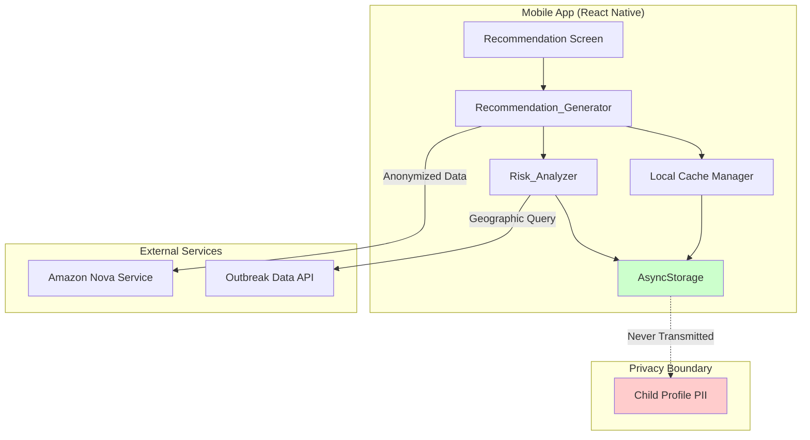
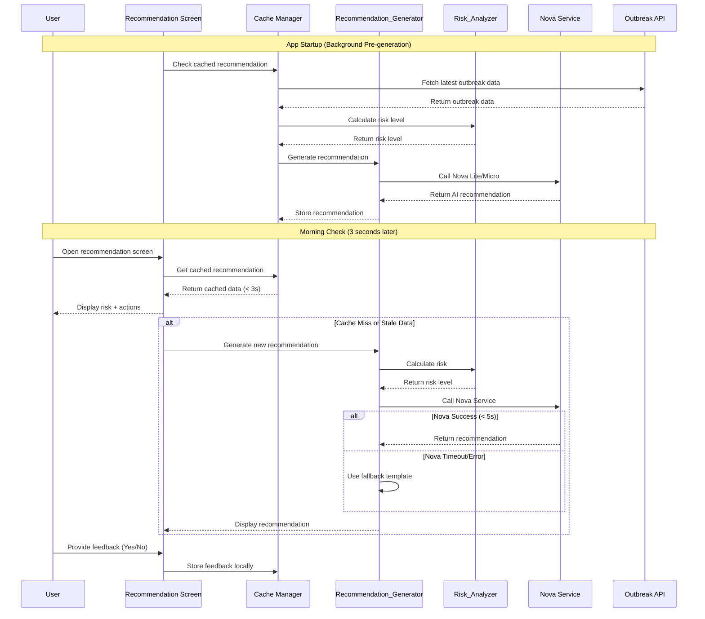
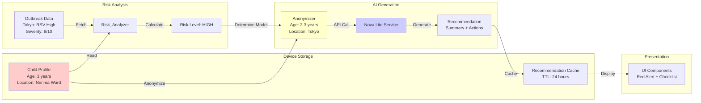
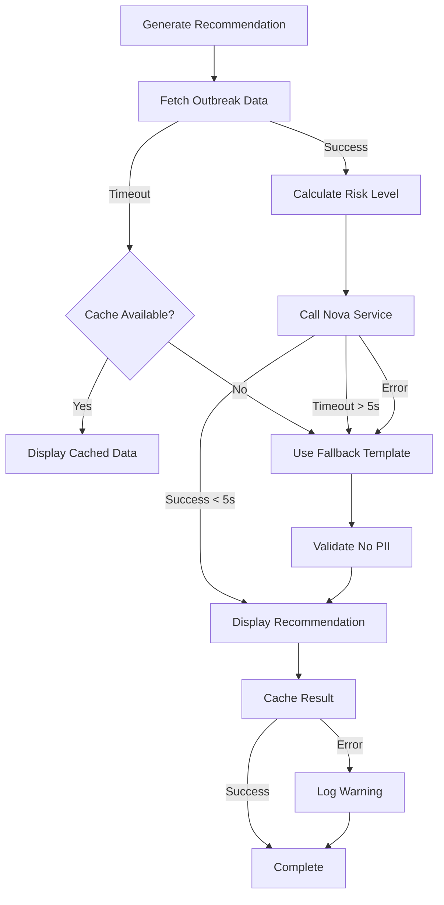

# Design Document: Nova AI Recommendations

## Overview

### Purpose

This feature integrates Amazon Nova Lite/Micro AI models to provide personalized infectious disease risk assessments and actionable recommendations for parents of young children. The system analyzes real-time outbreak data, child age, and geographic location to generate context-aware guidance that helps parents make informed decisions about childcare attendance and preventive measures during their morning routine.

### Key Design Goals

1. **Privacy-First Architecture**: All personally identifiable information (PII) remains on-device; only anonymized, aggregated data is transmitted to external services
2. **Performance Optimization**: Sub-3-second response time for cached recommendations to support busy morning routines
3. **Graceful Degradation**: Rule-based fallback system ensures functionality when AI services are unavailable
4. **Cultural Sensitivity**: Language-specific guidance that respects local childcare norms (e.g., Japanese 37.5°C fever threshold)
5. **Cost Efficiency**: Strategic use of Nova Micro (low-risk scenarios) vs Nova Lite (high-risk scenarios) to balance quality and cost

### High-Level Architecture

The system follows a layered architecture with clear separation between data collection, risk analysis, AI generation, and presentation:

```
┌─────────────────────────────────────────────────────────────┐
│                      Presentation Layer                      │
│  ┌──────────────┐  ┌──────────────┐  ┌──────────────┐      │
│  │ Risk Display │  │ Action Items │  │ Feedback UI  │      │
│  └──────────────┘  └──────────────┘  └──────────────┘      │
└─────────────────────────────────────────────────────────────┘
                            │
┌─────────────────────────────────────────────────────────────┐
│                    Application Layer                         │
│  ┌──────────────────────────────────────────────────┐       │
│  │         Recommendation_Generator                  │       │
│  │  ┌────────────┐  ┌────────────┐  ┌────────────┐ │       │
│  │  │ Nova_Lite  │  │ Nova_Micro │  │  Fallback  │ │       │
│  │  │  Service   │  │  Service   │  │  Templates │ │       │
│  │  └────────────┘  └────────────┘  └────────────┘ │       │
│  └──────────────────────────────────────────────────┘       │
│  ┌──────────────────────────────────────────────────┐       │
│  │            Risk_Analyzer                          │       │
│  │  - Severity Evaluation                            │       │
│  │  - Geographic Proximity Calculation               │       │
│  │  - Age-Based Risk Adjustment                      │       │
│  └──────────────────────────────────────────────────┘       │
└─────────────────────────────────────────────────────────────┘
                            │
┌─────────────────────────────────────────────────────────────┐
│                       Data Layer                             │
│  ┌──────────────┐  ┌──────────────┐  ┌──────────────┐      │
│  │   Outbreak   │  │    Child     │  │ Recommendation│      │
│  │   Data API   │  │   Profile    │  │    Cache      │      │
│  │              │  │ (Local Only) │  │  (Local Only) │      │
│  └──────────────┘  └──────────────┘  └──────────────┘      │
└─────────────────────────────────────────────────────────────┘
```

### Privacy Boundaries

The system maintains strict privacy boundaries with different granularity for local computation vs external transmission:

- **Local-Only Data**: Child profile (exact age, name, date of birth, address), conversation history, feedback data
- **Local Computation**: Risk_Analyzer uses ward/county level location data for accurate risk calculation
- **Anonymized Transmission to Nova**: Age range (0-1, 2-3, 4-6, 7+), geographic area (prefecture/state level only)
- **No PII Transmission**: Name, address, date of birth, ward/county, exact age never leave the device

## Architecture

### Component Diagram




### Sequence Diagram: Morning Routine Use Case



### Data Flow Diagram



## Components and Interfaces

### 1. Risk_Analyzer

**Responsibility**: Evaluates outbreak data and child profile to determine risk level (high, medium, low).

**Algorithm**:

```
function calculateRiskLevel(outbreakData, childProfile):
    // Step 1: Filter outbreaks by geographic proximity
    relevantOutbreaks = filterByGeography(outbreakData, childProfile.location)
    
    // Step 2: Apply age-based susceptibility weights
    weightedOutbreaks = applyAgeWeights(relevantOutbreaks, childProfile.ageRange)
    
    // Step 3: Determine risk level based on severity
    if hasHighSeverityOutbreak(weightedOutbreaks):
        return RiskLevel.HIGH
    else if hasMediumSeverityOutbreak(weightedOutbreaks):
        return RiskLevel.MEDIUM
    else:
        return RiskLevel.LOW
```


**Geographic Fallback Logic**:

When user location is more granular than available outbreak data:

1. **Exact Match**: User in "Nerima Ward, Tokyo" → Outbreak data for "Nerima Ward" → Use exact data
2. **Prefecture/State Fallback**: User in "Nerima Ward, Tokyo" → Outbreak data for "Tokyo" only → Use Tokyo-wide data with proximity adjustment
3. **National Fallback**: User in "Nerima Ward, Tokyo" → No Tokyo data → Use national data with significant risk reduction factor (0.5x)

**Age-Based Susceptibility Weights**:

- **0-1 years (Infants)**: 1.5x weight for respiratory diseases, 1.2x for gastrointestinal
- **2-3 years (Toddlers)**: 1.3x weight for hand-foot-mouth disease, 1.1x for flu
- **4-6 years (Preschool)**: 1.0x baseline weight
- **7+ years (School-age)**: 0.9x weight (stronger immune system)

**Severity Thresholds**:

- **High Risk**: Any outbreak with severity ≥ 7/10 within user's geographic unit
- **Medium Risk**: Any outbreak with severity 4-6/10 within user's geographic unit
- **Low Risk**: Only outbreaks with severity ≤ 3/10, or no outbreaks

**Interface**:

```typescript
interface RiskAnalyzer {
  calculateRiskLevel(
    outbreakData: OutbreakData[],
    childProfile: ChildProfile
  ): Promise<RiskLevel>;
}

enum RiskLevel {
  HIGH = 'high',
  MEDIUM = 'medium',
  LOW = 'low'
}

interface OutbreakData {
  diseaseId: string;
  diseaseName: string;
  severity: number; // 1-10 scale
  geographicUnit: GeographicUnit;
  affectedAgeRanges: AgeRange[];
  reportedCases: number;
  timestamp: Date;
}

interface GeographicUnit {
  country: string;
  stateOrPrefecture: string;
  countyOrWard?: string; // Used for local risk calculation, excluded from Nova transmission
}

interface ChildProfile {
  ageRange: AgeRange;
  location: GeographicUnit;
}

enum AgeRange {
  INFANT = '0-1',
  TODDLER = '2-3',
  PRESCHOOL = '4-6',
  SCHOOL_AGE = '7+'
}
```

### 2. Recommendation_Generator

**Responsibility**: Produces actionable guidance based on risk analysis, using Nova AI or fallback templates.

**Nova Model Selection Strategy**:

```
function selectNovaModel(riskLevel: RiskLevel): NovaModel {
  switch (riskLevel) {
    case RiskLevel.LOW:
      return NovaModel.MICRO; // Cost-efficient for simple guidance
    case RiskLevel.MEDIUM:
      return NovaModel.LITE; // Balanced quality/cost
    case RiskLevel.HIGH:
      return NovaModel.LITE; // Higher quality for critical guidance
  }
}
```

**System Prompt Design**:

```
You are a helpful childcare advisor providing infectious disease guidance to parents.

ROLE: Act as a knowledgeable but reassuring childcare professional.

TONE REQUIREMENTS:
- Use calm, supportive language
- Avoid alarmist phrases like "dangerous", "urgent", "emergency"
- Focus on actionable steps rather than fear
- Be specific and practical

LANGUAGE REQUIREMENTS:
- Japanese: Use polite form (です・ます調)
- English: Use declarative sentences

PROHIBITED:
- Medical diagnosis or treatment recommendations
- Statements like "your child has [disease]"
- Phrases suggesting diagnosis: "suspected of", "疑いがあります", "diagnosed with"
- Advice to avoid medical consultation

OUTPUT FORMAT:
{
  "summary": "2-3 sentence overview mentioning disease names and risk level",
  "actionItems": [
    "Specific action 1",
    "Specific action 2",
    "Specific action 3"
  ]
}

CONTEXT:
- Child age range: {ageRange}
- Geographic area: {prefecture/state}
- Current outbreaks: {diseaseNames}
- Risk level: {riskLevel}
```


**Fallback Template Design**:

When Nova service is unavailable, use rule-based templates that match AI tone:

```typescript
const FALLBACK_TEMPLATES = {
  HIGH_RISK_JAPANESE: {
    summary: "{diseaseNames}の流行が{area}で報告されています。お子様の健康状態を注意深く観察し、症状が見られる場合は登園を控えることをお勧めします。",
    actionItems: [
      "朝の検温を実施し、37.5℃以上または平熱より高い場合は登園を見合わせる",
      "咳、鼻水、下痢などの症状がないか確認する",
      "手洗いとアルコール消毒を徹底する",
      "保育園に現在の流行状況を確認する",
      "症状が見られる場合は、医療機関を受診し、必要に応じて登園許可証を取得する"
    ]
  },
  HIGH_RISK_ENGLISH: {
    summary: "Outbreaks of {diseaseNames} have been reported in {area}. Monitor your child's health closely and consider keeping them home if symptoms appear.",
    actionItems: [
      "Check temperature in the morning; stay home if above 99.5°F or higher than normal",
      "Watch for symptoms like cough, runny nose, or diarrhea",
      "Practice thorough handwashing and use hand sanitizer",
      "Contact daycare to confirm current outbreak status",
      "If symptoms appear, consult a healthcare provider and obtain medical clearance if required"
    ]
  },
  MEDIUM_RISK_JAPANESE: {
    summary: "{diseaseNames}の感染が{area}で増加傾向にあります。予防措置を講じながら、通常通りの登園が可能です。",
    actionItems: [
      "登園前に体調を確認する",
      "手洗いを丁寧に行う",
      "十分な睡眠と栄養を確保する"
    ]
  },
  MEDIUM_RISK_ENGLISH: {
    summary: "Cases of {diseaseNames} are increasing in {area}. Normal attendance is appropriate with preventive measures in place.",
    actionItems: [
      "Check your child's condition before daycare",
      "Practice thorough handwashing",
      "Ensure adequate sleep and nutrition"
    ]
  },
  LOW_RISK_JAPANESE: {
    summary: "現在、{area}では大きな感染症の流行は報告されていません。通常通りの登園で問題ありません。",
    actionItems: [
      "日常的な手洗いを継続する",
      "規則正しい生活リズムを維持する",
      "体調の変化があれば早めに対応する"
    ]
  },
  LOW_RISK_ENGLISH: {
    summary: "No major disease outbreaks are currently reported in {area}. Normal attendance is appropriate.",
    actionItems: [
      "Continue routine handwashing practices",
      "Maintain regular sleep and meal schedules",
      "Monitor for any changes in health"
    ]
  }
};

// Diseases requiring medical clearance certificate (登園許可証) in Japan
const DISEASES_REQUIRING_CLEARANCE_JP = [
  'インフルエンザ', 'RSウイルス感染症', '溶連菌感染症', 
  '水痘', '流行性耳下腺炎', '風疹', '麻疹', '百日咳'
];
```

**Interface**:

```typescript
interface RecommendationGenerator {
  generateRecommendation(
    riskLevel: RiskLevel,
    outbreakData: OutbreakData[],
    childProfile: ChildProfile,
    language: Language
  ): Promise<Recommendation>;
  
  validateSafety(recommendation: Recommendation): boolean;
}

interface Recommendation {
  summary: string;
  actionItems: string[];
  riskLevel: RiskLevel;
  diseaseNames: string[];
  requiresMedicalClearance?: boolean; // True if disease requires 登園許可証 in Japan
  generatedAt: Date;
  outbreakDataTimestamp: Date;
  source: 'nova-lite' | 'nova-micro' | 'fallback';
}

enum Language {
  JAPANESE = 'ja',
  ENGLISH = 'en'
}
```

**Safety Validation Implementation**:

```typescript
class RecommendationGenerator {
  private readonly DIAGNOSIS_PATTERNS = [
    /疑いがあります/,
    /suspected of/i,
    /diagnosed with/i,
    /has [a-z\s]+ disease/i,
    /お子様は.*です/,
    /your child has/i
  ];
  
  validateSafety(recommendation: Recommendation): boolean {
    const fullText = recommendation.summary + ' ' + recommendation.actionItems.join(' ');
    
    // Check for medical diagnosis phrases
    for (const pattern of this.DIAGNOSIS_PATTERNS) {
      if (pattern.test(fullText)) {
        console.error('Safety validation failed: Medical diagnosis phrase detected');
        return false;
      }
    }
    
    return true;
  }
  
  async generateRecommendation(
    riskLevel: RiskLevel,
    outbreakData: OutbreakData[],
    childProfile: ChildProfile,
    language: Language
  ): Promise<Recommendation> {
    let recommendation: Recommendation;
    
    try {
      // Generate recommendation via Nova or fallback
      recommendation = await this.generateInternal(riskLevel, outbreakData, childProfile, language);
      
      // Safety validation before returning
      if (!this.validateSafety(recommendation)) {
        // If validation fails, use safe fallback template
        recommendation = this.generateFallbackRecommendation(riskLevel, outbreakData, childProfile, language);
      }
      
      // Check if disease requires medical clearance certificate (Japan only)
      if (language === Language.JAPANESE) {
        recommendation.requiresMedicalClearance = this.checkMedicalClearanceRequired(outbreakData);
      }
      
      return recommendation;
    } catch (error) {
      console.error('Recommendation generation failed:', error);
      return this.generateFallbackRecommendation(riskLevel, outbreakData, childProfile, language);
    }
  }
  
  private checkMedicalClearanceRequired(outbreakData: OutbreakData[]): boolean {
    const diseaseNames = outbreakData.map(o => o.diseaseNameLocal);
    return diseaseNames.some(name => DISEASES_REQUIRING_CLEARANCE_JP.includes(name));
  }
}
```
```

### 3. Nova_Service

**Responsibility**: Wrapper for Amazon Nova Lite/Micro API calls with timeout handling and error recovery.

**Implementation Details**:

```typescript
class NovaService {
  private readonly TIMEOUT_MS = 5000;
  private readonly INTERMEDIATE_UI_THRESHOLD_MS = 3000;
  private readonly MAX_RETRY_ATTEMPTS = 1;
  
  async callNova(
    model: NovaModel,
    systemPrompt: string,
    userInput: string
  ): Promise<NovaResponse> {
    const controller = new AbortController();
    const timeoutId = setTimeout(() => controller.abort(), this.TIMEOUT_MS);
    
    try {
      const response = await fetch(NOVA_API_ENDPOINT, {
        method: 'POST',
        headers: {
          'Content-Type': 'application/json',
          'Authorization': `Bearer ${API_KEY}`
        },
        body: JSON.stringify({
          model: model,
          systemPrompt: this.enhanceSystemPromptForJSON(systemPrompt),
          userInput: userInput,
          temperature: 0.7,
          maxTokens: 500,
          // Enable JSON Mode if supported by Nova API
          responseFormat: { type: 'json_object' }
        }),
        signal: controller.signal
      });
      
      clearTimeout(timeoutId);
      const rawResponse = await response.text();
      
      // Parse with retry logic for malformed JSON
      return this.parseNovaResponse(rawResponse);
    } catch (error) {
      if (error.name === 'AbortError') {
        throw new NovaTimeoutError('Nova service timeout after 5s');
      }
      throw new NovaServiceError(`Nova service error: ${error.message}`);
    }
  }
  
  private enhanceSystemPromptForJSON(systemPrompt: string): string {
    return systemPrompt + '\n\nCRITICAL: Return ONLY valid JSON. No markdown code blocks, no explanations, no additional text. Just the JSON object.';
  }
  
  private parseNovaResponse(rawResponse: string): NovaResponse {
    // Strip markdown code blocks if present
    let cleaned = rawResponse.trim();
    if (cleaned.startsWith('```json')) {
      cleaned = cleaned.replace(/^```json\s*/, '').replace(/\s*```$/, '');
    } else if (cleaned.startsWith('```')) {
      cleaned = cleaned.replace(/^```\s*/, '').replace(/\s*```$/, '');
    }
    
    try {
      const parsed = JSON.parse(cleaned);
      
      // Validate required fields
      if (!parsed.summary || !Array.isArray(parsed.actionItems)) {
        throw new Error('Missing required fields: summary or actionItems');
      }
      
      return parsed as NovaResponse;
    } catch (error) {
      throw new NovaServiceError(`Failed to parse Nova response: ${error.message}`);
    }
  }
}
```

**Cold Start Mitigation**:

To handle Nova 2 Lite's potential 5-second latency:

1. **Background Pre-generation**: On app startup, immediately fetch outbreak data and generate recommendations in the background
2. **Intermediate UI**: If generation takes > 3 seconds, display:
   - Risk level (calculated locally by Risk_Analyzer)
   - Visual indicator (red/yellow/green)
   - Loading message: "Generating personalized guidance..."
3. **Progressive Enhancement**: Once Nova responds, replace loading message with full recommendations

**Interface**:

```typescript
interface NovaService {
  callNova(
    model: NovaModel,
    systemPrompt: string,
    userInput: string
  ): Promise<NovaResponse>;
}

enum NovaModel {
  LITE = 'amazon.nova-lite-v1',
  MICRO = 'amazon.nova-micro-v1'
}

interface NovaResponse {
  summary: string;
  actionItems: string[];
  model: NovaModel;
  latencyMs: number;
}
```


### 4. Cache_Manager

**Responsibility**: Manages recommendation caching with 24-hour TTL and staleness detection.

**Caching Strategy**:

```typescript
class CacheManager {
  private readonly CACHE_TTL_MS = 24 * 60 * 60 * 1000; // 24 hours
  
  async getCachedRecommendation(
    childProfile: ChildProfile
  ): Promise<CachedRecommendation | null> {
    const cacheKey = this.generateCacheKey(childProfile);
    const cached = await AsyncStorage.getItem(cacheKey);
    
    if (!cached) return null;
    
    const data = JSON.parse(cached);
    const age = Date.now() - data.timestamp;
    
    return {
      recommendation: data.recommendation,
      isStale: age > this.CACHE_TTL_MS,
      age: age,
      outbreakDataTimestamp: data.outbreakDataTimestamp
    };
  }
  
  async setCachedRecommendation(
    childProfile: ChildProfile,
    recommendation: Recommendation,
    outbreakDataTimestamp: Date
  ): Promise<void> {
    const cacheKey = this.generateCacheKey(childProfile);
    const data = {
      recommendation,
      timestamp: Date.now(),
      outbreakDataTimestamp: outbreakDataTimestamp.getTime()
    };
    
    await AsyncStorage.setItem(cacheKey, JSON.stringify(data));
  }
  
  private generateCacheKey(childProfile: ChildProfile): string {
    // Cache key based on age range and prefecture/state only
    return `rec_${childProfile.ageRange}_${childProfile.location.stateOrPrefecture}`;
  }
}
```

**Cache Invalidation**:

- **Time-based**: Automatically invalidate after 24 hours
- **Data-based**: Invalidate when outbreak data timestamp changes
- **Age-based**: Invalidate when child's age range changes (especially 0→1 year transition)
- **Manual**: User can force refresh

**Age Range Change Detection**:

```typescript
class CacheManager {
  async checkAgeRangeChange(childProfile: ChildProfile): Promise<boolean> {
    const cacheKey = this.generateCacheKey(childProfile);
    const cached = await AsyncStorage.getItem(cacheKey);
    
    if (!cached) return false;
    
    const data = JSON.parse(cached);
    const cachedAgeRange = data.childAgeRange;
    
    // If age range changed, invalidate cache
    if (cachedAgeRange !== childProfile.ageRange) {
      await this.invalidateCache(childProfile);
      return true;
    }
    
    return false;
  }
  
  async setCachedRecommendation(
    childProfile: ChildProfile,
    recommendation: Recommendation,
    outbreakDataTimestamp: Date
  ): Promise<void> {
    const cacheKey = this.generateCacheKey(childProfile);
    const data = {
      recommendation,
      timestamp: Date.now(),
      outbreakDataTimestamp: outbreakDataTimestamp.getTime(),
      childAgeRange: childProfile.ageRange // Store age range for change detection
    };
    
    await AsyncStorage.setItem(cacheKey, JSON.stringify(data));
  }
}
```

**Optional Server-Side Caching** (Future Enhancement):

For cost optimization, implement server-side caching:

```
Cache Key: {prefecture/state}_{ageRange}_{outbreakDataHash}
TTL: 1 hour
Benefit: Multiple users in same area/age group share cached AI responses
```

**Interface**:

```typescript
interface CacheManager {
  getCachedRecommendation(
    childProfile: ChildProfile
  ): Promise<CachedRecommendation | null>;
  
  setCachedRecommendation(
    childProfile: ChildProfile,
    recommendation: Recommendation,
    outbreakDataTimestamp: Date
  ): Promise<void>;
  
  invalidateCache(childProfile: ChildProfile): Promise<void>;
}

interface CachedRecommendation {
  recommendation: Recommendation;
  isStale: boolean;
  age: number; // milliseconds
  outbreakDataTimestamp: Date;
}
```

### 5. Feedback_Collector

**Responsibility**: Collects user feedback on recommendation usefulness for prompt improvement.

**Implementation**:

```typescript
class FeedbackCollector {
  private readonly MAX_FEEDBACK_ITEMS = 100;
  private readonly FEEDBACK_RETENTION_DAYS = 30;
  
  async saveFeedback(
    recommendationId: string,
    helpful: boolean,
    reason?: string
  ): Promise<void> {
    const feedback: FeedbackData = {
      id: generateUUID(),
      recommendationId,
      helpful,
      reason,
      timestamp: Date.now(),
      // Anonymized context
      riskLevel: this.currentRiskLevel,
      ageRange: this.currentAgeRange,
      language: this.currentLanguage
    };
    
    await this.appendToLocalStorage(feedback);
    
    // Optional: Send to server if user opted in
    if (await this.hasUserConsent()) {
      await this.sendAnonymizedFeedback(feedback);
    }
  }
  
  private async appendToLocalStorage(feedback: FeedbackData): Promise<void> {
    const key = 'feedback_data';
    const existing = await AsyncStorage.getItem(key);
    const feedbackList: FeedbackData[] = existing ? JSON.parse(existing) : [];
    
    // Add new feedback
    feedbackList.push(feedback);
    
    // Prune old feedback (> 30 days or > 100 items)
    const cutoffTime = Date.now() - (this.FEEDBACK_RETENTION_DAYS * 24 * 60 * 60 * 1000);
    const pruned = feedbackList
      .filter(f => f.timestamp > cutoffTime)
      .slice(-this.MAX_FEEDBACK_ITEMS);
    
    await AsyncStorage.setItem(key, JSON.stringify(pruned));
  }
}
```

**Interface**:

```typescript
interface FeedbackCollector {
  saveFeedback(
    recommendationId: string,
    helpful: boolean,
    reason?: string
  ): Promise<void>;
  
  hasUserConsent(): Promise<boolean>;
  requestConsent(): Promise<boolean>;
}

interface FeedbackData {
  id: string;
  recommendationId: string;
  helpful: boolean;
  reason?: string;
  timestamp: number;
  riskLevel: RiskLevel;
  ageRange: AgeRange;
  language: Language;
}
```

## Data Models

### Child_Profile

```typescript
interface ChildProfile {
  // Stored locally only
  id: string;
  name: string; // Never transmitted
  dateOfBirth: Date; // Never transmitted
  exactAge: number; // Never transmitted
  
  // Transmitted in anonymized form
  ageRange: AgeRange; // Transmitted as range
  location: GeographicUnit; // Transmitted as prefecture/state only
  
  createdAt: Date;
  updatedAt: Date;
}
```

### Outbreak_Data

```typescript
interface OutbreakData {
  id: string;
  diseaseId: string;
  diseaseName: string;
  diseaseNameLocal: string; // Localized name
  
  severity: number; // 1-10 scale
  severityTrend: 'increasing' | 'stable' | 'decreasing';
  
  geographicUnit: GeographicUnit;
  affectedAgeRanges: AgeRange[];
  
  reportedCases: number;
  casesPerCapita: number;
  
  symptoms: string[];
  transmissionMode: 'airborne' | 'contact' | 'foodborne' | 'vector';
  
  reportedAt: Date;
  dataSource: string;
}
```

### Recommendation

```typescript
interface Recommendation {
  id: string;
  
  summary: string;
  actionItems: ActionItem[];
  
  riskLevel: RiskLevel;
  diseaseNames: string[];
  
  generatedAt: Date;
  outbreakDataTimestamp: Date;
  
  source: 'nova-lite' | 'nova-micro' | 'fallback';
  modelLatencyMs?: number;
  
  childAgeRange: AgeRange;
  geographicArea: string; // Prefecture/state level
  language: Language;
}

interface ActionItem {
  id: string;
  text: string;
  category: 'hygiene' | 'monitoring' | 'attendance' | 'nutrition' | 'other';
  priority: number; // 1-5, 1 being highest
}
```

### Feedback_Data

```typescript
interface FeedbackData {
  id: string;
  recommendationId: string;
  
  helpful: boolean;
  reason?: 'too-vague' | 'not-relevant' | 'too-alarming' | 'other';
  
  timestamp: number;
  
  // Anonymized context (no PII)
  riskLevel: RiskLevel;
  ageRange: AgeRange;
  language: Language;
  source: 'nova-lite' | 'nova-micro' | 'fallback';
}
```

## API Specifications

### Nova_Service API

**Request**:

```typescript
interface NovaRequest {
  model: 'amazon.nova-lite-v1' | 'amazon.nova-micro-v1';
  systemPrompt: string;
  userInput: string;
  temperature: number; // 0.7 recommended
  maxTokens: number; // 500 recommended
}
```

**Response**:

```typescript
interface NovaResponse {
  summary: string;
  actionItems: string[];
  model: string;
  latencyMs: number;
}
```

**Error Handling**:

```typescript
class NovaTimeoutError extends Error {
  constructor(message: string) {
    super(message);
    this.name = 'NovaTimeoutError';
  }
}

class NovaServiceError extends Error {
  constructor(message: string) {
    super(message);
    this.name = 'NovaServiceError';
  }
}
```


### Outbreak Data API

**Endpoint**: `GET /api/v1/outbreaks`

**Query Parameters**:

```typescript
interface OutbreakQueryParams {
  country: string;
  stateOrPrefecture: string;
  countyOrWard?: string;
  startDate?: string; // ISO 8601
  endDate?: string; // ISO 8601
}
```

**Response**:

```typescript
interface OutbreakAPIResponse {
  data: OutbreakData[];
  metadata: {
    lastUpdated: Date;
    dataSource: string;
    coverage: 'national' | 'regional' | 'local';
  };
}
```

### Internal Component Interfaces

**Risk_Analyzer → Recommendation_Generator**:

```typescript
interface RiskAnalysisResult {
  riskLevel: RiskLevel;
  relevantOutbreaks: OutbreakData[];
  primaryDiseases: string[];
  riskFactors: string[];
}
```

**Recommendation_Generator → Cache_Manager**:

```typescript
interface CacheableRecommendation {
  recommendation: Recommendation;
  outbreakDataTimestamp: Date;
  cacheKey: string;
}
```

## Correctness Properties

*A property is a characteristic or behavior that should hold true across all valid executions of a system—essentially, a formal statement about what the system should do. Properties serve as the bridge between human-readable specifications and machine-verifiable correctness guarantees.*

### Property Reflection

Before defining properties, I analyzed the acceptance criteria to eliminate redundancy:

**Redundancies Identified**:

1. **Risk Calculation Properties (1.6, 1.7, 1.8)**: These three properties test specific severity scenarios. They can be combined into a single comprehensive property that validates the severity-to-risk-level mapping.

2. **Age-Specific Guidance Properties (2.1, 2.2, 2.3, 2.4)**: These four properties test the same behavior (age-appropriate content) for different age ranges. They can be combined into one property that validates age-appropriate guidance across all age ranges.

3. **Language Output Properties (8.1, 8.2)**: These test the same behavior (language matching) for different languages. They can be combined into one property.

4. **Risk-Specific Guidance Properties (4.1, 4.2, 4.3, 4.4)**: These test that different risk levels produce appropriate guidance. They can be combined into a single property that validates risk-appropriate content.

5. **Privacy Properties (5.2, 5.3, 5.6, 5.7)**: These all test data transmission restrictions. They can be combined into a comprehensive privacy property.

**Properties Retained**:

After reflection, the following properties provide unique validation value and will be implemented:

### Property 1: Risk Level Calculation Performance

*For any* outbreak data and child profile, the Risk_Analyzer SHALL calculate and return a risk level within 3 seconds.

**Validates: Requirements 1.1**

### Property 2: Risk Level Output Constraint

*For any* outbreak data and child profile, the Risk_Analyzer SHALL return exactly one of three risk levels: high, medium, or low.

**Validates: Requirements 1.5**

### Property 3: Severity-Based Risk Classification

*For any* outbreak data and child profile, the Risk_Analyzer SHALL return high risk when high-severity outbreaks (≥7/10) exist, medium risk when only medium-severity outbreaks (4-6/10) exist, and low risk when only low-severity outbreaks (≤3/10) exist or no outbreaks exist.

**Validates: Requirements 1.6, 1.7, 1.8, 1.9**

### Property 4: Age Range Influence on Risk

*For any* two identical outbreak scenarios with different child age ranges, the Risk_Analyzer SHALL produce different risk calculations when the age ranges have different susceptibility weights.

**Validates: Requirements 1.2**

### Property 5: Geographic Proximity Influence on Risk

*For any* two scenarios with identical outbreak data but different geographic proximities, the Risk_Analyzer SHALL produce higher risk for closer proximity.

**Validates: Requirements 1.3**

### Property 6: Disease Severity Influence on Risk

*For any* two scenarios with identical parameters except disease severity, the Risk_Analyzer SHALL produce higher risk for higher severity levels.

**Validates: Requirements 1.4**

### Property 7: Age-Appropriate Guidance Generation

*For any* child age range (0-1, 2-3, 4-6, 7+), the Recommendation_Generator SHALL include age-appropriate guidance keywords specific to that age range in the generated recommendations.

**Validates: Requirements 2.1, 2.2, 2.3, 2.4**

### Property 8: Action Item Count Constraint

*For any* generated recommendation, the Recommendation_Generator SHALL produce between 3 and 5 action items (inclusive).

**Validates: Requirements 2.5**

### Property 9: Action-Oriented Language

*For any* generated recommendation, the Recommendation_Generator SHALL use action verbs and SHALL NOT include fear-based terms like "dangerous", "emergency", or "urgent".

**Validates: Requirements 2.6**

### Property 10: Recommendation Generation Performance

*For any* risk level and outbreak data, the Recommendation_Generator SHALL complete generation within 5 seconds.

**Validates: Requirements 2.7**

### Property 11: Structured Output Format

*For any* Nova_Service call, the response SHALL contain both a summary field and an actionItems array field.

**Validates: Requirements 3.2**

### Property 12: Non-Alarmist Tone

*For any* Nova_Service generated recommendation, the text SHALL NOT contain alarmist language such as "panic", "crisis", "deadly", or "severe danger".

**Validates: Requirements 3.4**

### Property 13: Medical Diagnosis Prohibition

*For any* Nova_Service generated recommendation, the text SHALL NOT contain medical diagnosis phrases such as "your child has", "diagnosed with", or "treatment for".

**Validates: Requirements 3.5**

### Property 14: Disease Name Inclusion

*For any* Nova_Service call with outbreak data containing disease names, the generated summary SHALL include at least one disease name from the input data.

**Validates: Requirements 3.6**

### Property 15: Language Output Matching

*For any* user language setting (Japanese or English), the Recommendation_Generator SHALL produce output text in the specified language.

**Validates: Requirements 3.7, 8.1, 8.2**

### Property 16: Japanese Polite Form

*For any* recommendation generated in Japanese, the text SHALL use polite form markers (です, ます) and SHALL NOT use casual form.

**Validates: Requirements 8.3**

### Property 17: Risk-Appropriate Guidance Content

*For any* generated recommendation, when risk level is high, the output SHALL include monitoring guidance and symptom information; when risk level is medium, the output SHALL include preventive measures; when risk level is low, the output SHALL indicate normal attendance is appropriate.

**Validates: Requirements 4.1, 4.2, 4.3, 4.4**

### Property 18: Cached Recommendation Performance

*For any* cached recommendation, the system SHALL display it within 3 seconds of request.

**Validates: Requirements 4.5**

### Property 19: Privacy Data Transmission Restriction

*For any* Nova_Service API call and cache key generation, the request SHALL NOT contain child exact age, name, address, date of birth, or location more granular than prefecture/state level (ward/county must be excluded).

**Validates: Requirements 5.2, 5.3, 5.5, 5.6, 5.7**

### Property 20: Fallback on Service Failure

*For any* Nova_Service timeout (>5 seconds) or error response, the system SHALL return a fallback recommendation with the same risk level as would be calculated by Risk_Analyzer.

**Validates: Requirements 7.1, 7.2, 7.5**

### Property 21: Non-Alarming Error Messages

*For any* error condition, the system SHALL NOT display error messages containing alarming terms like "failed", "error", "broken", or "unavailable" to the user.

**Validates: Requirements 7.4**

### Property 22: Low Risk Display Performance

*For any* low risk scenario, the system SHALL display the summary within 10 seconds.

**Validates: Requirements 9.1**

### Property 23: Cache Invalidation on Data Change

*For any* cached recommendation, when outbreak data timestamp changes, the system SHALL generate a new recommendation rather than using the cached version.

**Validates: Requirements 9.6**

### Property 24: Behaviorally Specific Actions

*For any* generated action item, the text SHALL contain specific behaviors (verbs + objects) and SHALL NOT contain vague terms like "be careful", "stay safe", or "be cautious".

**Validates: Requirements 10.1, 10.2**

### Property 25: High Risk Content Requirements

*For any* high risk recommendation, the action items SHALL include at least one hygiene-related action and at least one monitoring-related action.

**Validates: Requirements 10.3, 10.4**

### Property 26: Feedback Data Privacy

*For any* feedback data, the stored or transmitted data SHALL NOT contain personally identifiable information such as child name, exact age, address, or date of birth.

**Validates: Requirements 12.6**


## Error Handling

### Error Categories

**1. Nova Service Errors**

| Error Type | Cause | Handling Strategy |
|------------|-------|-------------------|
| NovaTimeoutError | Response time > 5s | Use fallback template |
| NovaServiceError | API error response | Use fallback template |
| NovaAuthError | Invalid credentials | Log error, use fallback |
| NovaRateLimitError | Rate limit exceeded | Exponential backoff, then fallback |

**2. Outbreak Data Errors**

| Error Type | Cause | Handling Strategy |
|------------|-------|-------------------|
| OutbreakAPITimeout | API timeout | Use cached data if available |
| OutbreakDataNotFound | No data for region | Fallback to broader region |
| OutbreakDataStale | Data > 48 hours old | Display staleness warning |

**3. Cache Errors**

| Error Type | Cause | Handling Strategy |
|------------|-------|-------------------|
| CacheReadError | AsyncStorage failure | Generate fresh recommendation |
| CacheWriteError | Storage full | Log warning, continue operation |

**4. Privacy Validation Errors**

| Error Type | Cause | Handling Strategy |
|------------|-------|-------------------|
| PIIDetectedError | PII in API payload | Block transmission, log error |
| LocationTooGranularError | Location more detailed than allowed | Anonymize to prefecture/state |

### Error Handling Flow



### User-Facing Error Messages

All error messages follow non-alarmist tone:

```typescript
const USER_ERROR_MESSAGES = {
  GENERAL_ERROR: {
    ja: "現在、推奨事項を生成しています。しばらくお待ちください。",
    en: "Generating recommendations. Please wait a moment."
  },
  STALE_DATA: {
    ja: "表示されている情報は{hours}時間前のものです。",
    en: "This information is {hours} hours old."
  },
  NO_OUTBREAK_DATA: {
    ja: "現在、お住まいの地域の感染症情報を取得できません。一般的な予防措置を継続してください。",
    en: "Unable to retrieve outbreak data for your area. Continue general preventive measures."
  }
};
```

### Logging Strategy

**Log Levels**:

- **ERROR**: Service failures, API errors, privacy violations
- **WARN**: Cache failures, stale data, fallback usage
- **INFO**: Successful operations, cache hits
- **DEBUG**: Performance metrics, API latency

**Log Format**:

```typescript
interface LogEntry {
  timestamp: Date;
  level: 'ERROR' | 'WARN' | 'INFO' | 'DEBUG';
  component: string;
  message: string;
  metadata?: {
    riskLevel?: RiskLevel;
    ageRange?: AgeRange;
    latencyMs?: number;
    errorCode?: string;
  };
}
```

**Privacy in Logs**:

- Never log PII (names, exact ages, addresses)
- Log only anonymized data (age ranges, prefecture/state)
- Sanitize error messages before logging

## Testing Strategy

### Dual Testing Approach

This feature requires both unit tests and property-based tests for comprehensive coverage:

**Unit Tests**: Focus on specific examples, edge cases, and integration points
- Specific outbreak scenarios (e.g., "RSV outbreak in Tokyo with severity 8")
- Edge cases (empty outbreak data, missing fields)
- Error conditions (API timeouts, invalid responses)
- UI component rendering
- Cache hit/miss scenarios

**Property-Based Tests**: Verify universal properties across all inputs
- Risk calculation correctness across random outbreak data
- Language output consistency across random inputs
- Privacy guarantees across all API calls
- Performance requirements across varied scenarios

**Coverage Target**: 60% or higher overall, 80% for critical paths (Risk_Analyzer, privacy validation)

### Property-Based Testing Configuration

**Library**: Use `fast-check` for TypeScript/React Native

**Configuration**:
```typescript
import fc from 'fast-check';

// Minimum 100 iterations per property test
const PBT_CONFIG = {
  numRuns: 100,
  timeout: 10000, // 10 seconds per test
  verbose: true
};
```

**Test Tagging**: Each property test must reference its design document property:

```typescript
describe('Risk_Analyzer Properties', () => {
  it('Property 1: Risk Level Calculation Performance - Feature: nova-ai-recommendations', async () => {
    await fc.assert(
      fc.asyncProperty(
        outbreakDataArbitrary(),
        childProfileArbitrary(),
        async (outbreakData, childProfile) => {
          const startTime = Date.now();
          const riskLevel = await riskAnalyzer.calculateRiskLevel(
            outbreakData,
            childProfile
          );
          const duration = Date.now() - startTime;
          
          expect(duration).toBeLessThan(3000);
          expect(riskLevel).toBeDefined();
        }
      ),
      PBT_CONFIG
    );
  });
});
```

### Test Generators (Arbitraries)

**Outbreak Data Generator**:

```typescript
function outbreakDataArbitrary(): fc.Arbitrary<OutbreakData[]> {
  return fc.array(
    fc.record({
      diseaseId: fc.uuid(),
      diseaseName: fc.constantFrom('RSV', 'Influenza', 'Hand-Foot-Mouth', 'Norovirus'),
      severity: fc.integer({ min: 1, max: 10 }),
      geographicUnit: geographicUnitArbitrary(),
      affectedAgeRanges: fc.array(ageRangeArbitrary(), { minLength: 1 }),
      reportedCases: fc.integer({ min: 1, max: 10000 }),
      timestamp: fc.date()
    }),
    { maxLength: 10 }
  );
}
```

**Child Profile Generator**:

```typescript
function childProfileArbitrary(): fc.Arbitrary<ChildProfile> {
  return fc.record({
    ageRange: ageRangeArbitrary(),
    location: geographicUnitArbitrary()
  });
}

function ageRangeArbitrary(): fc.Arbitrary<AgeRange> {
  return fc.constantFrom(
    AgeRange.INFANT,
    AgeRange.TODDLER,
    AgeRange.PRESCHOOL,
    AgeRange.SCHOOL_AGE
  );
}
```

### Unit Test Examples

**Risk Analyzer Tests**:

```typescript
describe('Risk_Analyzer', () => {
  it('should return HIGH risk for high-severity outbreak in user area', async () => {
    const outbreakData = [{
      diseaseId: 'rsv-001',
      diseaseName: 'RSV',
      severity: 8,
      geographicUnit: { country: 'JP', stateOrPrefecture: 'Tokyo', countyOrWard: 'Nerima' },
      affectedAgeRanges: [AgeRange.INFANT],
      reportedCases: 150,
      timestamp: new Date()
    }];
    
    const childProfile = {
      ageRange: AgeRange.INFANT,
      location: { country: 'JP', stateOrPrefecture: 'Tokyo', countyOrWard: 'Nerima' }
    };
    
    const riskLevel = await riskAnalyzer.calculateRiskLevel(outbreakData, childProfile);
    expect(riskLevel).toBe(RiskLevel.HIGH);
  });
  
  it('should return LOW risk when no outbreaks exist', async () => {
    const outbreakData = [];
    const childProfile = {
      ageRange: AgeRange.TODDLER,
      location: { country: 'JP', stateOrPrefecture: 'Tokyo' }
    };
    
    const riskLevel = await riskAnalyzer.calculateRiskLevel(outbreakData, childProfile);
    expect(riskLevel).toBe(RiskLevel.LOW);
  });
});
```

**Privacy Validation Tests**:

```typescript
describe('Privacy Validation', () => {
  it('should not transmit child exact age to Nova Service', async () => {
    const mockFetch = jest.fn();
    global.fetch = mockFetch;
    
    const childProfile = {
      name: 'Test Child',
      dateOfBirth: new Date('2021-05-15'),
      exactAge: 3.5,
      ageRange: AgeRange.TODDLER,
      location: { country: 'JP', stateOrPrefecture: 'Tokyo', countyOrWard: 'Nerima' }
    };
    
    await recommendationGenerator.generateRecommendation(
      RiskLevel.MEDIUM,
      [],
      childProfile,
      Language.JAPANESE
    );
    
    const apiCall = mockFetch.mock.calls[0][1].body;
    expect(apiCall).not.toContain('3.5');
    expect(apiCall).not.toContain('Test Child');
    expect(apiCall).not.toContain('Nerima');
    expect(apiCall).toContain('2-3');
    expect(apiCall).toContain('Tokyo');
  });
});
```

### Integration Tests

**End-to-End Recommendation Flow**:

```typescript
describe('Recommendation Flow Integration', () => {
  it('should generate and cache recommendation on app startup', async () => {
    // Mock outbreak API
    mockOutbreakAPI.mockResolvedValue([
      { diseaseName: 'RSV', severity: 7, /* ... */ }
    ]);
    
    // Trigger app startup
    await app.initialize();
    
    // Wait for background generation
    await waitFor(() => {
      expect(cacheManager.getCachedRecommendation).toHaveBeenCalled();
    });
    
    // Verify cache contains recommendation
    const cached = await cacheManager.getCachedRecommendation(testProfile);
    expect(cached).toBeDefined();
    expect(cached.recommendation.riskLevel).toBe(RiskLevel.HIGH);
  });
});
```

### Performance Tests

```typescript
describe('Performance Requirements', () => {
  it('should display cached recommendation within 3 seconds', async () => {
    // Pre-populate cache
    await cacheManager.setCachedRecommendation(testProfile, testRecommendation, new Date());
    
    const startTime = Date.now();
    render(<RecommendationScreen />);
    
    await waitFor(() => {
      expect(screen.getByText(/RSV/)).toBeInTheDocument();
    });
    
    const duration = Date.now() - startTime;
    expect(duration).toBeLessThan(3000);
  });
});
```

## Security & Privacy

### Data Anonymization Implementation

**Anonymization Pipeline**:

```typescript
class DataAnonymizer {
  anonymizeForNovaService(childProfile: ChildProfile): AnonymizedProfile {
    return {
      ageRange: childProfile.ageRange, // Already anonymized
      geographicArea: this.anonymizeLocation(childProfile.location)
    };
  }
  
  private anonymizeLocation(location: GeographicUnit): string {
    // Only transmit prefecture/state level
    return `${location.stateOrPrefecture}, ${location.country}`;
  }
  
  validateNoPII(payload: any): boolean {
    // Check for PII in the entire payload
    const generalPIIPatterns = [
      /\b\d{4}-\d{2}-\d{2}\b/, // Date of birth pattern
      /\b[A-Z][a-z]+ [A-Z][a-z]+\b/, // Name pattern (English)
      /\b\d{1,2}(\.\d)? years old\b/, // Exact age pattern
      /\d{3}-?\d{4}/ // Postal code (Japanese/US format)
    ];
    
    const payloadString = JSON.stringify(payload);
    for (const pattern of generalPIIPatterns) {
      if (pattern.test(payloadString)) {
        return false;
      }
    }
    
    // Check for granular location only in location-related fields
    const locationFields = [
      payload.geographicArea,
      payload.location,
      payload.userInput
    ].filter(Boolean).join(' ');
    
    const granularLocationPatterns = [
      /ward|county|district/i, // Granular location (English)
      /[区郡](?![域圏])/, // Ward/county (Japanese) - exclude 区域/区圏/郡域/郡圏
      /[市町村](?!部)/ // City/town/village (Japanese) - exclude 市部/町部/村部
    ];
    
    for (const pattern of granularLocationPatterns) {
      if (pattern.test(locationFields)) {
        return false;
      }
    }
    
    return true;
  }
}
```

### Local Storage Security

**AsyncStorage Encryption** (Optional Enhancement):

```typescript
import * as SecureStore from 'expo-secure-store';

class SecureLocalStorage {
  async setItem(key: string, value: string): Promise<void> {
    await SecureStore.setItemAsync(key, value, {
      keychainAccessible: SecureStore.WHEN_UNLOCKED
    });
  }
  
  async getItem(key: string): Promise<string | null> {
    return await SecureStore.getItemAsync(key);
  }
}
```

### API Security

**Request Validation**:

```typescript
class NovaServiceClient {
  private validateRequest(request: NovaRequest): void {
    // Ensure no PII in request
    if (!this.anonymizer.validateNoPII(request)) {
      throw new PIIDetectedError('PII detected in Nova Service request');
    }
    
    // Ensure location is not too granular
    if (this.isLocationTooGranular(request.userInput)) {
      throw new LocationTooGranularError('Location more detailed than prefecture/state');
    }
  }
  
  private isLocationTooGranular(input: string): boolean {
    const granularPatterns = [
      /ward/i,
      /county/i,
      /district/i,
      /\d{3}-\d{4}/, // Postal code
      /\d+.*street/i
    ];
    
    return granularPatterns.some(pattern => pattern.test(input));
  }
}
```

### Consent Management

**Feedback Transmission Consent**:

```typescript
class ConsentManager {
  async requestFeedbackConsent(): Promise<boolean> {
    const consent = await this.showConsentDialog({
      title: 'Help Improve Recommendations',
      message: 'May we collect anonymized feedback to improve our recommendations? No personal information will be shared.',
      options: ['Yes, help improve', 'No thanks']
    });
    
    await AsyncStorage.setItem('feedback_consent', consent.toString());
    return consent;
  }
  
  async hasConsent(): Promise<boolean> {
    const consent = await AsyncStorage.getItem('feedback_consent');
    return consent === 'true';
  }
}
```

## Performance Optimization

### Background Pre-generation Strategy

**App Startup Flow**:

```typescript
class AppInitializer {
  async initialize(): Promise<void> {
    // Start background tasks immediately
    const backgroundTasks = [
      this.prefetchOutbreakData(),
      this.pregenerateRecommendations()
    ];
    
    // Don't block UI rendering
    Promise.all(backgroundTasks).catch(error => {
      console.warn('Background task failed:', error);
    });
    
    // Continue with UI initialization
    await this.initializeUI();
  }
  
  private async pregenerateRecommendations(): Promise<void> {
    const childProfile = await this.getChildProfile();
    if (!childProfile) return;
    
    const outbreakData = await this.outbreakAPI.fetch(childProfile.location);
    const riskLevel = await this.riskAnalyzer.calculateRiskLevel(
      outbreakData,
      childProfile
    );
    
    const recommendation = await this.recommendationGenerator.generateRecommendation(
      riskLevel,
      outbreakData,
      childProfile,
      this.getUserLanguage()
    );
    
    await this.cacheManager.setCachedRecommendation(
      childProfile,
      recommendation,
      new Date()
    );
  }
}
```

### Intermediate UI for Slow Responses

**Progressive Loading**:

```typescript
class RecommendationScreen extends React.Component {
  state = {
    riskLevel: null,
    recommendation: null,
    loading: true
  };
  
  async componentDidMount() {
    // Step 1: Show risk level immediately (< 3s)
    const riskLevel = await this.riskAnalyzer.calculateRiskLevel(
      this.props.outbreakData,
      this.props.childProfile
    );
    
    this.setState({ riskLevel, loading: true });
    
    // Step 2: Generate full recommendation (may take up to 5s)
    const recommendation = await this.recommendationGenerator.generateRecommendation(
      riskLevel,
      this.props.outbreakData,
      this.props.childProfile,
      this.props.language
    );
    
    this.setState({ recommendation, loading: false });
  }
  
  render() {
    if (this.state.riskLevel && this.state.loading) {
      return (
        <View>
          <RiskIndicator level={this.state.riskLevel} />
          <LoadingMessage>Generating personalized guidance...</LoadingMessage>
        </View>
      );
    }
    
    return (
      <View>
        <RiskIndicator level={this.state.riskLevel} />
        <RecommendationContent recommendation={this.state.recommendation} />
      </View>
    );
  }
}
```

### Nova Lite/Micro Cost Optimization

**Model Selection Logic**:

```typescript
class ModelSelector {
  selectModel(riskLevel: RiskLevel, outbreakComplexity: number): NovaModel {
    // Use Micro for simple, low-risk scenarios
    if (riskLevel === RiskLevel.LOW && outbreakComplexity < 3) {
      return NovaModel.MICRO;
    }
    
    // Use Lite for complex or high-risk scenarios
    return NovaModel.LITE;
  }
  
  private calculateOutbreakComplexity(outbreakData: OutbreakData[]): number {
    // Complexity based on number of diseases and severity variance
    const diseaseCount = new Set(outbreakData.map(o => o.diseaseId)).size;
    const severityVariance = this.calculateVariance(
      outbreakData.map(o => o.severity)
    );
    
    return diseaseCount + (severityVariance > 2 ? 1 : 0);
  }
}
```

**Cost Tracking**:

```typescript
interface CostMetrics {
  novaLiteCalls: number;
  novaMicroCalls: number;
  fallbackUsage: number;
  estimatedCost: number;
}

class CostTracker {
  private readonly LITE_COST_PER_CALL = 0.0006; // Example pricing
  private readonly MICRO_COST_PER_CALL = 0.00015;
  
  async trackCall(model: NovaModel): Promise<void> {
    const metrics = await this.getMetrics();
    
    if (model === NovaModel.LITE) {
      metrics.novaLiteCalls++;
      metrics.estimatedCost += this.LITE_COST_PER_CALL;
    } else if (model === NovaModel.MICRO) {
      metrics.novaMicroCalls++;
      metrics.estimatedCost += this.MICRO_COST_PER_CALL;
    }
    
    await this.saveMetrics(metrics);
  }
}
```

---

## Appendix

### Cultural Considerations

**Japanese Childcare Norms**:

- 37.5°C (99.5°F) fever threshold for daycare attendance
- Emphasis on group harmony and not spreading illness
- Preference for conservative health decisions
- Respect for medical authority

**US Childcare Norms**:

- 100.4°F (38°C) fever threshold common
- Emphasis on individual decision-making
- Balance between work obligations and child health
- Direct communication style

### Disease Reference Data

**Common Childhood Diseases**:

| Disease | Peak Season | Age Susceptibility | Severity Range |
|---------|-------------|-------------------|----------------|
| RSV | Winter | 0-2 years (high) | 6-9/10 |
| Influenza | Winter | All ages | 5-8/10 |
| Hand-Foot-Mouth | Summer | 2-5 years (high) | 3-5/10 |
| Norovirus | Winter | All ages | 6-8/10 |
| Rotavirus | Winter/Spring | 0-3 years (high) | 5-7/10 |

### Observability & Metrics

**SRE Perspective**: To ensure system reliability and optimize AI utilization, collect the following metrics:

**1. AI Utilization Metrics**:

```typescript
interface AIUtilizationMetrics {
  totalRequests: number;
  novaLiteUsage: number;
  novaMicroUsage: number;
  fallbackUsage: number;
  aiAvailabilityRate: number; // (novaLite + novaMicro) / totalRequests
}
```

**2. Latency Histogram**:

Track Nova response time distribution to validate 3s/5s thresholds:

```typescript
interface LatencyMetrics {
  p50: number; // Median latency
  p95: number; // 95th percentile
  p99: number; // 99th percentile
  under3s: number; // Count of responses < 3s
  under5s: number; // Count of responses < 5s
  over5s: number; // Count of timeouts
}
```

**3. Feedback Ratio by Risk Level**:

```typescript
interface FeedbackMetrics {
  highRisk: { helpful: number; notHelpful: number };
  mediumRisk: { helpful: number; notHelpful: number };
  lowRisk: { helpful: number; notHelpful: number };
}
```

**Metrics Collection**:

```typescript
class MetricsCollector {
  private readonly MAX_METRICS_ITEMS = 1000;
  private readonly METRICS_RETENTION_DAYS = 7;
  
  async recordRecommendationGeneration(
    source: 'nova-lite' | 'nova-micro' | 'fallback',
    latencyMs: number,
    riskLevel: RiskLevel
  ): Promise<void> {
    const metrics = await this.getMetrics();
    
    metrics.totalRequests++;
    if (source === 'nova-lite') metrics.novaLiteUsage++;
    if (source === 'nova-micro') metrics.novaMicroUsage++;
    if (source === 'fallback') metrics.fallbackUsage++;
    
    metrics.latencyHistogram.push({
      timestamp: Date.now(),
      latencyMs,
      riskLevel
    });
    
    // Prune old metrics (> 7 days or > 1000 items)
    const cutoffTime = Date.now() - (this.METRICS_RETENTION_DAYS * 24 * 60 * 60 * 1000);
    metrics.latencyHistogram = metrics.latencyHistogram
      .filter(m => m.timestamp > cutoffTime)
      .slice(-this.MAX_METRICS_ITEMS);
    
    await this.saveMetrics(metrics);
  }
}
```

**Metrics Dashboard** (Future Enhancement):

Display metrics in app settings for debugging:
- AI availability rate (target: >95%)
- Average latency (target: <3s for cached, <5s for new)
- Feedback satisfaction rate by risk level
- Cache hit rate (target: >80% during morning hours)

### Geographic Normalization

**Challenge**: User input "東京都練馬区" vs outbreak data "練馬区" or "Tokyo" creates matching issues.

**Solution**: Normalize geographic units to standard codes before Risk_Analyzer processing:

```typescript
class GeographicNormalizer {
  normalize(userInput: string): GeographicUnit {
    // Try exact match with JIS code map
    const exact = this.JIS_CODE_MAP[userInput];
    if (exact) {
      return {
        country: 'JP',
        stateOrPrefecture: exact.prefecture,
        countyOrWard: exact.ward,
        jisCode: exact.jisCode
      };
    }
    
    // Fallback to fuzzy matching
    return this.fuzzyMatch(userInput);
  }
}
```

**Updated GeographicUnit Interface**:

```typescript
interface GeographicUnit {
  country: string;
  stateOrPrefecture: string;
  countyOrWard?: string; // Used for local risk calculation, excluded from Nova transmission
  jisCode?: string; // JIS municipality code for precise matching (Japan only)
  fipsCode?: string; // FIPS code for US counties
}
```

**Benefits**:
- Eliminates matching ambiguity in Property 5 (Geographic Proximity)
- Enables precise outbreak data filtering
- Supports future multi-region expansion

### Future Enhancements

1. **Server-Side Caching**: Implement shared cache for users in same area/age group
2. **Predictive Pre-generation**: Generate recommendations before user opens app based on usage patterns
3. **Multi-Child Support**: Handle multiple children with different age ranges
4. **Symptom Checker Integration**: Allow parents to input symptoms for more personalized guidance
5. **Push Notifications**: Alert users when risk level changes significantly
6. **Historical Tracking**: Show risk level trends over time
7. **Feedback Loop**: Use collected feedback to fine-tune system prompts automatically

---

**Document Version**: 1.0  
**Last Updated**: 2024  
**Authors**: Kiro AI Agent  
**Status**: Ready for Review
