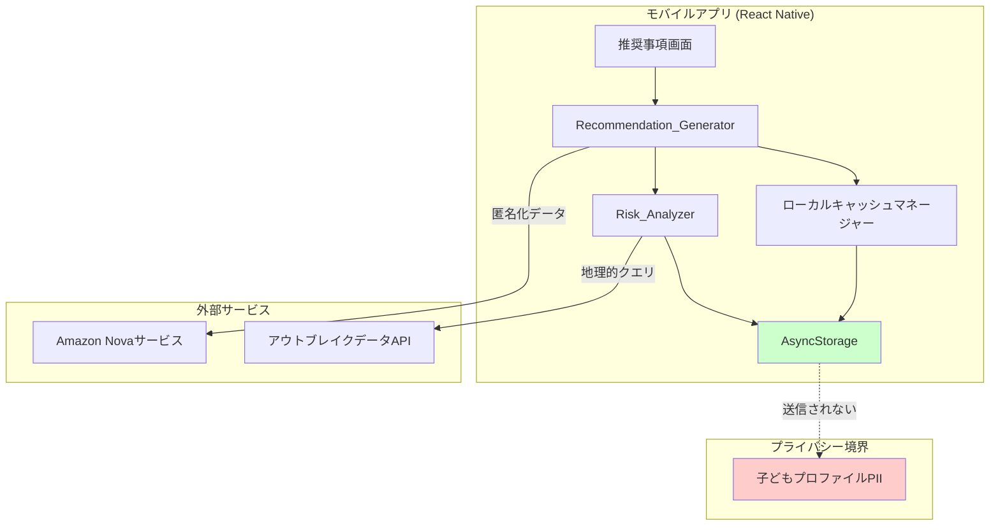
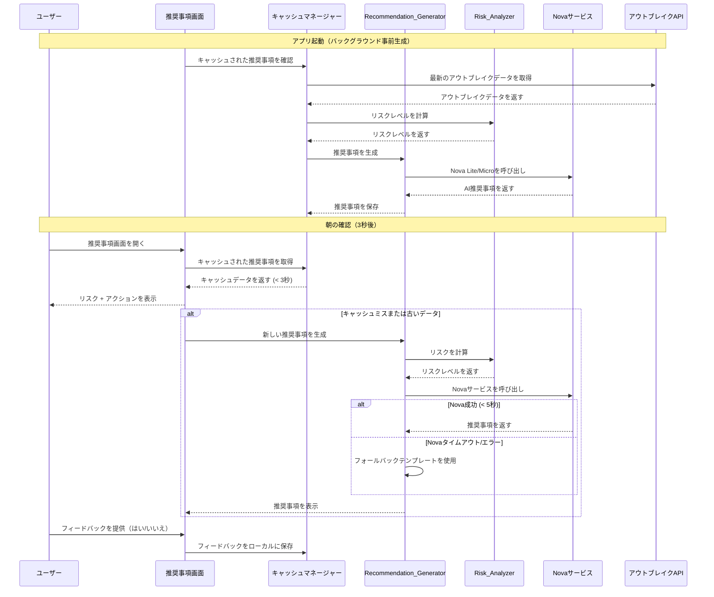
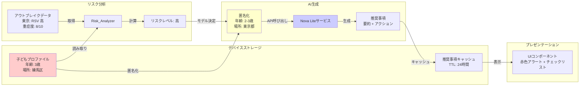

# 設計書: Nova AI レコメンデーション

## 概要

### 目的

本機能は、Amazon Nova Lite/Micro AIモデルを統合し、幼い子どもを持つ保護者に対して、パーソナライズされた感染症リスク評価と実行可能な推奨事項を提供します。システムは、リアルタイムのアウトブレイクデータ、子どもの年齢、地理的位置を分析し、保護者が朝のルーティン中に保育園への登園や予防措置について情報に基づいた判断を下せるよう、状況に応じたガイダンスを生成します。

### 主要な設計目標

1. **プライバシー優先アーキテクチャ**: すべての個人識別情報(PII)はデバイス上に保持され、外部サービスには匿名化された集約データのみが送信される
2. **パフォーマンス最適化**: 忙しい朝のルーティンをサポートするため、キャッシュされた推奨事項の応答時間を3秒未満に
3. **グレースフルデグラデーション**: AIサービスが利用できない場合でも機能を保証するルールベースのフォールバックシステム
4. **文化的配慮**: 地域の保育規範を尊重した言語固有のガイダンス（例: 日本の37.5℃発熱基準）
5. **コスト効率**: Nova Micro（低リスクシナリオ）とNova Lite（高リスクシナリオ）の戦略的使用により、品質とコストのバランスを実現

### ハイレベルアーキテクチャ

システムは、データ収集、リスク分析、AI生成、プレゼンテーションの間で明確に分離されたレイヤードアーキテクチャに従います:

```
┌─────────────────────────────────────────────────────────────┐
│                    プレゼンテーション層                        │
│  ┌──────────────┐  ┌──────────────┐  ┌──────────────┐      │
│  │ リスク表示   │  │ アクション項目│  │フィードバックUI│     │
│  └──────────────┘  └──────────────┘  └──────────────┘      │
└─────────────────────────────────────────────────────────────┘
                            │
┌─────────────────────────────────────────────────────────────┐
│                    アプリケーション層                          │
│  ┌──────────────────────────────────────────────────┐       │
│  │         Recommendation_Generator                  │       │
│  │  ┌────────────┐  ┌────────────┐  ┌────────────┐ │       │
│  │  │ Nova_Lite  │  │ Nova_Micro │  │フォールバック│ │       │
│  │  │  サービス  │  │  サービス  │  │テンプレート  │ │       │
│  │  └────────────┘  └────────────┘  └────────────┘ │       │
│  └──────────────────────────────────────────────────┘       │
│  ┌──────────────────────────────────────────────────┐       │
│  │            Risk_Analyzer                          │       │
│  │  - 重症度評価                                      │       │
│  │  - 地理的近接性計算                                │       │
│  │  - 年齢ベースのリスク調整                          │       │
│  └──────────────────────────────────────────────────┘       │
└─────────────────────────────────────────────────────────────┘
                            │
┌─────────────────────────────────────────────────────────────┐
│                       データ層                                │
│  ┌──────────────┐  ┌──────────────┐  ┌──────────────┐      │
│  │ アウトブレイク│  │    子ども    │  │  推奨事項    │      │
│  │  データAPI   │  │  プロファイル │  │  キャッシュ  │      │
│  │              │  │(ローカルのみ) │  │(ローカルのみ) │      │
│  └──────────────┘  └──────────────┘  └──────────────┘      │
└─────────────────────────────────────────────────────────────┘
```

### プライバシー境界

システムは、ローカル計算と外部送信で異なる粒度を持つ厳格なプライバシー境界を維持します:

- **ローカルのみのデータ**: 子どもプロファイル（正確な年齢、名前、生年月日、住所）、会話履歴、フィードバックデータ
- **ローカル計算**: Risk_Analyzerは正確なリスク計算のために区/郡レベルの位置情報を使用
- **Novaへの匿名化送信**: 年齢範囲（0-1、2-3、4-6、7+）、地理的エリア（都道府県/州レベルのみ）
- **PII送信なし**: 名前、住所、生年月日、区/郡、正確な年齢はデバイスから送信されない

## アーキテクチャ

### コンポーネント図



### シーケンス図: 朝のルーティンユースケース



### データフロー図



## コンポーネントとインターフェース

### 1. Risk_Analyzer

**責務**: アウトブレイクデータと子どもプロファイルを評価し、リスクレベル（高、中、低）を判定します。

**アルゴリズム**:

```
function calculateRiskLevel(outbreakData, childProfile):
    // ステップ1: 地理的近接性でアウトブレイクをフィルタリング
    relevantOutbreaks = filterByGeography(outbreakData, childProfile.location)
    
    // ステップ2: 年齢ベースの感受性重みを適用
    weightedOutbreaks = applyAgeWeights(relevantOutbreaks, childProfile.ageRange)
    
    // ステップ3: 重症度に基づいてリスクレベルを決定
    if hasHighSeverityOutbreak(weightedOutbreaks):
        return RiskLevel.HIGH
    else if hasMediumSeverityOutbreak(weightedOutbreaks):
        return RiskLevel.MEDIUM
    else:
        return RiskLevel.LOW
```

**地理的フォールバックロジック**:

ユーザーの位置情報が利用可能なアウトブレイクデータよりも詳細な場合:

1. **完全一致**: ユーザーが「東京都練馬区」→ 「練馬区」のアウトブレイクデータ → 正確なデータを使用
2. **都道府県/州フォールバック**: ユーザーが「東京都練馬区」→ 「東京都」のみのアウトブレイクデータ → 東京都全体のデータを近接性調整して使用
3. **全国フォールバック**: ユーザーが「東京都練馬区」→ 東京都のデータなし → 全国データを大幅なリスク低減係数（0.5倍）で使用

**年齢ベースの感受性重み**:

- **0-1歳（乳児）**: 呼吸器疾患に1.5倍、消化器疾患に1.2倍の重み
- **2-3歳（幼児）**: 手足口病に1.3倍、インフルエンザに1.1倍の重み
- **4-6歳（未就学児）**: 1.0倍のベースライン重み
- **7歳以上（学齢期）**: 0.9倍の重み（免疫系が強い）

**重症度閾値**:

- **高リスク**: ユーザーの地理的単位内で重症度≥7/10のアウトブレイク
- **中リスク**: ユーザーの地理的単位内で重症度4-6/10のアウトブレイク
- **低リスク**: 重症度≤3/10のアウトブレイクのみ、またはアウトブレイクなし

**インターフェース**:

```typescript
interface RiskAnalyzer {
  calculateRiskLevel(
    outbreakData: OutbreakData[],
    childProfile: ChildProfile
  ): Promise<RiskLevel>;
}

enum RiskLevel {
  HIGH = 'high',
  MEDIUM = 'medium',
  LOW = 'low'
}

interface OutbreakData {
  diseaseId: string;
  diseaseName: string;
  severity: number; // 1-10スケール
  geographicUnit: GeographicUnit;
  affectedAgeRanges: AgeRange[];
  reportedCases: number;
  timestamp: Date;
}

interface GeographicUnit {
  country: string;
  stateOrPrefecture: string;
  countyOrWard?: string; // ローカルリスク計算で使用、Nova送信では除外
}

interface ChildProfile {
  ageRange: AgeRange;
  location: GeographicUnit;
}

enum AgeRange {
  INFANT = '0-1',
  TODDLER = '2-3',
  PRESCHOOL = '4-6',
  SCHOOL_AGE = '7+'
}
```

### 2. Recommendation_Generator

**責務**: リスク分析に基づいて、Nova AIまたはフォールバックテンプレートを使用して実行可能なガイダンスを生成します。

**Novaモデル選択戦略**:

```
function selectNovaModel(riskLevel: RiskLevel): NovaModel {
  switch (riskLevel) {
    case RiskLevel.LOW:
      return NovaModel.MICRO; // シンプルなガイダンスにコスト効率的
    case RiskLevel.MEDIUM:
      return NovaModel.LITE; // 品質とコストのバランス
    case RiskLevel.HIGH:
      return NovaModel.LITE; // 重要なガイダンスに高品質
  }
}
```

**システムプロンプト設計**:

```
あなたは保護者に感染症ガイダンスを提供する親切な保育アドバイザーです。

役割: 知識豊富で安心感を与える保育専門家として振る舞ってください。

トーン要件:
- 穏やかで支援的な言葉を使用する
- 「危険」「緊急」「非常事態」などの不安を煽る表現を避ける
- 恐怖ではなく実行可能なステップに焦点を当てる
- 具体的で実用的であること

言語要件:
- 日本語: 敬体（です・ます調）を使用
- 英語: 平叙文を使用

禁止事項:
- 医療診断や治療の推奨
- 「お子様は[疾病]です」のような表現
- 診断を示唆するフレーズ: 「疑いがあります」、「suspected of」、「diagnosed with」
- 医療相談を避けるアドバイス

出力形式:
{
  "summary": "疾病名とリスクレベルに言及した2-3文の概要",
  "actionItems": [
    "具体的なアクション1",
    "具体的なアクション2",
    "具体的なアクション3"
  ]
}

コンテキスト:
- 子どもの年齢範囲: {ageRange}
- 地理的エリア: {prefecture/state}
- 現在のアウトブレイク: {diseaseNames}
- リスクレベル: {riskLevel}
```


**フォールバックテンプレート設計**:

Novaサービスが利用できない場合、AIのトーンに合わせたルールベースのテンプレートを使用します:

```typescript
const FALLBACK_TEMPLATES = {
  HIGH_RISK_JAPANESE: {
    summary: "{diseaseNames}の流行が{area}で報告されています。お子様の健康状態を注意深く観察し、症状が見られる場合は登園を控えることをお勧めします。",
    actionItems: [
      "朝の検温を実施し、37.5℃以上または平熱より高い場合は登園を見合わせる",
      "咳、鼻水、下痢などの症状がないか確認する",
      "手洗いとアルコール消毒を徹底する",
      "保育園に現在の流行状況を確認する",
      "症状が見られる場合は、医療機関を受診し、必要に応じて登園許可証を取得する"
    ]
  },
  HIGH_RISK_ENGLISH: {
    summary: "Outbreaks of {diseaseNames} have been reported in {area}. Monitor your child's health closely and consider keeping them home if symptoms appear.",
    actionItems: [
      "Check temperature in the morning; stay home if above 99.5°F or higher than normal",
      "Watch for symptoms like cough, runny nose, or diarrhea",
      "Practice thorough handwashing and use hand sanitizer",
      "Contact daycare to confirm current outbreak status",
      "If symptoms appear, consult a healthcare provider and obtain medical clearance if required"
    ]
  },
  MEDIUM_RISK_JAPANESE: {
    summary: "{diseaseNames}の感染が{area}で増加傾向にあります。予防措置を講じながら、通常通りの登園が可能です。",
    actionItems: [
      "登園前に体調を確認する",
      "手洗いを丁寧に行う",
      "十分な睡眠と栄養を確保する"
    ]
  },
  MEDIUM_RISK_ENGLISH: {
    summary: "Cases of {diseaseNames} are increasing in {area}. Normal attendance is appropriate with preventive measures in place.",
    actionItems: [
      "Check your child's condition before daycare",
      "Practice thorough handwashing",
      "Ensure adequate sleep and nutrition"
    ]
  },
  LOW_RISK_JAPANESE: {
    summary: "現在、{area}では大きな感染症の流行は報告されていません。通常通りの登園で問題ありません。",
    actionItems: [
      "日常的な手洗いを継続する",
      "規則正しい生活リズムを維持する",
      "体調の変化があれば早めに対応する"
    ]
  },
  LOW_RISK_ENGLISH: {
    summary: "No major disease outbreaks are currently reported in {area}. Normal attendance is appropriate.",
    actionItems: [
      "Continue routine handwashing practices",
      "Maintain regular sleep and meal schedules",
      "Monitor for any changes in health"
    ]
  }
};

// 日本で登園許可証が必要な疾病
const DISEASES_REQUIRING_CLEARANCE_JP = [
  'インフルエンザ', 'RSウイルス感染症', '溶連菌感染症', 
  '水痘', '流行性耳下腺炎', '風疹', '麻疹', '百日咳'
];
```

**インターフェース**:

```typescript
interface RecommendationGenerator {
  generateRecommendation(
    riskLevel: RiskLevel,
    outbreakData: OutbreakData[],
    childProfile: ChildProfile,
    language: Language
  ): Promise<Recommendation>;
  
  validateSafety(recommendation: Recommendation): boolean;
}

interface Recommendation {
  summary: string;
  actionItems: string[];
  riskLevel: RiskLevel;
  diseaseNames: string[];
  requiresMedicalClearance?: boolean; // 日本で登園許可証が必要な場合はtrue
  generatedAt: Date;
  outbreakDataTimestamp: Date;
  source: 'nova-lite' | 'nova-micro' | 'fallback';
}

enum Language {
  JAPANESE = 'ja',
  ENGLISH = 'en'
}
```

**安全性検証の実装**:

```typescript
class RecommendationGenerator {
  private readonly DIAGNOSIS_PATTERNS = [
    /疑いがあります/,
    /suspected of/i,
    /diagnosed with/i,
    /has [a-z\s]+ disease/i,
    /お子様は.*です/,
    /your child has/i
  ];
  
  validateSafety(recommendation: Recommendation): boolean {
    const fullText = recommendation.summary + ' ' + recommendation.actionItems.join(' ');
    
    // 医療診断フレーズをチェック
    for (const pattern of this.DIAGNOSIS_PATTERNS) {
      if (pattern.test(fullText)) {
        console.error('安全性検証失敗: 医療診断フレーズが検出されました');
        return false;
      }
    }
    
    return true;
  }
  
  async generateRecommendation(
    riskLevel: RiskLevel,
    outbreakData: OutbreakData[],
    childProfile: ChildProfile,
    language: Language
  ): Promise<Recommendation> {
    let recommendation: Recommendation;
    
    try {
      // NovaまたはフォールバックでRecommendationを生成
      recommendation = await this.generateInternal(riskLevel, outbreakData, childProfile, language);
      
      // 返す前に安全性検証
      if (!this.validateSafety(recommendation)) {
        // 検証失敗の場合、安全なフォールバックテンプレートを使用
        recommendation = this.generateFallbackRecommendation(riskLevel, outbreakData, childProfile, language);
      }
      
      // 疾病が登園許可証を必要とするかチェック（日本のみ）
      if (language === Language.JAPANESE) {
        recommendation.requiresMedicalClearance = this.checkMedicalClearanceRequired(outbreakData);
      }
      
      return recommendation;
    } catch (error) {
      console.error('推奨事項生成失敗:', error);
      return this.generateFallbackRecommendation(riskLevel, outbreakData, childProfile, language);
    }
  }
  
  private checkMedicalClearanceRequired(outbreakData: OutbreakData[]): boolean {
    const diseaseNames = outbreakData.map(o => o.diseaseNameLocal);
    return diseaseNames.some(name => DISEASES_REQUIRING_CLEARANCE_JP.includes(name));
  }
}
```
```

### 3. Nova_Service

**責務**: タイムアウト処理とエラー回復を備えたAmazon Nova Lite/Micro API呼び出しのラッパー。

**実装詳細**:

```typescript
class NovaService {
  private readonly TIMEOUT_MS = 5000;
  private readonly INTERMEDIATE_UI_THRESHOLD_MS = 3000;
  private readonly MAX_RETRY_ATTEMPTS = 1;
  
  async callNova(
    model: NovaModel,
    systemPrompt: string,
    userInput: string
  ): Promise<NovaResponse> {
    const controller = new AbortController();
    const timeoutId = setTimeout(() => controller.abort(), this.TIMEOUT_MS);
    
    try {
      const response = await fetch(NOVA_API_ENDPOINT, {
        method: 'POST',
        headers: {
          'Content-Type': 'application/json',
          'Authorization': `Bearer ${API_KEY}`
        },
        body: JSON.stringify({
          model: model,
          systemPrompt: this.enhanceSystemPromptForJSON(systemPrompt),
          userInput: userInput,
          temperature: 0.7,
          maxTokens: 500,
          // Nova APIがサポートしている場合はJSON Modeを有効化
          responseFormat: { type: 'json_object' }
        }),
        signal: controller.signal
      });
      
      clearTimeout(timeoutId);
      const rawResponse = await response.text();
      
      // 不正なJSON用のリトライロジックで解析
      return this.parseNovaResponse(rawResponse);
    } catch (error) {
      if (error.name === 'AbortError') {
        throw new NovaTimeoutError('Novaサービスが5秒後にタイムアウトしました');
      }
      throw new NovaServiceError(`Novaサービスエラー: ${error.message}`);
    }
  }
  
  private enhanceSystemPromptForJSON(systemPrompt: string): string {
    return systemPrompt + '\n\n重要: 有効なJSONのみを返してください。Markdownコードブロック、説明、追加テキストは不要です。JSONオブジェクトのみを返してください。';
  }
  
  private parseNovaResponse(rawResponse: string): NovaResponse {
    // Markdownコードブロックがある場合は削除
    let cleaned = rawResponse.trim();
    if (cleaned.startsWith('```json')) {
      cleaned = cleaned.replace(/^```json\s*/, '').replace(/\s*```$/, '');
    } else if (cleaned.startsWith('```')) {
      cleaned = cleaned.replace(/^```\s*/, '').replace(/\s*```$/, '');
    }
    
    try {
      const parsed = JSON.parse(cleaned);
      
      // 必須フィールドを検証
      if (!parsed.summary || !Array.isArray(parsed.actionItems)) {
        throw new Error('必須フィールドが不足: summary または actionItems');
      }
      
      return parsed as NovaResponse;
    } catch (error) {
      throw new NovaServiceError(`Nova応答の解析に失敗: ${error.message}`);
    }
  }
}
```

**コールドスタート緩和策**:

Nova 2 Liteの潜在的な5秒のレイテンシに対処するため:

1. **バックグラウンド事前生成**: アプリ起動時に、すぐにアウトブレイクデータを取得し、バックグラウンドで推奨事項を生成
2. **中間UI**: 生成に3秒以上かかる場合、以下を表示:
   - リスクレベル（Risk_Analyzerによってローカルで計算）
   - 視覚的インジケーター（赤/黄/緑）
   - ローディングメッセージ: 「パーソナライズされたガイダンスを生成中...」
3. **プログレッシブエンハンスメント**: Novaが応答したら、ローディングメッセージを完全な推奨事項に置き換え

**インターフェース**:

```typescript
interface NovaService {
  callNova(
    model: NovaModel,
    systemPrompt: string,
    userInput: string
  ): Promise<NovaResponse>;
}

enum NovaModel {
  LITE = 'amazon.nova-lite-v1',
  MICRO = 'amazon.nova-micro-v1'
}

interface NovaResponse {
  summary: string;
  actionItems: string[];
  model: NovaModel;
  latencyMs: number;
}
```

### 4. Cache_Manager

**責務**: 24時間TTLと古さ検出を備えた推奨事項キャッシュを管理します。

**キャッシング戦略**:

```typescript
class CacheManager {
  private readonly CACHE_TTL_MS = 24 * 60 * 60 * 1000; // 24時間
  
  async getCachedRecommendation(
    childProfile: ChildProfile
  ): Promise<CachedRecommendation | null> {
    const cacheKey = this.generateCacheKey(childProfile);
    const cached = await AsyncStorage.getItem(cacheKey);
    
    if (!cached) return null;
    
    const data = JSON.parse(cached);
    const age = Date.now() - data.timestamp;
    
    return {
      recommendation: data.recommendation,
      isStale: age > this.CACHE_TTL_MS,
      age: age,
      outbreakDataTimestamp: data.outbreakDataTimestamp
    };
  }
  
  private generateCacheKey(childProfile: ChildProfile): string {
    // 年齢範囲と都道府県/州のみに基づくキャッシュキー
    return `rec_${childProfile.ageRange}_${childProfile.location.stateOrPrefecture}`;
  }
}
```

**キャッシュ無効化**:

- **時間ベース**: 24時間後に自動的に無効化
- **データベース**: アウトブレイクデータのタイムスタンプが変更されたときに無効化
- **年齢ベース**: 子どもの年齢範囲が変更されたときに無効化（特に0→1歳の移行時）
- **手動**: ユーザーが強制更新可能

**年齢範囲変更検出**:

```typescript
class CacheManager {
  async checkAgeRangeChange(childProfile: ChildProfile): Promise<boolean> {
    const cacheKey = this.generateCacheKey(childProfile);
    const cached = await AsyncStorage.getItem(cacheKey);
    
    if (!cached) return false;
    
    const data = JSON.parse(cached);
    const cachedAgeRange = data.childAgeRange;
    
    // 年齢範囲が変更された場合、キャッシュを無効化
    if (cachedAgeRange !== childProfile.ageRange) {
      await this.invalidateCache(childProfile);
      return true;
    }
    
    return false;
  }
  
  async setCachedRecommendation(
    childProfile: ChildProfile,
    recommendation: Recommendation,
    outbreakDataTimestamp: Date
  ): Promise<void> {
    const cacheKey = this.generateCacheKey(childProfile);
    const data = {
      recommendation,
      timestamp: Date.now(),
      outbreakDataTimestamp: outbreakDataTimestamp.getTime(),
      childAgeRange: childProfile.ageRange // 変更検出のために年齢範囲を保存
    };
    
    await AsyncStorage.setItem(cacheKey, JSON.stringify(data));
  }
}
```

**オプションのサーバーサイドキャッシング**（将来の拡張）:

コスト最適化のため、サーバーサイドキャッシングを実装:

```
キャッシュキー: {都道府県/州}_{年齢範囲}_{アウトブレイクデータハッシュ}
TTL: 1時間
メリット: 同じエリア/年齢グループの複数ユーザーがキャッシュされたAI応答を共有
```

### 5. Feedback_Collector

**責務**: プロンプト改善のために推奨事項の有用性に関するユーザーフィードバックを収集します。

**実装**:

```typescript
class FeedbackCollector {
  private readonly MAX_FEEDBACK_ITEMS = 100;
  private readonly FEEDBACK_RETENTION_DAYS = 30;
  
  async saveFeedback(
    recommendationId: string,
    helpful: boolean,
    reason?: string
  ): Promise<void> {
    const feedback: FeedbackData = {
      id: generateUUID(),
      recommendationId,
      helpful,
      reason,
      timestamp: Date.now(),
      // 匿名化されたコンテキスト
      riskLevel: this.currentRiskLevel,
      ageRange: this.currentAgeRange,
      language: this.currentLanguage
    };
    
    await this.appendToLocalStorage(feedback);
    
    // オプション: ユーザーがオプトインした場合、サーバーに送信
    if (await this.hasUserConsent()) {
      await this.sendAnonymizedFeedback(feedback);
    }
  }
}
```

## データモデル

### Child_Profile

```typescript
interface ChildProfile {
  // ローカルにのみ保存
  id: string;
  name: string; // 送信されない
  dateOfBirth: Date; // 送信されない
  exactAge: number; // 送信されない
  
  // 匿名化された形式で送信
  ageRange: AgeRange; // 範囲として送信
  location: GeographicUnit; // 都道府県/州レベルのみ送信
  
  createdAt: Date;
  updatedAt: Date;
}
```

### Outbreak_Data

```typescript
interface OutbreakData {
  id: string;
  diseaseId: string;
  diseaseName: string;
  diseaseNameLocal: string; // ローカライズされた名前
  
  severity: number; // 1-10スケール
  severityTrend: 'increasing' | 'stable' | 'decreasing';
  
  geographicUnit: GeographicUnit;
  affectedAgeRanges: AgeRange[];
  
  reportedCases: number;
  casesPerCapita: number;
  
  symptoms: string[];
  transmissionMode: 'airborne' | 'contact' | 'foodborne' | 'vector';
  
  reportedAt: Date;
  dataSource: string;
}
```

### Recommendation

```typescript
interface Recommendation {
  id: string;
  
  summary: string;
  actionItems: ActionItem[];
  
  riskLevel: RiskLevel;
  diseaseNames: string[];
  
  generatedAt: Date;
  outbreakDataTimestamp: Date;
  
  source: 'nova-lite' | 'nova-micro' | 'fallback';
  modelLatencyMs?: number;
  
  childAgeRange: AgeRange;
  geographicArea: string; // 都道府県/州レベル
  language: Language;
}

interface ActionItem {
  id: string;
  text: string;
  category: 'hygiene' | 'monitoring' | 'attendance' | 'nutrition' | 'other';
  priority: number; // 1-5、1が最高優先度
}
```


## 正確性プロパティ

*プロパティとは、システムのすべての有効な実行において真であるべき特性または動作です。本質的には、システムが何をすべきかについての形式的な記述です。プロパティは、人間が読める仕様と機械で検証可能な正確性保証との橋渡しとなります。*

### プロパティリフレクション

プロパティを定義する前に、受入基準を分析して冗長性を排除しました:

**特定された冗長性**:

1. **リスク計算プロパティ（1.6、1.7、1.8）**: これら3つのプロパティは特定の重症度シナリオをテストします。重症度からリスクレベルへのマッピングを検証する単一の包括的なプロパティに統合できます。

2. **年齢固有のガイダンスプロパティ（2.1、2.2、2.3、2.4）**: これら4つのプロパティは、異なる年齢範囲に対して同じ動作（年齢に適したコンテンツ）をテストします。すべての年齢範囲にわたって年齢に適したガイダンスを検証する1つのプロパティに統合できます。

3. **言語出力プロパティ（8.1、8.2）**: これらは異なる言語に対して同じ動作（言語マッチング）をテストします。1つのプロパティに統合できます。

4. **リスク固有のガイダンスプロパティ（4.1、4.2、4.3、4.4）**: これらは異なるリスクレベルが適切なガイダンスを生成することをテストします。リスクに適したコンテンツを検証する単一のプロパティに統合できます。

5. **プライバシープロパティ（5.2、5.3、5.6、5.7）**: これらはすべてデータ送信制限をテストします。包括的なプライバシープロパティに統合できます。

### プロパティ1: リスクレベル計算パフォーマンス

*任意の*アウトブレイクデータと子どもプロファイルに対して、Risk_Analyzerは3秒以内にリスクレベルを計算して返さなければなりません。

**検証: 要件1.1**

### プロパティ2: リスクレベル出力制約

*任意の*アウトブレイクデータと子どもプロファイルに対して、Risk_Analyzerは高、中、低の3つのリスクレベルのうち正確に1つを返さなければなりません。

**検証: 要件1.5**

### プロパティ3: 重症度ベースのリスク分類

*任意の*アウトブレイクデータと子どもプロファイルに対して、Risk_Analyzerは、高重症度アウトブレイク（≥7/10）が存在する場合は高リスクを、中重症度アウトブレイク（4-6/10）のみが存在する場合は中リスクを、低重症度アウトブレイク（≤3/10）のみが存在するかアウトブレイクが存在しない場合は低リスクを返さなければなりません。

**検証: 要件1.6、1.7、1.8、1.9**

### プロパティ4: 年齢範囲のリスクへの影響

*任意の*異なる子どもの年齢範囲を持つ2つの同一のアウトブレイクシナリオに対して、年齢範囲が異なる感受性重みを持つ場合、Risk_Analyzerは異なるリスク計算を生成しなければなりません。

**検証: 要件1.2**

### プロパティ5: 地理的近接性のリスクへの影響

*任意の*同一のアウトブレイクデータを持つが地理的近接性が異なる2つのシナリオに対して、Risk_Analyzerはより近い近接性に対してより高いリスクを生成しなければなりません。

**検証: 要件1.3**

### プロパティ6: 疾病重症度のリスクへの影響

*任意の*疾病重症度以外が同一のパラメータを持つ2つのシナリオに対して、Risk_Analyzerはより高い重症度レベルに対してより高いリスクを生成しなければなりません。

**検証: 要件1.4**

### プロパティ7: 年齢に適したガイダンス生成

*任意の*子どもの年齢範囲（0-1、2-3、4-6、7+）に対して、Recommendation_Generatorは生成された推奨事項にその年齢範囲に固有の年齢に適したガイダンスキーワードを含めなければなりません。

**検証: 要件2.1、2.2、2.3、2.4**

### プロパティ8: アクション項目数制約

*任意の*生成された推奨事項に対して、Recommendation_Generatorは3〜5個（両端を含む）のアクション項目を生成しなければなりません。

**検証: 要件2.5**

### プロパティ9: 行動指向の言葉

*任意の*生成された推奨事項に対して、Recommendation_Generatorは行動動詞を使用し、「危険」「緊急」「非常事態」などの恐怖ベースの用語を含めてはなりません。

**検証: 要件2.6**

### プロパティ10: 推奨事項生成パフォーマンス

*任意の*リスクレベルとアウトブレイクデータに対して、Recommendation_Generatorは5秒以内に生成を完了しなければなりません。

**検証: 要件2.7**

### プロパティ11: 構造化出力形式

*任意の*Nova_Service呼び出しに対して、応答はsummaryフィールドとactionItems配列フィールドの両方を含まなければなりません。

**検証: 要件3.2**

### プロパティ12: 不安を煽らないトーン

*任意の*Nova_Serviceが生成した推奨事項に対して、テキストは「パニック」「危機」「致命的」「深刻な危険」などの不安を煽る言葉を含んではなりません。

**検証: 要件3.4**

### プロパティ13: 医療診断の禁止

*任意の*Nova_Serviceが生成した推奨事項に対して、テキストは「お子様は〜です」「〜と診断されました」「〜の治療」などの医療診断フレーズを含んではなりません。

**検証: 要件3.5**

### プロパティ14: 疾病名の包含

*任意の*疾病名を含むアウトブレイクデータを持つNova_Service呼び出しに対して、生成された要約は入力データから少なくとも1つの疾病名を含まなければなりません。

**検証: 要件3.6**

### プロパティ15: 言語出力マッチング

*任意の*ユーザー言語設定（日本語または英語）に対して、Recommendation_Generatorは指定された言語で出力テキストを生成しなければなりません。

**検証: 要件3.7、8.1、8.2**

### プロパティ16: 日本語敬体

*任意の*日本語で生成された推奨事項に対して、テキストは敬体マーカー（です、ます）を使用し、常体を使用してはなりません。

**検証: 要件8.3**

### プロパティ17: リスクに適したガイダンスコンテンツ

*任意の*生成された推奨事項に対して、リスクレベルが高い場合、出力はモニタリングガイダンスと症状情報を含まなければならず、リスクレベルが中程度の場合、出力は予防措置を含まなければならず、リスクレベルが低い場合、出力は通常の登園が適切であることを示さなければなりません。

**検証: 要件4.1、4.2、4.3、4.4**

### プロパティ18: キャッシュされた推奨事項のパフォーマンス

*任意の*キャッシュされた推奨事項に対して、システムはリクエストから3秒以内にそれを表示しなければなりません。

**検証: 要件4.5**

### プロパティ19: プライバシーデータ送信制限

*任意の*Nova_Service API呼び出しとキャッシュキー生成に対して、リクエストは子どもの正確な年齢、名前、住所、生年月日、または都道府県/州レベルよりも詳細な位置情報（区/郡は除外する必要がある）を含んではなりません。

**検証: 要件5.2、5.3、5.5、5.6、5.7**

### プロパティ20: サービス障害時のフォールバック

*任意の*Nova_Serviceタイムアウト（>5秒）またはエラー応答に対して、システムはRisk_Analyzerによって計算されるのと同じリスクレベルを持つフォールバック推奨事項を返さなければなりません。

**検証: 要件7.1、7.2、7.5**

### プロパティ21: 不安を与えないエラーメッセージ

*任意の*エラー条件に対して、システムはユーザーに「失敗」「エラー」「故障」「利用不可」などの不安を与える用語を含むエラーメッセージを表示してはなりません。

**検証: 要件7.4**

### プロパティ22: 低リスク表示パフォーマンス

*任意の*低リスクシナリオに対して、システムは10秒以内に要約を表示しなければなりません。

**検証: 要件9.1**

### プロパティ23: データ変更時のキャッシュ無効化

*任意の*キャッシュされた推奨事項に対して、アウトブレイクデータのタイムスタンプが変更された場合、システムはキャッシュされたバージョンを使用するのではなく、新しい推奨事項を生成しなければなりません。

**検証: 要件9.6**

### プロパティ24: 行動的に具体的なアクション

*任意の*生成されたアクション項目に対して、テキストは具体的な行動（動詞+目的語）を含み、「気をつける」「安全に過ごす」「注意する」などの曖昧な用語を含んではなりません。

**検証: 要件10.1、10.2**

### プロパティ25: 高リスクコンテンツ要件

*任意の*高リスク推奨事項に対して、アクション項目は少なくとも1つの衛生関連アクションと少なくとも1つのモニタリング関連アクションを含まなければなりません。

**検証: 要件10.3、10.4**

### プロパティ26: フィードバックデータのプライバシー

*任意の*フィードバックデータに対して、保存または送信されるデータは、子どもの名前、正確な年齢、住所、生年月日などの個人識別情報を含んではなりません。

**検証: 要件12.6**

## エラー処理

### エラーカテゴリ

**1. Novaサービスエラー**

| エラータイプ | 原因 | 処理戦略 |
|------------|-------|-------------------|
| NovaTimeoutError | 応答時間 > 5秒 | フォールバックテンプレートを使用 |
| NovaServiceError | APIエラー応答 | フォールバックテンプレートを使用 |
| NovaAuthError | 無効な認証情報 | エラーをログに記録、フォールバックを使用 |
| NovaRateLimitError | レート制限超過 | 指数バックオフ、その後フォールバック |

**2. アウトブレイクデータエラー**

| エラータイプ | 原因 | 処理戦略 |
|------------|-------|-------------------|
| OutbreakAPITimeout | APIタイムアウト | 利用可能な場合はキャッシュデータを使用 |
| OutbreakDataNotFound | 地域のデータなし | より広い地域にフォールバック |
| OutbreakDataStale | データが48時間以上古い | 古さの警告を表示 |

**3. キャッシュエラー**

| エラータイプ | 原因 | 処理戦略 |
|------------|-------|-------------------|
| CacheReadError | AsyncStorage障害 | 新しい推奨事項を生成 |
| CacheWriteError | ストレージ満杯 | 警告をログに記録、操作を続行 |

**4. プライバシー検証エラー**

| エラータイプ | 原因 | 処理戦略 |
|------------|-------|-------------------|
| PIIDetectedError | APIペイロードにPII | 送信をブロック、エラーをログに記録 |
| LocationTooGranularError | 許可されているよりも詳細な位置情報 | 都道府県/州に匿名化 |

## テスト戦略

### デュアルテストアプローチ

この機能には、包括的なカバレッジのために単体テストとプロパティベーステストの両方が必要です:

**単体テスト**: 特定の例、エッジケース、統合ポイントに焦点を当てる
- 特定のアウトブレイクシナリオ（例: 「東京でのRSVアウトブレイク、重症度8」）
- エッジケース（空のアウトブレイクデータ、欠落フィールド）
- エラー条件（APIタイムアウト、無効な応答）
- UIコンポーネントのレンダリング
- キャッシュヒット/ミスシナリオ

**プロパティベーステスト**: すべての入力にわたって普遍的なプロパティを検証
- ランダムなアウトブレイクデータにわたるリスク計算の正確性
- ランダムな入力にわたる言語出力の一貫性
- すべてのAPI呼び出しにわたるプライバシー保証
- さまざまなシナリオにわたるパフォーマンス要件

**カバレッジ目標**: 全体で60%以上、クリティカルパス（Risk_Analyzer、プライバシー検証）で80%

### プロパティベーステストの設定

**ライブラリ**: TypeScript/React Nativeには`fast-check`を使用

**設定**:
```typescript
import fc from 'fast-check';

// プロパティテストごとに最低100回の反復
const PBT_CONFIG = {
  numRuns: 100,
  timeout: 10000, // テストごとに10秒
  verbose: true
};
```

**テストタグ付け**: 各プロパティテストは設計書のプロパティを参照する必要があります:

```typescript
describe('Risk_Analyzer Properties', () => {
  it('プロパティ1: リスクレベル計算パフォーマンス - Feature: nova-ai-recommendations', async () => {
    await fc.assert(
      fc.asyncProperty(
        outbreakDataArbitrary(),
        childProfileArbitrary(),
        async (outbreakData, childProfile) => {
          const startTime = Date.now();
          const riskLevel = await riskAnalyzer.calculateRiskLevel(
            outbreakData,
            childProfile
          );
          const duration = Date.now() - startTime;
          
          expect(duration).toBeLessThan(3000);
          expect(riskLevel).toBeDefined();
        }
      ),
      PBT_CONFIG
    );
  });
});
```

## セキュリティとプライバシー

### データ匿名化の実装

**匿名化パイプライン**:

```typescript
class DataAnonymizer {
  anonymizeForNovaService(childProfile: ChildProfile): AnonymizedProfile {
    return {
      ageRange: childProfile.ageRange, // すでに匿名化済み
      geographicArea: this.anonymizeLocation(childProfile.location)
    };
  }
  
  private anonymizeLocation(location: GeographicUnit): string {
    // 都道府県/州レベルのみを送信
    return `${location.stateOrPrefecture}, ${location.country}`;
  }
  
  validateNoPII(payload: any): boolean {
    // ペイロード全体でPIIをチェック
    const generalPIIPatterns = [
      /\b\d{4}-\d{2}-\d{2}\b/, // 生年月日パターン
      /\b[A-Z][a-z]+ [A-Z][a-z]+\b/, // 名前パターン（英語）
      /\b\d{1,2}(\.\d)? years old\b/, // 正確な年齢パターン
      /\d{3}-?\d{4}/ // 郵便番号（日本/米国形式）
    ];
    
    const payloadString = JSON.stringify(payload);
    for (const pattern of generalPIIPatterns) {
      if (pattern.test(payloadString)) {
        return false;
      }
    }
    
    // 位置情報関連フィールドのみで詳細な位置情報をチェック
    const locationFields = [
      payload.geographicArea,
      payload.location,
      payload.userInput
    ].filter(Boolean).join(' ');
    
    const granularLocationPatterns = [
      /ward|county|district/i, // 詳細な位置情報（英語）
      /[区郡](?![域圏])/, // 区/郡（日本語） - 区域/区圏/郡域/郡圏を除外
      /[市町村](?!部)/ // 市/町/村（日本語） - 市部/町部/村部を除外
    ];
    
    for (const pattern of granularLocationPatterns) {
      if (pattern.test(locationFields)) {
        return false;
      }
    }
    
    return true;
  }
}
```

## パフォーマンス最適化

### バックグラウンド事前生成戦略

**アプリ起動フロー**:

```typescript
class AppInitializer {
  async initialize(): Promise<void> {
    // バックグラウンドタスクをすぐに開始
    const backgroundTasks = [
      this.prefetchOutbreakData(),
      this.pregenerateRecommendations()
    ];
    
    // UIレンダリングをブロックしない
    Promise.all(backgroundTasks).catch(error => {
      console.warn('バックグラウンドタスクが失敗しました:', error);
    });
    
    // UI初期化を続行
    await this.initializeUI();
  }
  
  private async pregenerateRecommendations(): Promise<void> {
    const childProfile = await this.getChildProfile();
    if (!childProfile) return;
    
    const outbreakData = await this.outbreakAPI.fetch(childProfile.location);
    const riskLevel = await this.riskAnalyzer.calculateRiskLevel(
      outbreakData,
      childProfile
    );
    
    const recommendation = await this.recommendationGenerator.generateRecommendation(
      riskLevel,
      outbreakData,
      childProfile,
      this.getUserLanguage()
    );
    
    await this.cacheManager.setCachedRecommendation(
      childProfile,
      recommendation,
      new Date()
    );
  }
}
```

### 遅い応答のための中間UI

**プログレッシブローディング**:

```typescript
class RecommendationScreen extends React.Component {
  state = {
    riskLevel: null,
    recommendation: null,
    loading: true
  };
  
  async componentDidMount() {
    // ステップ1: リスクレベルをすぐに表示 (< 3秒)
    const riskLevel = await this.riskAnalyzer.calculateRiskLevel(
      this.props.outbreakData,
      this.props.childProfile
    );
    
    this.setState({ riskLevel, loading: true });
    
    // ステップ2: 完全な推奨事項を生成 (最大5秒かかる可能性)
    const recommendation = await this.recommendationGenerator.generateRecommendation(
      riskLevel,
      this.props.outbreakData,
      this.props.childProfile,
      this.props.language
    );
    
    this.setState({ recommendation, loading: false });
  }
  
  render() {
    if (this.state.riskLevel && this.state.loading) {
      return (
        <View>
          <RiskIndicator level={this.state.riskLevel} />
          <LoadingMessage>パーソナライズされたガイダンスを生成中...</LoadingMessage>
        </View>
      );
    }
    
    return (
      <View>
        <RiskIndicator level={this.state.riskLevel} />
        <RecommendationContent recommendation={this.state.recommendation} />
      </View>
    );
  }
}
```

---

## 付録

### 文化的考慮事項

**日本の保育規範**:

- 保育園登園のための37.5℃（99.5°F）発熱基準
- 集団の調和と病気を広げないことへの重点
- 保守的な健康判断への好み
- 医療権威への尊重

**米国の保育規範**:

- 一般的な100.4°F（38°C）発熱基準
- 個人の意思決定への重点
- 仕事の義務と子どもの健康のバランス
- 直接的なコミュニケーションスタイル

### 可観測性とメトリクス

**SRE視点**: システムの信頼性を確保し、AI利用を最適化するため、以下のメトリクスを収集します:

**1. AI利用率メトリクス**:

```typescript
interface AIUtilizationMetrics {
  totalRequests: number;
  novaLiteUsage: number;
  novaMicroUsage: number;
  fallbackUsage: number;
  aiAvailabilityRate: number; // (novaLite + novaMicro) / totalRequests
}
```

**2. レイテンシヒストグラム**:

3秒/5秒の閾値を検証するためにNova応答時間の分布を追跡:

```typescript
interface LatencyMetrics {
  p50: number; // 中央値レイテンシ
  p95: number; // 95パーセンタイル
  p99: number; // 99パーセンタイル
  under3s: number; // 3秒未満の応答数
  under5s: number; // 5秒未満の応答数
  over5s: number; // タイムアウト数
}
```

**3. リスクレベル別フィードバック比率**:

```typescript
interface FeedbackMetrics {
  highRisk: { helpful: number; notHelpful: number };
  mediumRisk: { helpful: number; notHelpful: number };
  lowRisk: { helpful: number; notHelpful: number };
}
```

**メトリクス収集**:

```typescript
class MetricsCollector {
  private readonly MAX_METRICS_ITEMS = 1000;
  private readonly METRICS_RETENTION_DAYS = 7;
  
  async recordRecommendationGeneration(
    source: 'nova-lite' | 'nova-micro' | 'fallback',
    latencyMs: number,
    riskLevel: RiskLevel
  ): Promise<void> {
    const metrics = await this.getMetrics();
    
    metrics.totalRequests++;
    if (source === 'nova-lite') metrics.novaLiteUsage++;
    if (source === 'nova-micro') metrics.novaMicroUsage++;
    if (source === 'fallback') metrics.fallbackUsage++;
    
    metrics.latencyHistogram.push({
      timestamp: Date.now(),
      latencyMs,
      riskLevel
    });
    
    // 古いメトリクスを削除（7日以上または1000項目以上）
    const cutoffTime = Date.now() - (this.METRICS_RETENTION_DAYS * 24 * 60 * 60 * 1000);
    metrics.latencyHistogram = metrics.latencyHistogram
      .filter(m => m.timestamp > cutoffTime)
      .slice(-this.MAX_METRICS_ITEMS);
    
    await this.saveMetrics(metrics);
  }
}
```

**メトリクスダッシュボード**（将来の拡張）:

デバッグ用にアプリ設定でメトリクスを表示:
- AI可用性率（目標: >95%）
- 平均レイテンシ（目標: キャッシュ<3秒、新規<5秒）
- リスクレベル別フィードバック満足度
- キャッシュヒット率（目標: 朝の時間帯>80%）

### 地理的正規化

**課題**: ユーザー入力「東京都練馬区」とアウトブレイクデータ「練馬区」または「Tokyo」でマッチングの問題が発生。

**解決策**: Risk_Analyzer処理前に地理的単位を標準コードに正規化:

```typescript
class GeographicNormalizer {
  normalize(userInput: string): GeographicUnit {
    // JISコードマップで完全一致を試行
    const exact = this.JIS_CODE_MAP[userInput];
    if (exact) {
      return {
        country: 'JP',
        stateOrPrefecture: exact.prefecture,
        countyOrWard: exact.ward,
        jisCode: exact.jisCode
      };
    }
    
    // あいまいマッチングにフォールバック
    return this.fuzzyMatch(userInput);
  }
}
```

**更新されたGeographicUnitインターフェース**:

```typescript
interface GeographicUnit {
  country: string;
  stateOrPrefecture: string;
  countyOrWard?: string; // ローカルリスク計算で使用、Nova送信では除外
  jisCode?: string; // 正確なマッチング用のJIS自治体コード（日本のみ）
  fipsCode?: string; // 米国郡のFIPSコード
}
```

**メリット**:
- プロパティ5（地理的近接性）のマッチングの曖昧さを排除
- 正確なアウトブレイクデータフィルタリングを実現
- 将来の多地域展開をサポート

### 将来の拡張

1. **サーバーサイドキャッシング**: 同じエリア/年齢グループのユーザーのための共有キャッシュを実装
2. **予測的事前生成**: 使用パターンに基づいてユーザーがアプリを開く前に推奨事項を生成
3. **複数子どもサポート**: 異なる年齢範囲の複数の子どもを処理
4. **症状チェッカー統合**: 保護者が症状を入力してよりパーソナライズされたガイダンスを得られるようにする
5. **プッシュ通知**: リスクレベルが大幅に変化したときにユーザーに警告
6. **履歴追跡**: 時間経過に伴うリスクレベルの傾向を表示
7. **フィードバックループ**: 収集されたフィードバックを使用してシステムプロンプトを自動的に微調整

---

**ドキュメントバージョン**: 1.0  
**最終更新**: 2024  
**作成者**: Kiro AIエージェント  
**ステータス**: レビュー準備完了
